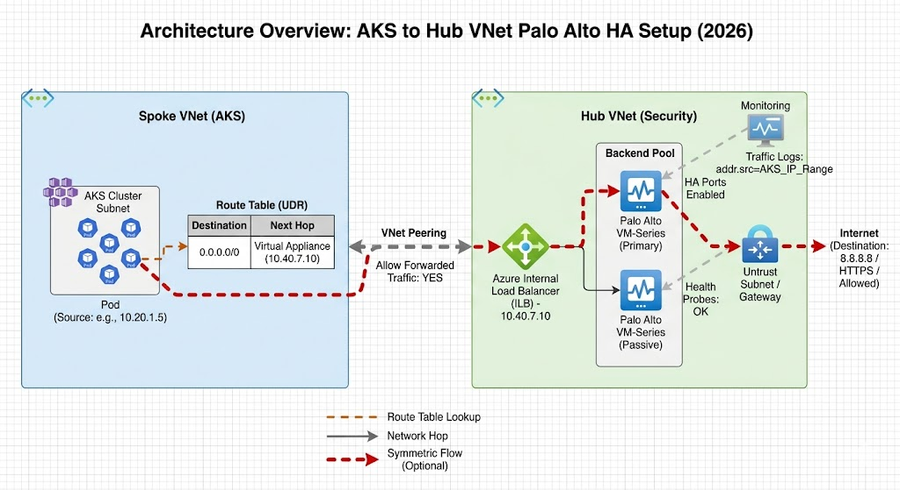
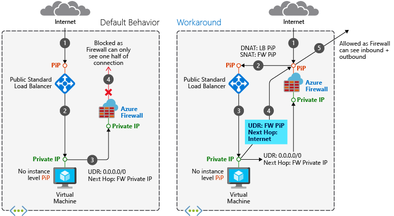
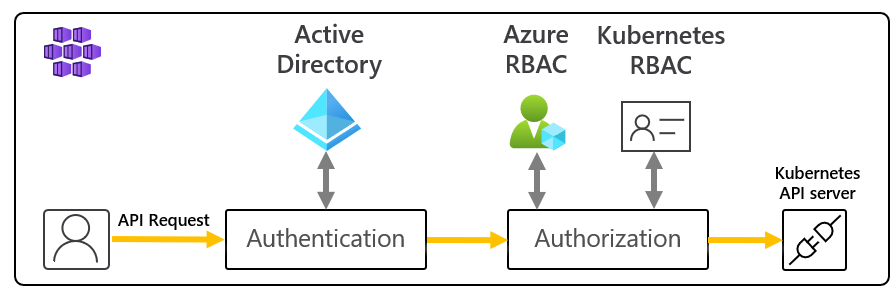
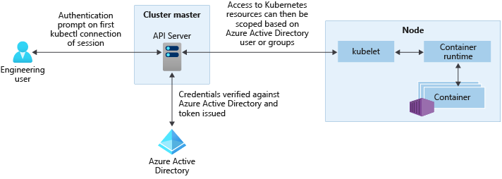
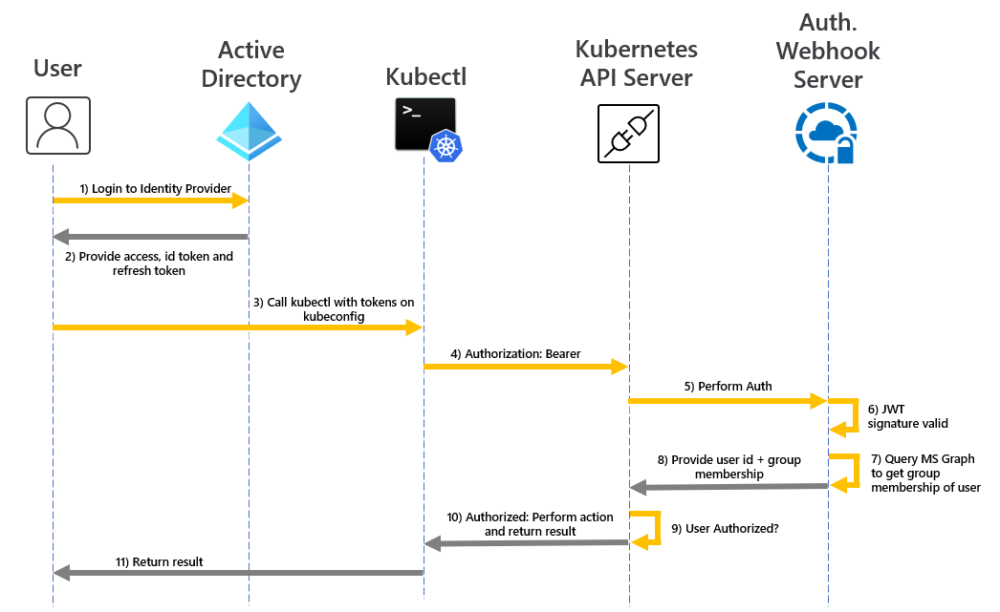

# Azure
```sh
Microsoft Entra ID (Azure AD) Tenant
  └── Management Groups (optional, nestable up to 6 levels)
        └── Subscriptions
              └── Resource Groups
                    └── Resources (VMs, Storage, DBs, etc.)
```

## Subscriptions
- The billing boundary and a trust boundary for Azure AD.
- Each subscription is linked to exactly one tenant.
- Resource limits (quotas) are scoped per subscription.
- Common pattern: separate subscriptions for Dev, Staging, Prod.

## Resource Groups
- A logical container for resources that share the same lifecycle.
- Every resource must live in exactly one resource group.
- Deleting a resource group deletes everything inside it.
- Resource groups have a location (where metadata is stored), but resources inside can be in different regions

## Resources
- The actual services: VMs, VNets, Storage Accounts, Databases, etc.
- Each resource has a unique Resource ID:
`/subscriptions/{sub-id}/resourceGroups/{rg-name}/providers/{provider}/{type}/{name}`

### Parent-Child (Containment)

Some resources are sub-resources of others. They can't exist independently:

| Parent | Child |
|---|---|
| Virtual Network (VNet) | Subnet |
| Storage Account | Blob Container, File Share, Queue |
| SQL Server | SQL Database |
| Key Vault | Secret, Key, Certificate |
| App Service Plan | App Service (Web App) |

### Reference Links (Cross-Resource Dependencies)

Resources reference each other by ID:
- A NIC references a Subnet (which references a VNet)
- A VM references a NIC, a Disk, and optionally an Availability Set
- A Private Endpoint references a target resource (e.g., Storage Account)

```sh
VM ──→ NIC ──→ Subnet ──→ VNet
 └──→ OS Disk
 └──→ Availability Set
```
A NIC must be connected to a Subnet so the VM gets an IP address and can communicate on the network. The Subnet must be part of a VNet, which provides the overall network infrastructure. The VM also needs an OS Disk to boot--
### Networking

| Concept | Purpose |
|---|---|
| VNet Peering | Connects two VNets (even cross-subscription/region) |
| Private Endpoint | Private IP for a PaaS service inside your VNet |
| Service Endpoint | Optimized route from Subnet → PaaS over Azure backbone |
| NSG (Network Security Group) | Firewall rules, attached to Subnet or NIC |
| Route Table (UDR) | Custom routing, attached to a Subnet |
| VNet Gateway | Connects VNet to on-premises (VPN/ExpressRoute) |


Every resource type belongs to a provider namespace:
- Microsoft.Compute → VMs, Disks, Scale Sets
- Microsoft.Network → VNets, NICs, Load Balancers
- Microsoft.Storage → Storage Accounts

Providers must be registered on a subscription before use.

```sh
VNet: 10.0.0.0/16
  ├── Subnet-Web:  10.0.1.0/24  (NSG: allow HTTP/HTTPS only)
  ├── Subnet-App:  10.0.2.0/24  (NSG: allow traffic from Web only)
  └── Subnet-DB:   10.0.3.0/24  (NSG: allow traffic from App only)
```
## VNet Peering
- Connects two VNets, allowing resources in both to communicate privately.
- Can be within the same subscription or across subscriptions/regions.
- Peering is non-transitive: if VNet A is peered with B, and B is peered with C, A cannot communicate with C through B.


### Hub VNet — 10.0.0.0/16
| Subnet | CIDR | Purpose |
|---|---|---|
| AzureFirewallSubnet | 10.0.1.0/26 | Azure Firewall (required name) |
| GatewaySubnet | 10.0.2.0/27 | VPN/ExpressRoute to office/on-prem |
| AzureBastionSubnet | 10.0.3.0/26 | Bastion for secure VM access (no public RDP/SSH) |
| ManagementSubnet | 10.0.4.0/24 | Jump boxes, monitoring agents |

### Production Spoke VNet — 10.1.0.0/16
| Subnet | CIDR | Purpose | NSG Rules |
|---|---|---|---|
| snet-agw | 10.1.1.0/24 | Application Gateway (WAF v2) | Allow HTTPS inbound from Front Door only |
| snet-app | 10.1.2.0/24 | AKS / App Services | Allow from AGW only |
| snet-data | 10.1.3.0/24 | Private Endpoints (SQL, Redis, Storage) | Allow from App subnet only |
| snet-integration | 10.1.4.0/24 | Service Bus, Event Hub, Logic Apps | Allow from App subnet |
| snet-pep | 10.1.5.0/24 | Additional Private Endpoints | Locked down |

### Staging Spoke — 10.2.0.0/16 (mirrors prod, smaller SKUs)
### Dev Spoke — 10.3.0.0/16 (relaxed NSGs, smaller SKUs)

| Azure | Linux | Purpose |
|---|---|---|
| NSG | iptables (filter table) / nftables | Allow/deny traffic |
| UDR | route table (ip route) | Where to send traffic |

```sh
$ ip route
default via 192.168.1.1 dev eth0          # internet → go to gateway
10.244.0.0/24 via 10.0.1.5 dev eth0       # pod CIDR → go to node-1
10.244.1.0/24 via 10.0.1.6 dev eth0       # pod CIDR → go to node-2
172.17.0.0/16 dev docker0                  # docker → go to bridge
```
```sh
Packet arrives at eth0
    │
    ▼
1. iptables PREROUTING (nat table — DNAT)
    │
    ▼
2. ROUTING DECISION (ip route)          ← "where does it go?" (= UDR)
    │           │
    │       Is it for me?
    │      /          \
    │   Yes            No (forwarding)
    │    │              │
    ▼    ▼              ▼
3. iptables INPUT    iptables FORWARD   ← "is it allowed?" (= NSG)
    │                   │
    ▼                   ▼
4. Local process     iptables POSTROUTING (nat table — SNAT)
                        │
                        ▼
                     Out via eth0
```

The Service Plan defines:
- The pricing tier (Free, Shared, Basic, Standard, Premium, or Isolated)
- The hardware resources (CPU, Memory, Disk Size)
- The scaling mode (manual or auto-scaling)

## Analogy: Service Plan = Real Estate
- You buy/rent an office building (App Service Plan) with different floors (tiers).
- Each business (App) rents rooms inside that building.
- If you want better quality (faster performance), you need to pay more for a better building (higher SKU)

- All apps in the same App Service Plan share the same underlying compute resources (CPU, RAM, Disk) provided by the plan.

```sh
[ App Service Plan: 2 vCPUs, 7 GB RAM ]
┌──────────────────┬──────────────────┬──────────────────┐
│ Web App A (Portal)│ Web App B (API) │ Function App (Jobs) │
│  Consuming 1 CPU │   Consuming ½ CPU│   Consuming ½ CPU│
│  Using 4 GB RAM  │   Using 2 GB RAM │   Using 1 GB RAM │
└──────────────────┴──────────────────┴──────────────────┘
  Shared: No fixed allocation per app
```  

## Scaling Out: Replicating the App Service Plan
When you scale out, Azure does not change the resources (CPU/RAM) per instance. Instead, it spins up multiple identical instances of the App Service Plan, each one hosting the same apps you assigned to the plan

## VNet


## VNet Peering
VNet Peering is the mechanism that connects two virtual networks (VNets) in Azure so they can communicate with each other. It allows VNets to communicate privately (without traversing the public internet) over Azure's backbone.

It's called hub and spoke — named after a wheel. The hub is the central VNet that contains shared services (firewall, VPN gateway, bastion). The spokes are separate VNets for Prod, Staging, and Dev. Each spoke is peered to the hub, allowing them to use the shared services while keeping their workloads isolated from each other.

```sh
        spoke
    ----─────────── spoke-vnet-1 (app team A)
    │   
hub─┼── spoke-vnet-2 (app team B)
    │
    └── spoke-vnet-3 (app team C)
```    
Look at a bicycle wheel:
```sh
         [spoke-vnet-1]
              │
              │  ← spoke
              │
[spoke-vnet-2]──── [HUB] ────[spoke-vnet-3]
              │
              │  ← spoke
              │
         [spoke-vnet-4]
```
- The hub is the center — shared services (firewall, DNS, VPN, bastion)
- The spokes are the arms radiating out — workload VNets for each team/app
- Spokes connect to the hub, not to each other directly 
- The hub acts as the central transit VNet: if Spoke1 wants to talk to Spoke2, the traffic can be routed via the hub.   

```sh
HUB VNet (10.0.0.0/16):
  ├── Azure Firewall          ← all traffic inspected here
  ├── VPN Gateway             ← on-premises connectivity
  ├── ExpressRoute Gateway    ← dedicated circuit to on-prem
  ├── Azure Bastion           ← secure SSH/RDP to VMs
  ├── DNS servers             ← private DNS resolution
  └── Shared services         ← monitoring, log aggregation

SPOKE VNets (10.1.0.0/16, 10.2.0.0/16, ...):
  ├── spoke-prod   (AKS cluster, prod apps)
  ├── spoke-dev    (AKS cluster, dev apps)
  ├── spoke-data   (databases, storage)
  └── spoke-dmz    (public-facing services)
```

### The UDR Connection
This is why UDRs matter in hub and spoke — spokes don't route to each other directly. You force traffic through the hub firewall:
```sh
# UDR on every spoke subnet:
Destination: 0.0.0.0/0
Next hop: 10.0.0.4 (Azure Firewall in hub)

# Even spoke-A to spoke-B:
spoke-A → UDR says "go to firewall" → firewall decides → spoke-B
```
Without UDR, Azure would route spoke-to-spoke traffic directly via peering, bypassing the firewall.

## Types of Peering
### Regional VNet Peering
Same Azure region, two VNets connected directly:
```sh
Region: East US
  VNet-A (10.0.0.0/16) ←──── peering ────→ VNet-B (10.1.0.0/16)
```  
- Low latency (same region, Microsoft backbone)
- Traffic stays within the region
- Most common type
### Global VNet Peering
Different Azure regions:
```sh
East US                          West Europe
  VNet-A (10.0.0.0/16) ←──── peering ────→ VNet-B (10.2.0.0/16)
```  
- Traffic travels over Microsoft's global backbone (not public internet)
- Higher latency than regional (cross-region by definition)
- Higher cost (cross-region data transfer fees)

## Gateway Transit (Hub and Spoke Enabler)
A spoke borrows the hub's VPN/ExpressRoute gateway:
```sh
HUB VNet
  ├── VPN Gateway (connects to on-premises)
  └── peering to spoke (with "allow gateway transit" = ON)

SPOKE VNet
  └── peering to hub (with "use remote gateways" = ON)
         │
         └── spoke can now reach on-premises
             WITHOUT having its own gateway
``` 
Without this, every spoke would need its own VPN gateway (~$140/mo each). With gateway transit, only the hub needs one.

A common mistake — peering is not transitive:
```sh
VNet-A ←── peered ──→ VNet-B ←── peered ──→ VNet-CVNet-A CANNOT reach VNet-C directly.Peering is point-to-point, not chained.
```


the IP belongs to a Load Balancer Internal Frontend (which is common for high-availability Palo Alto setups),and the LB is configured to forward traffic to the firewall's private IPs. The firewall then applies its security policies and forwards allowed traffic to the destination (e.g., VMs in the spoke VNets).

- A pod in AKS (Spoke) sends a packet.
- Azure looks at the User-Defined Route (UDR) on the AKS subnet. It sees 0.0.0.0/0 -> Next Hop 10.40.7.10
- Azure encapsulates that packet and sends it across the VNet Peering to the Hub.
- The packet hits the Internal LB at 10.40.7.10
- The LB picks an active Palo Alto VM from the backend pool and hands it the packet.
- The Palo Alto checks its rules (App-ID, threat prevention, etc.).
- If allowed, the Palo Alto sends the traffic out to its own "Untrust" interface (usually to the Internet or a VPN/ExpressRoute)

## The "Transit Hub" Concept
A three-VNet setup
- VNet A (AKS Spoke): Where your cluster lives.
- VNet B (Intermediate Hub): This is the VNet your AKS is actually peered with.
- VNet C (Security/Management Hub): This is where the Load Balancer (10.40.7.10) lives.

For Zero Trust control and the ability to inspect traffic, send all egress traffic through Azure Firewall. Implement this configuration with user-defined routes (UDRs). The next hop of the route is the private IP address of Azure Firewall. Azure Firewall decides whether to block or allow the egress traffic based on the rules that you define or the built-in threat intelligence rules.

## Integrate Azure Firewall with Azure Standard Load Balancer
You can integrate an Azure Firewall into a virtual network with either a public or internal Azure Standard Load Balancer.The preferred design is to use an internal load balancer with your Azure Firewall, as it simplifies the setup

### Asymmetric routing

Asymmetric routing occurs when a packet takes one path to the destination and takes another path when returning to the source. This problem occurs when a subnet has a default route going to the firewall's private IP address and you're using a public load balancer. In this case, the incoming load balancer traffic comes through its public IP address, but the return path goes through the firewall's private IP address. Since the firewall is stateful, it drops the returning packet because the firewall isn't aware of such an established session.



### Internal load balancer
An internal load balancer is deployed with a private frontend IP address.
This scenario doesn't have asymmetric routing issues. Incoming packets arrive at the firewall's public IP address, are translated to the load balancer's private IP address, and return to the firewall's private IP address using the same path.

Deploy this scenario similarly to the public load balancer scenario, but without needing the firewall public IP address host route.

Virtual machines in the backend pool can have outbound Internet connectivity through the Azure Firewall. Configure a user-defined route on the virtual machine's subnet with the firewall as the next hop.

```sh
[ SPOKE: AKS ]             [ HUB: NETWORKING ]           [ HUB: SECURITY ]
+---------------+         +---------------------+       +---------------------+
| Subnet: 10.20 |         | Subnet: 10.40.7     |       | Subnet: 10.16.0     |
|               |         |                     |       |                     |
|  [ POD ]      | Peering |  [ INT. LOAD      ] |Peering|  [ PALO ALTO ]      |
|     |         |========>|  [ BALANCER       ] |======>|  [ 10.16.0.5 ]      |
|     V         | (Jump 1)|  [ 10.40.7.10 ]     | (Jump 2)                    |
| +-----------+ |         |          |          |       |          |          |
| | UDR:      | |         |   (Backend Pool)    |       | (Inspect & Egress)  |
| | .10       | |         |          +---------------------------->|          |
| +-----------+ |         |                     |       |          V          |
+---------------+         +---------------------+       +----[ INTERNET ]-----+
```                                                                  
Managed Identities in Kubernetes (AKS)
In the context of this Kubernetes code, the relevant pattern is:
```
AKS Node/Pod → Azure IMDS (http://169.254.169.254) → gets token → calls Azure API
```

### Azure Workload Identity (current standard)
Uses Kubernetes ServiceAccount Token Volume Projection + OIDC federation
Flow:
AKS exposes an OIDC issuer endpoint
A Kubernetes ServiceAccount is annotated with an Azure AD app/managed identity client ID
Kubernetes injects a signed JWT (projected ServiceAccount token) into the pod
The pod exchanges that JWT at Azure AD for an access token — no IMDS interception needed
No privileged daemonset required; works at the pod level natively
Supported via the `azure.workload.identity/use: "true"` pod label

### Load balancer overview
Azure Load Balancer operates at layer 4 of the Open Systems Interconnection (OSI) model. It's the single point of contact for clients. The service distributes inbound flows that arrive at the load balancer's frontend to backend pool instances. These flows are distributed according to configured load-balancing rules and health probes. The backend pool instances can be Azure virtual machines (VMs) or virtual machine scale sets.

```sh
# Create a Standard Internal Load Balancer with a private frontend IP

az network lb create \
  --resource-group myResourceGroup \
  --name myInternalLB \
  --sku Standard \
  --vnet-name myVNet \
  --subnet backendSubnet \
  --frontend-ip-name frontendPrivateIP \
  --private-ip-address 10.0.3.100 \
  --backend-pool-name backendPool
  ```
  The `--private-ip-address` is optional. If you omit it, Azure assigns one dynamically from the subnet. For production, I recommend specifying a static IP so your clients always know where to connect

  Notice there is no `--public-ip-address` parameter. That is what makes it internal

  ### Accessing the ILB from Peered VNets

The ILB is accessible from peered VNets as long as:
- VNet peering is configured and both sides show Connected
- There is no NSG blocking traffic to the ILB subnet
- There are no UDRs diverting traffic away from the peered VNet

The Azure Internal Load Balancer (ILB) does NOT perform SNAT.

Azure has a service called Private Link (used to securely connect VNets to PaaS databases like Azure SQL or Storage Accounts).

Private Link heavily relies on Internal SNAT.

When your AKS pod talks to a database via Private Link, Azure automatically SNATs the pod's IP to an IP from the database's local subnet. The database never knows the true IP of your pod; it only sees the Private Endpoint IP.

With a public load balancer, Azure SNATs outbound traffic (replaces source IP with the LB's public IP). With an internal load balancer, there is no outbound SNAT — traffic flows with the original source IP preserved.

### The asymmetric routing problem
This causes a well-known issue:
```sh
Client (10.0.1.5)
    │
    ▼
ILB VIP (10.0.2.100)
    │
    ▼
Backend VM (10.0.2.10)
    │
    └── reply goes directly back to 10.0.1.5  ← bypasses LB
```

If the client and backend are in the same subnet/VNet, the backend may respond directly to the client without going through the LB. This breaks stateful connections because the LB never sees the return traffic

## Resource Providers
A resource provider is a collection of REST operations that enables functionality for an Azure service. Each resource provider has a namespace in the format of `company-name.service-label`.

### Compute

| Resource Provider | Service |
|---|---|
| Microsoft.AppPlatform | Azure Spring Apps |
| Microsoft.AVS | Azure VMware Solution |
| Microsoft.Batch | Batch |
| Microsoft.ClassicCompute | Classic deployment model virtual machine |
| Microsoft.Compute | Virtual Machines, Virtual Machine Scale Sets |
| Microsoft.DesktopVirtualization | Azure Virtual Desktop |
| Microsoft.DevTestLab | Azure Lab Services |
| Microsoft.HanaOnAzure | SAP HANA on Azure Large Instances |
| Microsoft.LabServices | Azure Lab Services |
| Microsoft.Maintenance | Azure Maintenance |
| Microsoft.Microservices4Spring | Azure Spring Apps |
| Microsoft.Quantum | Azure Quantum |
| Microsoft.SerialConsole | Azure Serial Console for Windows |
| Microsoft.ServiceFabric | Service Fabric |
| Microsoft.VirtualMachineImages | Azure Image Builder |
| Microsoft.VMware | Azure VMware Solution |
| Microsoft.VMwareCloudSimple | Azure VMware Solution by CloudSimple |

### Network

| Resource Provider | Service |
|---|---|
| Microsoft.Cdn | Content Delivery Network |
| Microsoft.ClassicNetwork | Classic deployment model virtual network |
| Microsoft.ManagedNetwork | Virtual networks managed by PaaS services |
| Microsoft.Network | Application Gateway, Azure Bastion, Azure DDoS Protection, Azure DNS, Azure ExpressRoute, Azure Firewall, Azure Front Door Service, Azure Private Link, Azure Route Server, Load Balancer, Network Watcher, Traffic Manager, Virtual Network, Virtual Network NAT, Virtual Network Manager, Virtual WAN, VPN Gateway |
| Microsoft.Peering | Azure Peering Service |

### Storage

| Resource Provider | Service |
|---|---|
| Microsoft.ClassicStorage | Classic deployment model storage |
| Microsoft.ElasticSan | Elastic SAN |
| Microsoft.HybridData | StorSimple |
| Microsoft.ImportExport | Azure Import/Export |
| Microsoft.NetApp | Azure NetApp Files |
| Microsoft.ObjectStore | Object Store |
| Microsoft.Storage | Storage |
| Microsoft.StorageCache | Azure HPC Cache |
| Microsoft.StorageSync | Storage |
| Microsoft.StorSimple | StorSimple |

### AI and Machine Learning

| Resource Provider | Service |
|---|---|
| Microsoft.AutonomousSystems | Autonomous Systems |
| Microsoft.BotService | Azure Bot Service |
| Microsoft.CognitiveServices | Cognitive Services |
| Microsoft.EnterpriseKnowledgeGraph | Enterprise Knowledge Graph |
| Microsoft.MachineLearningServices | Azure Machine Learning |
| Microsoft.Search | Azure AI Search |

### Analytics

| Resource Provider | Service |
|---|---|
| Microsoft.AnalysisServices | Azure Analysis Services |
| Microsoft.Databricks | Azure Databricks |
| Microsoft.DataCatalog | Data Catalog |
| Microsoft.DataFactory | Data Factory |
| Microsoft.DataLakeAnalytics | Data Lake Analytics |
| Microsoft.DataLakeStore | Azure Data Lake Storage Gen2 |
| Microsoft.DataShare | Azure Data Share |
| Microsoft.HDInsight | HDInsight |
| Microsoft.Kusto | Azure Data Explorer |
| Microsoft.PowerBI | Power BI |
| Microsoft.PowerBIDedicated | Power BI Embedded |
| Microsoft.ProjectBabylon | Azure Data Catalog |
| Microsoft.Purview | Microsoft Purview |
| Microsoft.StreamAnalytics | Azure Stream Analytics |
| Microsoft.Synapse | Azure Synapse Analytics |

### Blockchain

| Resource Provider | Service |
|---|---|
| Microsoft.Blockchain | Azure Blockchain Service |
| Microsoft.BlockchainTokens | Azure Blockchain Tokens |

### Container

| Resource Provider | Service |
|---|---|
| Microsoft.App | Azure Container Apps |
| Microsoft.ContainerInstance | Container Instances |
| Microsoft.ContainerRegistry | Container Registry |
| Microsoft.ContainerService | Azure Kubernetes Service (AKS) |
| Microsoft.RedHatOpenShift | Azure Red Hat OpenShift |

### Core

| Resource Provider | Service |
|---|---|
| Microsoft.Addons | core |
| Microsoft.AzureStack | core |
| Microsoft.Capacity | core |
| Microsoft.Commerce | core |
| Microsoft.Marketplace | core |
| Microsoft.MarketplaceApps | core |
| Microsoft.MarketplaceOrdering | core |
| Microsoft.SaaS | core |
| Microsoft.Services | core |
| Microsoft.Subscription | core |
| microsoft.support | core |

### Database

| Resource Provider | Service |
|---|---|
| Microsoft.Cache | Azure Managed Reference, Azure Cache for Redis |
| Microsoft.DBforMariaDB | Azure Database for MariaDB |
| Microsoft.DBforMySQL | Azure Database for MySQL |
| Microsoft.DBforPostgreSQL | Azure Database for PostgreSQL |
| Microsoft.DocumentDB | Azure Cosmos DB, Azure DocumentDB |
| Microsoft.Sql | Azure SQL Database, Azure SQL Managed Instance, Azure Synapse Analytics |
| Microsoft.SqlVirtualMachine | SQL Server on Azure Virtual Machines |
| Microsoft.AzureData | SQL Server enabled by Azure Arc |

### Developer Tools

| Resource Provider | Service |
|---|---|
| Microsoft.AppConfiguration | Azure App Configuration |
| Microsoft.DevCenter | Microsoft Dev Box |
| Microsoft.DevSpaces | Azure Dev Spaces |
| Microsoft.LoadTestService | Azure Load Testing |
| Microsoft.Notebooks | Azure Notebooks |

### DevOps

| Resource Provider | Service |
|---|---|
| microsoft.visualstudio | Azure DevOps |
| Microsoft.VSOnline | Azure DevOps |
| Microsoft.DevOpsInfrastructure | Managed DevOps Pools |

### Hybrid

| Resource Provider | Service |
|---|---|
| Microsoft.AzureArcData | Azure Arc-enabled data services |
| Microsoft.AzureStackHCI | Azure Local |
| Microsoft.HybridCompute | Azure Arc-enabled servers |
| Microsoft.Kubernetes | Azure Arc-enabled Kubernetes |
| Microsoft.KubernetesConfiguration | Azure Arc-enabled Kubernetes |
| Microsoft.Edge | Azure Arc site manager |

### Identity

| Resource Provider | Service |
|---|---|
| Microsoft.AAD | Microsoft Entra Domain Services |
| Microsoft.ADHybridHealthService | Microsoft Entra ID |
| Microsoft.AzureActiveDirectory | Microsoft Entra ID B2C |
| Microsoft.ManagedIdentity | Managed identities for Azure resources |
| Microsoft.Token | Token |

### Integration

| Resource Provider | Service |
|---|---|
| Microsoft.ApiManagement | API Management |
| Microsoft.Communication | Azure Communication Services |
| Microsoft.EventGrid | Event Grid |
| Microsoft.EventHub | Event Hubs |
| Microsoft.HealthcareApis | Azure API for FHIR, Healthcare APIs |
| Microsoft.Logic | Logic Apps |
| Microsoft.NotificationHubs | Notification Hubs |
| Microsoft.PowerPlatform | Power Platform |
| Microsoft.Relay | Azure Relay |
| Microsoft.ServiceBus | Service Bus |

### IoT

| Resource Provider | Service |
|---|---|
| Microsoft.IoTOperations | Azure IoT Operations |
| Microsoft.DeviceRegistry | Azure Device Registry |
| Microsoft.Devices | Azure IoT Hub, Azure IoT Hub Device Provisioning Service |
| Microsoft.DeviceUpdate | Device Update for IoT Hub |
| Microsoft.DigitalTwins | Azure Digital Twins |
| Microsoft.IoTSpaces | Azure Digital Twins |
| Microsoft.IoTCentral | Azure IoT Central |
| Microsoft.WindowsIoT | Windows 10 IoT Core Services |

### Management

| Resource Provider | Service |
|---|---|
| Microsoft.Advisor | Azure Advisor |
| Microsoft.Authorization | Azure Resource Manager |
| Microsoft.Automation | Automation |
| Microsoft.Billing | Cost Management and Billing |
| Microsoft.Blueprint | Azure Blueprints |
| Microsoft.ChangeSafety | Safety checks that help Microsoft reduce risk and improve reliability |
| Microsoft.ClassicSubscription | Classic deployment model |
| Microsoft.Consumption | Cost Management |
| Microsoft.CostManagement | Cost Management |
| Microsoft.CostManagementExports | Cost Management |
| Microsoft.CustomProviders | Azure Custom Providers |
| Microsoft.DynamicsLcs | Lifecycle Services |
| Microsoft.Features | Azure Resource Manager |
| Microsoft.GuestConfiguration | Azure Policy |
| Microsoft.ManagedServices | Azure Lighthouse |
| Microsoft.Management | Management Groups |
| Microsoft.PolicyInsights | Azure Policy |
| Microsoft.Portal | Azure portal |
| Microsoft.RecoveryServices | Azure Site Recovery |
| Microsoft.ResourceGraph | Azure Resource Graph |
| Microsoft.ResourceHealth | Azure Service Health |
| Microsoft.ResourceNotification | Azure Resource Notifications |
| Microsoft.Resources | Azure Resource Manager |
| Microsoft.Scheduler | Scheduler |
| Microsoft.SoftwarePlan | License |
| Microsoft.Solutions | Azure Managed Applications |

### Migration

| Resource Provider | Service |
|---|---|
| Microsoft.ClassicInfrastructureMigrate | Classic deployment model migration |
| Microsoft.DataBox | Azure Data Box |
| Microsoft.DataBoxEdge | Azure Stack Edge |
| Microsoft.DataMigration | Azure Database Migration Service |
| Microsoft.OffAzure | Azure Migrate |
| Microsoft.Migrate | Azure Migrate |

### Monitoring

| Resource Provider | Service |
|---|---|
| Microsoft.AlertsManagement | Azure Monitor |
| Microsoft.ChangeAnalysis | Azure Monitor |
| Microsoft.Insights | Azure Monitor |
| Microsoft.Intune | Azure Monitor |
| Microsoft.Monitor | Azure Monitor |
| Microsoft.OperationalInsights | Azure Monitor |
| Microsoft.OperationsManagement | Azure Monitor |
| Microsoft.WorkloadMonitor | Azure Monitor |

### Security

| Resource Provider | Service |
|---|---|
| Microsoft.Attestation | Azure Attestation Service |
| Microsoft.CustomerLockbox | Customer Lockbox for Microsoft Azure |
| Microsoft.DataProtection | Data Protection |
| Microsoft.HardwareSecurityModules | Azure Dedicated HSM |
| Microsoft.KeyVault | Key Vault |
| Microsoft.Security | Security Center |
| Microsoft.SecurityInsights | Microsoft Sentinel |
| Microsoft.WindowsDefenderATP | Microsoft Defender Advanced Threat Protection |
| Microsoft.WindowsESU | Extended Security Updates |

### Web

| Resource Provider | Service |
|---|---|
| Microsoft.BingMaps | Bing Maps |
| Microsoft.CertificateRegistration | App Service Certificates |
| Microsoft.DomainRegistration | App Service |
| Microsoft.Maps | Azure Maps |
| Microsoft.SignalRService | Azure SignalR Service |
| Microsoft.Web | App Service, Azure Functions |

### 5G & Space

| Resource Provider | Service |
|---|---|
| Microsoft.HybridNetwork | Network Function Manager |
| Microsoft.MobileNetwork | Azure Private 5G Core |


## Azure RBAC for Kubernetes Authorization

With the Azure RBAC integration, AKS will use a Kubernetes Authorization webhook server so you can manage Microsoft Entra integrated Kubernetes cluster resource permissions and assignments using Azure role definition and role assignments.


If the identity making the request exists in Microsoft Entra ID, Azure will team with Kubernetes RBAC to authorize the request. If the identity exists outside of Microsoft Entra ID (i.e., a Kubernetes ServiceAccount), authorization will defer to the normal Kubernetes RBAC.

With this feature, you not only give users permissions to the AKS resource across subscriptions, but you also configure the role and permissions for inside each of those clusters controlling Kubernetes API access. For example, you can grant the `Azure Kubernetes Service RBAC Reader` role on the subscription scope. The role recipient will be able to list and get all Kubernetes objects from all clusters without modifying them

## Microsoft Entra integration

Enhance your AKS cluster security with Microsoft Entra integration. Built on decades of enterprise identity management, Microsoft Entra ID is a multi-tenant, cloud-based directory and identity management service that combines core directory services, application access management, and identity protection. With Microsoft Entra ID, you can integrate on-premises identities into AKS clusters to provide a single source for account management and security.



Microsoft Entra authentication is provided to AKS clusters with OpenID Connect. OpenID Connect is an identity layer built on top of the OAuth 2.0 protocol
From inside of the Kubernetes cluster, Webhook Token Authentication is used to verify authentication tokens. Webhook token authentication is configured and managed as part of the AKS cluster.

### Webhook and API server


As shown in the graphic above, the API server calls the AKS webhook server and performs the following steps:
- `kubectl` uses the Microsoft Entra client application to sign in users with OAuth 2.0 device authorization grant flow.
- Microsoft Entra ID provides an `access_token`, `id_token`, and a `refresh_token`.
- The user makes a request to `kubectl` with an `access_token` from `kubeconfig`.
- `kubectl` sends the `access_token` to API Server.
- The API Server is configured with the Auth WebHook Server to perform validation.
- The authentication webhook server confirms the JSON Web Token signature is valid by checking the Microsoft Entra public signing key.
- If the user is a member of more than 200 groups, the server application uses user-provided credentials to query group memberships of the logged-in user from the MS Graph API. For users with group memberships of 200 or fewer the groups claim already exists in the client token. No query will be performed.
- A response is sent to the API Server with user information such as the user principal name (UPN) claim of the access token, and the group membership of the user based on the object ID.
- The API performs an authorization decision based on the Kubernetes Role/RoleBinding.
- Once authorized, the API server returns a response to `kubectl`.
- `kubectl` provides feedback to the user.
