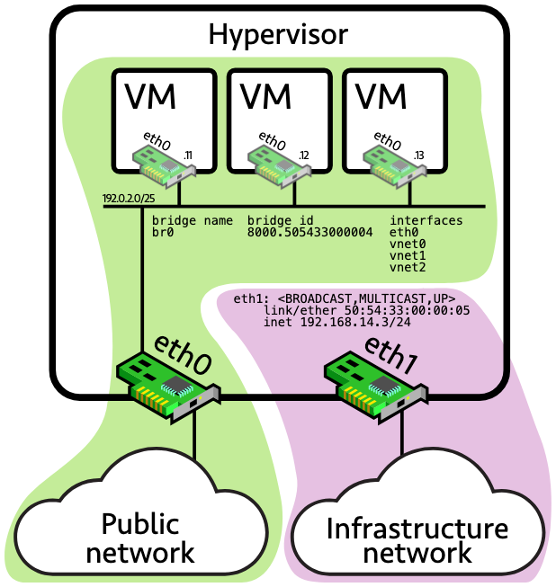

When configuring a Linux bridge, use the following commands to enforce isolation:
```sh
bridge vlan del dev br0 vid 1 self
ip link set dev br0 type bridge vlan_filtering 1
```




The main expectation of such a setup is that while the virtual hosts should be able to use resources from the public network, they should not be able to access resources from the infrastructure network (including resources hosted on the hypervisor itself, like a SSH server). In other words, we expect total isolation between the green domain and the purple one.

That’s not the case. From any virtual host:
```sh
ip route add 192.168.14.3/32 dev eth0
ping -c 3 192.168.14.3
PING 192.168.14.3 (192.168.14.3) 56(84) bytes of data.
64 bytes from 192.168.14.3: icmp_seq=1 ttl=59 time=0.644 ms
64 bytes from 192.168.14.3: icmp_seq=2 ttl=59 time=0.829 ms
64 bytes from 192.168.14.3: icmp_seq=3 ttl=59 time=0.894 ms
```

## Why?

There are two main factors behind this behavior:
- `A bridge can accept IP traffic`. This is a useful feature if you want Linux to act as a bridge and provide some IP services to bridge users (a DHCP relay or a default gateway). This is usually done by configuring the IP address on the bridge device: ip addr add 192.0.2.2/25 dev br0.
- `An interface does not need an IP address to process incoming IP traffic`. Additionally, by default, Linux accepts to answer ARP requests independently from the incoming interface.


## Bridge processing
1. Evaluate XDP receive hooks
2. Copy frame to taps (tcpdump etc. — ptype_all)
3. Evaluate TC ingress policy
4. Evaluate netfilter ingress hook (NF_NETDEV_INGRESS — used by nftables netdev family)
5. Hand to device-specific rx_handler if any — this is where the bridge intercepts frames
6. Hand to protocol handler (IPv4, ARP, IPv6 — via ptype_base)

A bridge port's `net_device` has a `rx_handler` of `br_handle_frame`. When the frame arrives on a bridge-member port, that handler is called and runs the bridge's own forwarding logic (including the bridge netfilter hooks: `NF_BR_PRE_ROUTING`, `NF_BR_FORWARD`, etc.).

If `br_handle_frame` returns `RX_HANDLER_CONSUMED` the frame never reaches step 6 — the bridge handled it. If the frame is destined for the bridge's IP itself, `br_handle_frame` re-injects it into the local stack so step 6 (IP handler) does run.

So the bridge sits at the `rx_handler` slot — same mechanism used by bonding, macvlan, OvS, etc. That's how you can put any device into a bridge transparently: assigning the bridge's `rx_handler` to the port redirects all incoming frames into the bridge code before the IP stack ever sees them.

### how a port becomes a bridge member

When you run:
```sh
ip link set eth0 master br0
```
The kernel calls `br_add_if()`, which eventually does (br_if.c:613):
```c
netdev_rx_handler_register(eth0, br_handle_frame, port);
```
This sets two fields on the `eth0 net_device`:
```c
eth0->rx_handler = br_handle_frame
eth0->rx_handler_data = port (the net_bridge_port struct)
```

That's the entire hookup. No magic — one function pointer and a context pointer.

### what happens when a frame arrives on eth0
```c
//dev.c:6033:
rx_handler = rcu_dereference(skb->dev->rx_handler);
if (rx_handler) {
    switch (rx_handler(&skb)) {
        case RX_HANDLER_CONSUMED: ... goto out;      // bridge took it
        case RX_HANDLER_ANOTHER:  ... goto another_round;  // re-process as different dev
        case RX_HANDLER_PASS:     break;             // continue to protocol handler
        ...
    }
}
```
For an `eth0 `frame, `skb->dev->rx_handler` is `br_handle_frame`. The core network code doesn't know it's a bridge — it just calls whatever function is registered. Bonding's `bond_handle_frame`, macvlan's `macvlan_handle_frame`, etc. all plug into this same slot.

**Inside br_handle_frame**

The handler decides the frame's fate based on destination MAC (br_input.c:339):

```sh
1. Sanity checks (valid source MAC, etc.)
2. If destination is a link-local reserved MAC (STP, LLDP, etc.):
   → handle/drop locally, return RX_HANDLER_PASS or CONSUMED
3. Otherwise: enter the bridge forwarding logic
   → fires NF_BR_PRE_ROUTING netfilter hook
   → looks up MAC in FDB (forwarding database)
   → either:
       a. floods to all ports if unknown unicast/broadcast
       b. forwards to specific port (fires NF_BR_FORWARD on that port)
       c. delivers locally (frame is for the bridge's own IP)
```
Return value tells the core what to do

- `RX_HANDLER_CONSUMED` — bridge already forwarded/dropped the frame. Core stops processing. The protocol handler (IP, ARP) `never runs on eth0`.

- `RX_HANDLER_PASS` — used for link-local control frames the bridge ignores; the core continues as if no `rx_handler existed`.

- `RX_HANDLER_ANOTHER` — bridge changed `skb->dev` (typically to `br0` itself) and asked the core to re-loop. The core jumps back to another_round in `__netif_receive_skb_core`, which re-reads `skb->dev->rx_handler` (now `br0`, which has none) and proceeds to the protocol handlers — IP sees the frame as if it arrived on `br0`. This is the "re-injection" path used when the frame is destined for the bridge's own IP.
## Why this design is elegant

The IP stack, ARP, etc. don't need any knowledge of bridging. They sit at step 6 (protocol handler) and process whatever arrives. The bridge intercepts at step 5 and either consumes the frame or re-presents it as if it arrived on a different device. From IP's perspective, packets simply arrive on `br0` instead of `eth0` — no special bridge code in the IP layer at all.

Bonding works the same way: a slave's `rx_handler` is b`ond_handle_frame`, which fixes `skb->dev = bond0` and returns `RX_HANDLER_ANOTHER` so IP sees the frame on `bond0`. Macvlan, OvS, team driver — all hooks into the same `rx_handler` slot, all transparent to the upper layers.


## RX_HANDLER_CONSUMED
When: the bridge has either forwarded the frame out another port or dropped it. The frame's job is done.

Example: PC1 on `eth0` sends a frame to PC2 on `eth1`, both attached to `br0`.

```sh
Frame arrives on eth0
  ↓
br_handle_frame called
  ↓
Bridge looks up dest MAC in FDB → "it's on eth1"
  ↓
Bridge calls dev_queue_xmit() on eth1 → frame leaves the box
  ↓
return RX_HANDLER_CONSUMED
  ↓
Core does `goto out;` — stops all further processing
```
The local IP/ARP stack on this machine never sees the frame because it wasn't for this machine anyway. The bridge just shuttled it through.

This is the most common case for any frame transiting a bridge.


## RX_HANDLER_ANOTHER
When: the frame is for the local machine, but it arrived on a port (eth0) — the local stack should see it as if it arrived on the bridge interface itself (br0).

Example: `br0` has IP 192.168.1.1. PC sends an ICMP ping to that IP. The frame arrives on `eth0`.

```sh
Frame arrives on eth0
  ↓
br_handle_frame called
  ↓
Bridge sees dest MAC matches br0's MAC → "this is for us"
  ↓
Bridge sets skb->dev = br0   ← the device field is rewritten
  ↓
return RX_HANDLER_ANOTHER
  ↓
Core does `goto another_round;`
  ↓
Loop re-enters at __netif_receive_skb_core
  ↓
This time skb->dev = br0
  ↓
Check rx_handler on br0 → none (br0 isn't a member of anything)
  ↓
Fall through to protocol handlers (ip_rcv) — IP sees the ping arriving on br0
  ↓
Kernel responds with ICMP reply sourced from br0
```
The re-loop is the re-injection. The bridge is saying "process this skb again, but pretend it arrived on `br0` from the start." Without this, IP would think the packet arrived on `eth0` — wrong, because the IP 192.168.1.1 belongs to `br0`, not `eth0`.


## RX_HANDLER_PASS 
When: the bridge looked at the frame, decided not to handle it, and wants the normal protocol stack to process it on the original receive device (eth0, not br0).

Examples from the code:
- `Loopback frames: skb->pkt_type == PACKET_LOOPBACK (line 346-347)`. Locally-generated frames echoed back shouldn't be bridged — just let them through.
- `STP BPDUs and LLDP` (the link-local handling around line 386-403): the bridge updates its internal state from these frames, but they're also exposed to userspace via packet sockets (e.g. for bridge link monitoring or lldpd). Returning PASS lets the standard protocol delivery happen.

```sh
Frame arrives on eth0 (it's an STP BPDU)
  ↓
br_handle_frame called
  ↓
Bridge updates its own STP state from the BPDU
  ↓
return RX_HANDLER_PASS
  ↓
Core continues at the next step as if no rx_handler existed
  ↓
Protocol handlers run — userspace listeners on eth0 see the frame
```
Crucially, `PASS` does not trigger a re-loop. The skb continues forward, still showing `eth0` as the receive device.

```sh
__netif_receive_skb_core
        │
        ▼
   skb->dev = eth0
   rx_handler = br_handle_frame
        │
        ▼
   ┌──────────────────────────┐
   │   br_handle_frame(skb)   │
   └──────────┬───────────────┘
              │
   ┌──────────┼──────────────────┐
   │          │                  │
   ▼          ▼                  ▼
CONSUMED   ANOTHER             PASS
   │          │                  │
   ▼          ▼                  ▼
goto out  skb->dev=br0      continue to
(stop)    goto another_round  taps/IP stack
             │                  with skb->dev=eth0
             ▼
        __netif_receive_skb_core
        runs again with new dev
             │
             ▼
        eth0 → br0 (no rx_handler now)
             │
             ▼
        IP stack sees packet on br0
```

every `net_device` has an `rx_handler` field, but it's optional. Most devices leave it `NULL`.

```
struct net_device {
    ...
    rx_handler_func_t __rcu  *rx_handler;
    void __rcu               *rx_handler_data;
    ...
};
```
When `__netif_receive_skb_core` checks it:

```c
rx_handler = rcu_dereference(skb->dev->rx_handler);
if (rx_handler) {           // ← only branches if one is set
    switch (rx_handler(&skb)) { ... }
}
```
If `NULL`, the core skips the whole switch and goes straight to the protocol handlers.

When a device gets an `rx_handler` set:
```sh
plain eth0 (not in any bridge/bond) →  rx_handler = NULL
eth0 added to a bridge               →  rx_handler = br_handle_frame
eth0 added to a bond                 →  rx_handler = bond_handle_frame
eth0 with a macvlan on top           →  rx_handler = macvlan_handle_frame
eth0 attached to OvS                 →  rx_handler = netdev_frame_hook
eth0 added to a team device          →  rx_handler = team_handle_frame
```
 only one `rx_handler` per device at a time. That's why you can't put eth0 simultaneously into a bridge AND a bond — both would want to claim the slot. `netdev_rx_handler_register` checks for this

```sh
# Works — eth0 has no rx_handler yet
ip link set eth0 master br0      # br0 registers br_handle_frame on eth0

# Fails — eth0 already has br_handle_frame from br0
ip link set eth0 master bond0    # EBUSY: bond0 can't register bond_handle_frame
```

You'd first have to detach eth0 from br0 (`ip link set eth0 nomaster`, which calls `netdev_rx_handler_unregister` → sets `rx_handler = NULL`) before something else can claim the slot

You can even stack them — a bond inside a bridge:
```sh
eth0 (slave of bond0)              rx_handler = bond_handle_frame
bond0 (port of br0)                rx_handler = br_handle_frame
br0                                rx_handler = NULL
```
stacking is how you compose features that the kernel keeps as separate, single-purpose pieces. Each layer does one thing well; stacking gives you the combination.

Real-world combinations and why they're useful:

1. Bond inside a bridge — redundant uplink for a virtual switch
`VMs → br0 → bond0 → eth0 + eth1`

The VMs share one bridge. The bridge's uplink is a bond, so if either physical NIC fails the bridge stays up. Without stacking you'd need bridge code that knows about NIC failover.

2. VLAN inside a bridge — multi-tenant isolation on shared uplink
```sh
br-prod → eth0.10
br-dev  → eth0.20
```
Two bridges share one physical NIC via 802.1Q VLAN subinterfaces. Each bridge sees only frames for its VLAN tag. Standard pattern for hypervisors hosting tenants on different VLANs.

3. Bridge inside a bond? No — usually the other way: bond is the uplink, bridge is on top. But you do see bridge → VXLAN → bond:
`br0 → vxlan0 (overlay) → bond0 → eth0 + eth1`

This is essentially what Kubernetes CNI plugins and OpenStack Neutron build under the hood. Container/VM traffic enters br0, gets VXLAN-encapsulated, sent over a bonded uplink for redundancy.

4. Macvlan on bond — independent MAC per container, with NIC failover
`mvlan0, mvlan1, mvlan2 → bond0 → eth0 + eth1`

Each container or VM has its own MAC visible on the network, but they all share the bonded physical uplink. Used in some container networking setups when you want the network to see each container as a separate L2 endpoint.

5. The classic VM/container stack:
`veth(container) → br0 → eth0`

`veth` pairs are the namespace-crossing piece, the bridge connects all containers, the bridge's uplink is the host NIC. Every Docker default install does this.

```sh
                        ┌──────────────────────────┐
                        │     rx_handler(skb)      │
                        └──────────────────────────┘
                                    │
        ┌──────────────┬────────────┼────────────┬──────────────┐
        │              │            │            │              │
        ▼              ▼            ▼            ▼              ▼
   CONSUMED         ANOTHER       EXACT         PASS          (BUG)
        │              │            │            │
        ▼              ▼            ▼            ▼
   stop, goto      change         continue,    continue,
   out             skb->dev,      but only     deliver to
                  goto another_   to dev-      all matching
                  round           specific     protocol
                                  ptypes       handlers
```

```sh
br_handle_frame(skb)
   │
   ├── Is it a PACKET_LOOPBACK frame?
   │       └── return PASS
   │           (don't bridge our own loopback echoes)
   │
   ├── Invalid source MAC?
   │       └── drop, return CONSUMED
   │
   ├── skb_share_check fails (cloning failure)?
   │       └── return CONSUMED  (frame is gone)
   │
   ├── Is dest MAC a link-local reserved address (01:80:C2:00:00:0x)?
   │       │
   │       ├── 01:80:C2:00:00:00 (Bridge Group / STP BPDU)
   │       │       ├── If STP disabled OR forwarding allowed in fwd_mask:
   │       │       │       └── goto forward (treat as normal frame)
   │       │       └── Otherwise:
   │       │               └── __br_handle_local_finish, return PASS
   │       │                   (update FDB, let userspace see it)
   │       │
   │       ├── 01:80:C2:00:00:01 (MAC Pause)
   │       │       └── drop, return CONSUMED
   │       │
   │       ├── 01:80:C2:00:00:0E (LLDP)
   │       │       ├── If forwarding allowed: goto forward
   │       │       └── Else: __br_handle_local_finish, return PASS
   │       │
   │       ├── Other 0x02..0x0F (link aggregation, 802.1X, etc.)
   │       │       └── If fwd_mask allows: goto forward
   │       │           Otherwise fall through to NF_BR_LOCAL_IN hook below
   │       │
   │       └── Fire NF_BR_LOCAL_IN netfilter hook with br_handle_local_finish:
   │               ├── hook returns 1 (ACCEPT, frame went to okfn)
   │               │       └── return PASS  ← deliver via normal path
   │               └── hook returns 0 or <0 (STOLEN / NF_QUEUE / DROP)
   │                       └── return CONSUMED
   │
   ├── Custom frame type registered via br_add_frame()?
   │       │   (e.g. 802.1ad provider bridges)
   │       └── return PASS
   │
   └── Normal frame (label `forward:`):
           │
           ├── Check STP/MST port state:
           │     │
           │     ├── BR_STATE_DISABLED / BLOCKING / LISTENING
           │     │       └── drop, return CONSUMED
           │     │
           │     └── BR_STATE_LEARNING or BR_STATE_FORWARDING:
           │           │
           │           ├── If dest MAC == br0's own MAC:
           │           │       set skb->pkt_type = PACKET_HOST
           │           │
           │           └── Fire NF_BR_PRE_ROUTING hook → continue in
           │               br_handle_frame_finish() (after hook):
           │                 │
           │                 ├── Learn source MAC into FDB
           │                 │
           │                 ├── Look up dest MAC in FDB:
           │                 │
           │                 ├── Match found, dest is OUR mac (frame is for us):
           │                 │       └── skb->dev = br0
           │                 │           return ANOTHER
           │                 │           (re-loop → IP stack sees it on br0)
           │                 │
           │                 ├── Match found, points to another port (eth1):
           │                 │       └── Fire NF_BR_FORWARD hook
           │                 │           br_forward() → dev_queue_xmit() on eth1
           │                 │           return CONSUMED
           │                 │
           │                 └── No match (unknown unicast) OR broadcast/multicast:
           │                         └── Flood to all forwarding ports
           │                             (each via NF_BR_FORWARD hook)
           │                             return CONSUMED
           │                 │
           │                 └── (rare) Netfilter hook returned STOLEN / NF_QUEUE:
           │                         └── return CONSUMED
           │
           └── Special case — DSA bridge (br_handle_frame_dummy):
                 └── return PASS
                     (DSA switch driver handles forwarding in hardware;
                      the kernel just needs an rx_handler slot occupied
                      so port detection works)

EXACT is not used by the bridge handler in current code paths.
(It can be returned by other handlers like macvlan in promisc setups.)
```
| Hook | Where fired | Purpose |
|------|-------------|---------|
| `NF_BR_PRE_ROUTING` | `br_input.c:286` via `nf_hook_bridge_pre` | Right after `br_handle_frame` finishes its checks, before any forwarding decision. Every ingress frame passes here. |
| `NF_BR_LOCAL_IN` | `br_input.c:70` in `br_pass_frame_up`, and `br_input.c:419` for link-local frames | When a frame is destined for the bridge itself (its IP). Last step before the frame is re-injected onto `br0` for the IP stack. |
| `NF_BR_FORWARD` | `br_forward.c:98` in `__br_forward` | When a frame is being forwarded between two bridge ports (transit traffic). |
| `NF_BR_LOCAL_OUT` | `br_forward.c:110`, `br_multicast.c:1809`, `br_stp_bpdu.c:59` | When the bridge generates a frame locally (locally-originated multicast, STP BPDUs, etc.) and sends it out a port. |
| `NF_BR_POST_ROUTING` | `br_forward.c:66` in `br_forward_finish` | Just before the frame leaves out an egress port. Last touch-point. |
| `NF_BR_BROUTING` | Not in the bridge core itself — invoked by the ebtables `broute` table to override bridging and re-route a frame into the L3 stack. Used for transparent proxies. | Decides, very early, whether a frame should be bridged (L2) or routed (L3). |

```sh
Frame arrives on eth0 (bridge port)
    │
    ▼
br_handle_frame()
    │  (sanity checks)
    ▼
NF_BR_PRE_ROUTING  ←─── all bridge ingress hits this
    │
    ▼
FDB lookup
    │
    ├── Destined for bridge IP:
    │     │
    │     ▼
    │   NF_BR_LOCAL_IN
    │     │
    │     ▼
    │   skb->dev = br0, return ANOTHER → IP stack
    │
    └── Forward to another port (eth1):
          │
          ▼
        NF_BR_FORWARD
          │
          ▼
        NF_BR_POST_ROUTING  ←─── about to leave via eth1
          │
          ▼
        dev_queue_xmit(eth1)

Locally generated bridge frame (BPDU, multicast):
    │
    ▼
NF_BR_LOCAL_OUT
    │
    ▼
NF_BR_POST_ROUTING
    │
    ▼
dev_queue_xmit
```
[](https://vincent.bernat.ch/en/blog/2017-linux-bridge-isolation#fn-brouting)