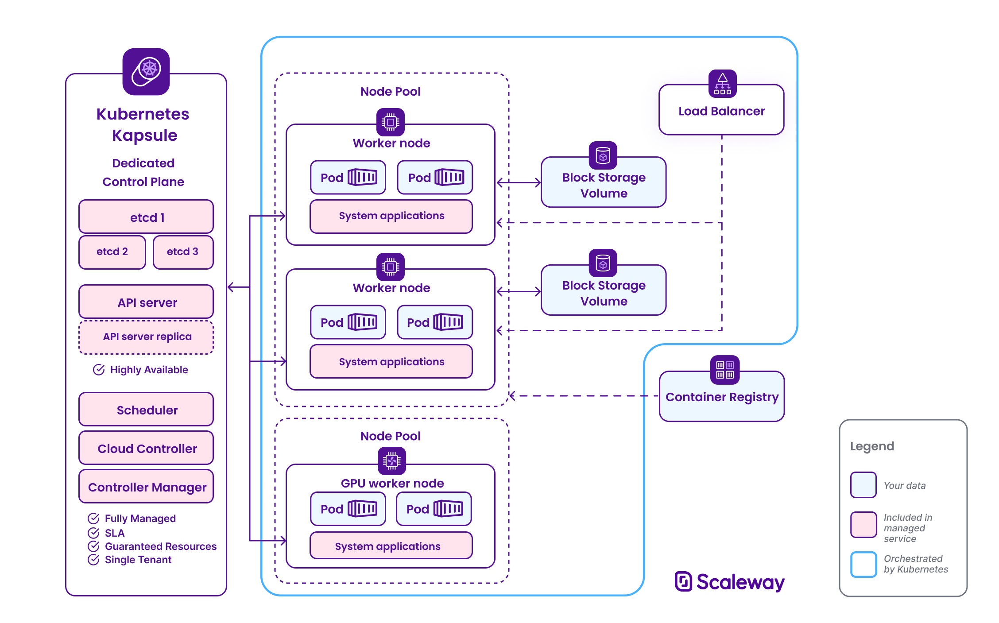
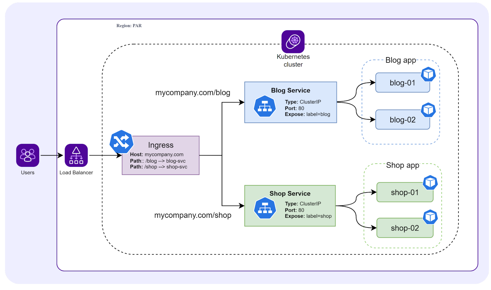

# Cloud Kubernetes
CNI internals (Azure CNI, AWS VPC CNI), workloads (Deployments, StatefulSets, sidecars, probes), AKS- and EKS-specific topics (egress, SNAT, IRSA webhook, workload identity), Ingress/Gateway API, kubeadm and kubeconfig.

See also: [`kubernetes.md`](kubernetes.md) (architecture overview) · [`kube-networking.md`](kube-networking.md) · [`rbac-and-identity.md`](rbac-and-identity.md)

### CNI Routes: How Pods Are Reached
Every node needs to know how to reach every Pod in the cluster. But how this works depends on the CNI plugin.

Example: A 3-Node cluster with 6 Pods total
```sh
Node 1 (10.0.1.10)              Node 2 (10.0.1.11)              Node 3 (10.0.1.12)
Pod CIDR: 10.244.0.0/24         Pod CIDR: 10.244.1.0/24         Pod CIDR: 10.244.2.0/24

+-----------------------+        +-----------------------+        +-----------------------+
| Pod A: 10.244.0.2     |        | Pod C: 10.244.1.2     |        | Pod E: 10.244.2.2     |
| Pod B: 10.244.0.3     |        | Pod D: 10.244.1.3     |        | Pod F: 10.244.2.3     |
+-----------------------+        +-----------------------+        +-----------------------+
```
What Node 1's route table looks like:
```sh
# Routes on Node 1
ip route show

# LOCAL pods (direct, via veth pairs on this node)
10.244.0.2 dev veth1234     # Pod A — directly connected
10.244.0.3 dev veth5678     # Pod B — directly connected

# REMOTE pods (via tunnels or direct routing to other nodes)
10.244.1.0/24 via 10.0.1.11  # "Everything in 10.244.1.x? Send to Node 2"
10.244.2.0/24 via 10.0.1.12  # "Everything in 10.244.2.x? Send to Node 3"
```
So even if Node 2 has 50 Pods, Node 1 just has one route: 10.244.1.0/24 via Node 2. The routing is done at the subnet level, not the individual Pod level.

### Kube-Proxy Rules: The Real Scaling Problem
This is where it gets painful. Unlike CNI routes, `kube-proxy` creates rules for every `Service` AND every `Endpoint` in the entire cluster, on every single node
```sh
CLUSTER: 500 Services, each backed by 3 Pods = 1,500 Endpoints

EVERY NODE gets ALL of these rules, even if the node runs zero Pods:

+------------------------------------------------------------------+
|  Node 1 iptables rules:                                          |
|                                                                  |
|  KUBE-SERVICES chain:                                            |
|    500 rules  (one per Service ClusterIP)                        |
|                                                                  |
|  KUBE-SVC-* chains:                                              |
|    500 chains (one per Service, each with 3 probability rules)   |
|    = 1,500 rules                                                 |
|                                                                  |
|  KUBE-SEP-* chains:                                              |
|    1,500 chains (one per Endpoint, each with a DNAT rule)        |
|    = 1,500 rules                                                 |
|                                                                  |
|  TOTAL: ~3,500 iptables rules on this ONE node                   |
+------------------------------------------------------------------+

+------------------------------------------------------------------+
|  Node 2: EXACT SAME 3,500 rules                                  |
|  Node 3: EXACT SAME 3,500 rules                                  |
|  ...                                                             |
|  Node 500: EXACT SAME 3,500 rules                                |
+------------------------------------------------------------------+
```
Why every node? Because any Pod on any node might try to reach any Service. The iptables rules are evaluated locally in the kernel, so they must exist everywhere.

## NETWORKING
### Network Policies (Pod-level firewall) 
Network Policies — The Pod-Level Firewall
```yaml
apiVersion: networking.k8s.io/v1
kind: NetworkPolicy
metadata:
  name: payment-isolation
  namespace: production
spec:
  podSelector:
    matchLabels:
      app: payment-service
  policyTypes: ["Ingress", "Egress"]
  ingress:
    - from:
        - podSelector:
            matchLabels:
              app: api-gateway          # ONLY the API gateway can talk to payment
      ports:
        - port: 8080
  egress:
    - to:
        - podSelector:
            matchLabels:
              app: postgres             # Payment can ONLY talk to Postgres
      ports:
        - port: 5432
    - to:                               # And DNS (required for service discovery)
        - namespaceSelector: {}
          podSelector:
            matchLabels:
              k8s-app: kube-dns
      ports:
        - port: 53
          protocol: UDP
```          

Pod Anti-Affinity — Spread Replicas Across Failure Domains
```yaml
# "Never put two replicas of this app on the same node"
spec:
  affinity:
    podAntiAffinity:
      requiredDuringSchedulingIgnoredDuringExecution:
        - labelSelector:
            matchLabels:
              app: payment-service
          topologyKey: kubernetes.io/hostname    # One per node
```
```yaml
spec:
  affinity:
    nodeAffinity:
      requiredDuringSchedulingIgnoredDuringExecution:      # HARD requirement
        nodeSelectorTerms:
          - matchExpressions:
              - key: topology.kubernetes.io/zone
                operator: In
                values: ["us-east-1a", "us-east-1b"]
      preferredDuringSchedulingIgnoredDuringExecution:     # SOFT preference
        - weight: 80
          preference:
            matchExpressions:
              - key: node-type
                operator: In
                values: ["high-memory"]
```                                          
### Probes (Startup, Liveness, Readiness)  
Probes — How K8s Knows If Your App Is Healthy
```yaml
containers:
  - name: app
    image: my-app:v2
    
    startupProbe:              # "Has the app finished booting?"
      httpGet:                 # Slow-starting apps (Java, .NET) need this
        path: /healthz         # Until this passes, K8s won't check the other probes
        port: 8080
      failureThreshold: 30     # Give it 30 * 10s = 5 minutes to boot
      periodSeconds: 10

    livenessProbe:             # "Is the app still alive, or is it deadlocked?"
      httpGet:                 # If this FAILS, K8s KILLS and RESTARTS the container
        path: /healthz
        port: 8080
      periodSeconds: 15
      failureThreshold: 3

    readinessProbe:            # "Can the app accept traffic right now?"
      httpGet:                 # If this FAILS, K8s REMOVES the pod from the Service
        path: /ready           # endpoints. Traffic stops flowing to it but it is NOT killed
        port: 8080
      periodSeconds: 5
      failureThreshold: 3
 ```                         
### Blue/Green and Canary strategies   
```sh
ROLLING UPDATE (default):
  v1: [####]  v2: []
  v1: [###]   v2: [#]
  v1: [##]    v2: [##]
  v1: [#]     v2: [###]
  v1: []      v2: [####]

BLUE/GREEN:
  v1 (Blue):  [####]  <-- All traffic here
  v2 (Green): [####]  <-- Deployed, tested, no traffic
  --- Switch Service selector ---
  v1 (Blue):  [####]  <-- No traffic (keep as rollback)
  v2 (Green): [####]  <-- All traffic here now

CANARY:
  v1: [####]  <-- 95% traffic
  v2: [#]     <-- 5% traffic (monitor for errors)
  If OK:
  v1: [###]   <-- 75% traffic
  v2: [##]    <-- 25% traffic
  If OK:
  v1: []      <-- 0%
  v2: [####]  <-- 100%
```                   
### HPA, VPA, Cluster Autoscaler    
```yaml
apiVersion: autoscaling/v2
kind: HorizontalPodAutoscaler
metadata:
  name: payment-hpa
spec:
  scaleTargetRef:
    apiVersion: apps/v1
    kind: Deployment
    name: payment-service
  minReplicas: 3
  maxReplicas: 100
  metrics:
    - type: Resource
      resource:
        name: cpu
        target:
          type: Utilization
          averageUtilization: 70     # Scale up when average CPU > 70%
    - type: Resource
      resource:
        name: memory
        target:
          type: Utilization
          averageUtilization: 80
```                             

## Ecosystem
- CRDs and Operators
- Helm, Kustomize
- ArgoCD / Flux (GitOps)

`kubeadm` is the official tool for bootstrapping a Kubernetes cluster from scratch. It is how you turn a set of bare Linux machines (VMs, bare metal, cloud instances) into a functioning Kubernetes cluster.

The Two-Command Cluster
On the control plane machine:
`kubeadm init --pod-network-cidr=10.244.0.0/16`
On every worker node: 
```sh
kubeadm join 192.168.1.100:6443 --token abcdef.0123456789abcdef \
  --discovery-token-ca-cert-hash sha256:1234567890abcdef...
```
```sh
+-------------------------------------------------------------------+
|  kubeadm init                                                     |
|                                                                   |
|  Step 1: PREFLIGHT CHECKS                                         |
|    - Is this machine Linux? ✓                                     |
|    - Is swap disabled? ✓  (K8s hates swap)                        |
|    - Is a container runtime installed? ✓                          |
|    - Are required ports free? (6443, 2379, 10250...) ✓            |
|                                                                   |
|  Step 2: GENERATE CERTIFICATES                                    |
|    - /etc/kubernetes/pki/ca.crt + ca.key         (Cluster CA)     |
|    - /etc/kubernetes/pki/apiserver.crt + .key    (API server TLS) |
|    - /etc/kubernetes/pki/etcd/ca.crt + .key      (etcd CA)        |
|    - /etc/kubernetes/pki/front-proxy-ca.crt      (Aggregation)    |
|    - /etc/kubernetes/pki/sa.key + sa.pub        (SA token signing)|
|    Total: ~10 certificate files                                   |
|                                                                   |
|  Step 3: GENERATE KUBECONFIGS                                     |
|    - /etc/kubernetes/admin.conf          (cluster-admin access)   |
|    - /etc/kubernetes/kubelet.conf        (this node's kubelet)    |
|    - /etc/kubernetes/controller-manager.conf                      |
|    - /etc/kubernetes/scheduler.conf                               |
|                                                                   |
|  Step 4: START ETCD                                               |
|    - Runs as a static Pod (YAML in /etc/kubernetes/manifests/)    |
|    - The kubelet watches this directory and starts whatever is    |
|      there, even before the API server exists                     |
|                                                                   |
|  Step 5: START CONTROL PLANE COMPONENTS                           |
|    - kube-apiserver      (static Pod)                             |
|    - kube-controller-manager (static Pod)                         |
|    - kube-scheduler      (static Pod)                             |
|    All are dropped as YAML files into /etc/kubernetes/manifests/  |
|                                                                   |
|  Step 6: UPLOAD CONFIG                                            |
|    - Stores the cluster config as a ConfigMap in kube-system      |
|      so that `kubeadm join` on worker nodes can discover it       |
|                                                                   |
|  Step 7: GENERATE BOOTSTRAP TOKEN                                 |
|    - Creates a temporary token (valid 24 hours)                   |
|    - Worker nodes use this to authenticate their first request    |
|                                                                   |
|  Step 8: INSTALL ADDONS                                           |
|    - CoreDNS (cluster DNS)                                        |
|    - kube-proxy (DaemonSet)                                       |
+-------------------------------------------------------------------+

OUTPUT:
  "Your Kubernetes control-plane has initialized successfully!"
  "To start using your cluster, run:"
  "  mkdir -p $HOME/.kube"
  "  sudo cp /etc/kubernetes/admin.conf $HOME/.kube/config"
  ""
  "Then join worker nodes with:"
  "  kubeadm join 192.168.1.100:6443 --token abcdef.012345 \"
  "    --discovery-token-ca-cert-hash sha256:1234..."
  ```

### The Static Pods Trick
One of the most clever design decisions in kubeadm: How do you start the API server if the API server doesn't exist yet?

The answer is Static Pods. The `kubelet` has a special feature: it watches a local directory (/`etc/kubernetes/manifests/`) for YAML files. If it finds a Pod manifest there, it starts it directly — no API server needed.
```sh
/etc/kubernetes/manifests/
├── etcd.yaml                    # Static Pod
├── kube-apiserver.yaml          # Static Pod
├── kube-controller-manager.yaml # Static Pod
└── kube-scheduler.yaml          # Static Pod

The kubelet reads these files directly from disk,
starts the containers, and keeps them alive.
No API server is required. This is how the
control plane bootstraps itself.
```

- kubelet starts (it's a systemd service)
- kubelet sees YAML files in `/etc/kubernetes/manifests/`
- kubelet starts etcd as a container
- kubelet starts the API server as a container
- The API server connects to etcd
- Now the cluster exists, and everything else can be scheduled normally

### 1. Create Namespace and Secret

```bash
# Create dedicated namespace
kubectl create namespace my-namespace
# Create Secret with AWS credentials
kubectl create secret generic aws-creds \
  --namespace my-namespace \
  --from-literal=aws_access_key_id=YOUR_ACCESS_KEY_ID \
  --from-literal=aws_secret_access_key=YOUR_SECRET_ACCESS_KEY

# Create a ServiceAccount that will be used by the Pod
kubectl create serviceaccount aws-sa \
  --namespace my-namespace 

# Bind the ServiceAccount to a Role with permissions to read the Secret
kubectl create role aws-secret-reader \
  --namespace my-namespace \
  --verb=get \
  --resource=secrets  

kubectl create rolebinding aws-secret-reader-binding \
  --namespace my-namespace \
  --role=aws-secret-reader \
  --serviceaccount=my-namespace:aws-sa
  
# Create Kubernetes secret from .env file
kubectl create secret generic app-config \
  --namespace my-namespace \
  --from-env-file=./config.env

# Or, from a different working directory:
kubectl -n my-namespace create secret generic app-env --from-env-file=.env
```

### 2. Deploy All Resources
Using Kustomize (recommended):

```bash
kubectl apply -k .
```
Or apply individual manifests:

```bash
kubectl apply -f namespace.yaml
kubectl apply -f postgres-statefulset.yaml
kubectl apply -f postgres-service.yaml
kubectl apply -f my-namespace-deployment.yaml
kubectl apply -f my-namespace-service.yaml
kubectl apply -f my-namespace-client-deployment.yaml
kubectl apply -f my-namespace-client-service.yaml
kubectl apply -f ingress.yaml
```
### Database Connection

Connect to PostgreSQL:
```bash
kubectl exec -n my-namespace -it $(kubectl get pods -n my-namespace -l app=postgres -o jsonpath="{.items[0].metadata.name}") -- psql -U postgres
```

Check Persistent Volume Claims:
```bash
kubectl -n my-namespace get pvc
```

Describe PVC for issues:
```bash
kubectl -n my-namespace describe pvc postgres-pvc
``` 
**Use external secret management** (HashiCorp Vault, AWS Secrets Manager, Azure Key Vault)

### Secret Management Strategies
Applications require several secrets (database credentials, JWT secret, encryption key, etc.). The recommended approach is to use **infrastructure-level secret injection** rather than storing secrets in `.env` files or passing them directly as environment variables.

### Option 1: External Secrets Operator (Recommended)
The [External Secrets Operator](https://external-secrets.io/) syncs secrets from external providers into Kubernetes Secrets.

```yaml
# Install External Secrets Operator
helm repo add external-secrets https://charts.external-secrets.io
helm install external-secrets external-secrets/external-secrets \
-n external-secrets --create-namespace
```
Example SecretStore for AWS Secrets Manager:
```yaml
apiVersion: external-secrets.io/v1
kind: SecretStore
metadata:
    name: aws-secrets-manager
    namespace: my-namespace
spec:
    provider:
        aws:
            service: SecretsManager
            region: eu-central-1
            auth:
                jwt:
                    serviceAccountRef:
                        name: my-namespace-sa
---
apiVersion: external-secrets.io/v1
kind: ExternalSecret
metadata:
    name: my-namespace-secrets
    namespace: my-namespace
spec:
    refreshInterval: 1h
    secretStoreRef:
        name: aws-secrets-manager
        kind: SecretStore
    target:
        name: my-namespace-env
        creationPolicy: Owner
    data:
        - secretKey: DB_PASSWORD
          remoteRef:
              key: my-namespace/production
              property: db_password
        - secretKey: MASTER_SECRET
          remoteRef:
              key: my-namespace/production
              property: master_secret
        - secretKey: AUTH_CLIENT_SECRET
          remoteRef:
              key: my-namespace/production
              property: auth_client_secret
```
### CoreDNS — How Service Discovery Actually Works
When your app calls `http://payment-service:8080`, how does Linux inside the container resolve payment-service to a ClusterIP?

The kubelet configures every Pod's resolv.conf:
```sh
# Inside any Pod:
cat /etc/resolv.conf

nameserver 10.96.0.10           # <-- CoreDNS ClusterIP (a Service itself!)
search production.svc.cluster.local svc.cluster.local cluster.local
ndots: 5
```
The DNS resolution chain:
```sh
App calls: "payment-service"
Step 1: ndots:5 means if the name has fewer than 5 dots, the system appends the search domains and tries each:
  Try: payment-service.production.svc.cluster.local  --> FOUND! Returns 10.96.0.100
  Try: payment-service.svc.cluster.local             (would try if first failed)
  Try: payment-service.cluster.local                 (would try if second failed)
  Try: payment-service                               (absolute, last resort)

Step 2: CoreDNS receives the query, looks up the Service
        "payment-service" in namespace "production",
        and returns the ClusterIP.
```        

| Record | Example | Resolves To |
|---|---|---|
| A record (Service) | payment-service.production.svc.cluster.local | ClusterIP (10.96.0.100) |
| A record (Pod) | 10-244-1-10.production.pod.cluster.local | Pod IP (10.244.1.10) |
| SRV record | _http._tcp.payment-service.production.svc.cluster.local | Port + host for each endpoint |
| A record (Headless Service) | payment-service.production.svc.cluster.local | Returns ALL Pod IPs directly (no ClusterIP) |

Headless Services (`clusterIP: None`) are critical for StatefulSets:
```yaml
apiVersion: v1
kind: Service
metadata:
  name: postgres
  namespace: production
spec:
  clusterIP: None            # <-- Headless! No virtual IP.
  selector:
    app: postgres
  ports:
    - port: 5432
```
Instead of returning one fake ClusterIP, CoreDNS returns the actual Pod IPs. Each StatefulSet pod also gets a unique DNS name:
```sh
postgres-0.postgres.production.svc.cluster.local  -->  10.244.1.10
postgres-1.postgres.production.svc.cluster.local  -->  10.244.2.11
postgres-2.postgres.production.svc.cluster.local  -->  10.244.3.12
```
This is how database replicas find each other.    

### Init Containers & Sidecars
Init Containers run BEFORE your main container starts. They run sequentially, one at a time, and must all succeed before the main container starts.
```yaml
apiVersion: v1
kind: Pod
metadata:
  name: my-app
spec:
  initContainers:
    # 1. Wait for the database to be ready
    - name: wait-for-db
      image: busybox
      command: ['sh', '-c', 'until nc -z postgres 5432; do sleep 2; done']

    # 2. Run database migrations
    - name: run-migrations
      image: my-app:v2
      command: ['./migrate', '--up']

  containers:
    # 3. Only THEN start the actual app
    - name: app
      image: my-app:v2
 ```
 Sidecar Containers (native sidecar support: alpha in K8s 1.28, beta default-on in 1.29, GA in 1.33) run alongside your main container for the entire Pod lifecycle. Common sidecars:
 ```yaml
 spec:
  initContainers:
    # Native sidecar: restartPolicy: Always makes it a TRUE sidecar
    - name: log-shipper
      image: fluent-bit:latest
      restartPolicy: Always          # <-- This is what makes it a sidecar, not an init container
      volumeMounts:
        - name: logs
          mountPath: /var/log/app

  containers:
    - name: app
      image: my-app:v2
      volumeMounts:
        - name: logs
          mountPath: /var/log/app

  volumes:
    - name: logs
      emptyDir: {}
 ```
 ```yaml
 # vault agent sidecar for dynamic secrets
 initContainers:
    - name: vault-agent
      image: vault:latest
      command: ["vault", "agent", "-config=/vault/config/agent.hcl"]
      volumeMounts:
        - name: vault-config
          mountPath: /vault/config
        - name: vault-secrets
          mountPath: /vault/secrets
  containers:
    - name: app
      image: my-app:v2
      volumeMounts:
        - name: vault-secrets
          mountPath: /app/secrets
  volumes:
    - name: vault-config
      configMap:
        name: vault-agent-config
    - name: vault-secrets
      emptyDir: {}
 ```

 ### Stateful Sets & Persistent Volumes
 ```sh
 Deployment Pods:              StatefulSet Pods:
  my-app-7b9f4d-x2k9m          postgres-0
  my-app-7b9f4d-r8m2n          postgres-1
  my-app-7b9f4d-p3k7j          postgres-2
  (random names, interchangeable)  (ordered, sticky, unique)
  ```

| Property | Deployment | StatefulSet |
|---|---|---|
| Pod names | Random hash | Ordered index (-0, -1, -2) |
| Startup order | All at once | Sequential (-0 first, then -1, then -2) |
| Shutdown order | All at once | Reverse sequential (-2 first, then -1, then -0) |
| Storage | Shared or no PVC | Each Pod gets its OWN dedicated PVC that survives restarts |
| Network identity | Random, changes on restart | Stable DNS name via Headless Service |

```yaml
apiVersion: apps/v1
kind: StatefulSet
metadata:
  name: postgres
spec:
  serviceName: postgres          # Must point to a Headless Service
  replicas: 3
  selector:
    matchLabels:
      app: postgres
  template:
    metadata:
      labels:
        app: postgres
    spec:
      containers:
        - name: postgres
          image: postgres:15
          ports:
            - containerPort: 5432
          volumeMounts:
            - name: data
              mountPath: /var/lib/postgresql/data
  volumeClaimTemplates:           # <-- Each Pod gets its OWN PVC
    - metadata:
        name: data
      spec:
        accessModes: ["ReadWriteOnce"]
        resources:
          requests:
            storage: 100Gi
```
```sh
Pod: postgres-0  -->  PVC: data-postgres-0  -->  PV: 100GB EBS volume (us-east-1a)
Pod: postgres-1  -->  PVC: data-postgres-1  -->  PV: 100GB EBS volume (us-east-1b)
Pod: postgres-2  -->  PVC: data-postgres-2  -->  PV: 100GB EBS volume (us-east-1c)
```
If `postgres-1` crashes and restarts, it reattaches to `data-postgres-1`. The data survives.

### Kubernetes Audit Logging
For compliance (SOC2, HIPAA, PCI-DSS), you need a record of every single API call made to the cluster
```yaml
# /etc/kubernetes/audit-policy.yaml
apiVersion: audit.k8s.io/v1
kind: Policy
rules:
  # Log all Secret access at the highest level (who read what password?)
  - level: RequestResponse
    resources:
      - group: ""
        resources: ["secrets"]

  # Log all RBAC changes
  - level: RequestResponse
    resources:
      - group: "rbac.authorization.k8s.io"
        resources: ["roles", "rolebindings", "clusterroles", "clusterrolebindings"]

  # Log Pod exec (who shelled into what container?)
  - level: Request
    resources:
      - group: ""
        resources: ["pods/exec", "pods/attach"]

  # Log everything else at metadata level (who did what, but not the body)
  - level: Metadata
    omitStages: ["RequestReceived"]
```    
Audit levels:
```sh
None            -->  Don't log this event
Metadata        -->  Log who, what, when (but not the request/response body)
Request         -->  Log metadata + request body
RequestResponse -->  Log metadata + request body + response body (most verbose)
```
A sample audit log entry:
```json
{
  "kind": "Event",
  "apiVersion": "audit.k8s.io/v1",
  "metadata": {
    "creationTimestamp": "2024-06-01T12:00:00Z"
  },
  "level": "RequestResponse",
  "timestamp": "2024-06-01T12:00:00Z",
  "auditID": "12345678-90ab-cdef-1234-567890abcdef",
  "stage": "ResponseComplete",
  "requestURI": "/api/v1/namespaces/production/secrets/my-secret",
  "verb": "get",
  "user": {
    "username": "alice",
    "uid": "abcdef123456",
    "groups": ["developers", "system:authenticated"]
  },
  "sourceIPs": ["192.168.1.1"],
  "userAgent": "kubectl/v1.28.0",
  "responseStatus": {
    "metadata": {},
    "code": 200
  },
  "requestObject": {  
    "kind": "Secret",
    "apiVersion": "v1",
    "metadata": {
      "name": "my-secret",
      "namespace": "production"
    }
  },
  "responseObject": {
    "kind": "Secret",
    "apiVersion": "v1",
    "metadata": {
      "name": "my-secret",  
      "namespace": "production"
    },
    "data": {
      "password": "cGFzc3dvcmQxMjM="  # Base64 encoded "password123"
    }
  }
}
```
```json
{
  "kind": "Event",
  "apiVersion": "audit.k8s.io/v1",
  "level": "RequestResponse",
  "verb": "get",
  "user": {
    "username": "oidc:jane@company.com",
    "groups": ["oidc:platform-team"]
  },
  "objectRef": {
    "resource": "secrets",
    "namespace": "production",
    "name": "db-credentials"
  },
  "sourceIPs": ["10.0.1.50"],
  "requestReceivedTimestamp": "2026-04-10T14:23:01Z",
  "responseStatus": {
    "code": 200
  }
}
```

## Multi-Cluster Patterns
At true enterprise scale, you don't have one cluster. You have many.
```sh
+------------------+     +------------------+     +------------------+
|  prod-us-east    |     |  prod-eu-west    |     |  staging         |
|  (EKS cluster)   |     |  (EKS cluster)   |     |  (EKS cluster)   |
+------------------+     +------------------+     +------------------+
         |                        |                        |
         +------------------------+------------------------+
                                  |
                    +-------------+-------------+
                    | Management Layer          |
                    | (ArgoCD / Rancher / Fleet)|
                    +---------------------------+
```                    

### Certificate Rotation
`kubeadm` certificates expire after 1 year by default. If you forget to renew them, one morning the API server stops accepting connections and the entire cluster is dead.
```sh
# Check when certs expire:
kubeadm certs check-expiration

# Output:
# CERTIFICATE                EXPIRES                  RESIDUAL TIME
# admin.conf                 Apr 10, 2027 00:00 UTC   364d
# apiserver                  Apr 10, 2027 00:00 UTC   364d
# etcd-server                Apr 10, 2027 00:00 UTC   364d
# ...

# Renew all certs:
kubeadm certs renew all

# Then restart control plane static pods:
# (kubeadm doesn't do this automatically)
kill $(crictl ps | grep kube-apiserver | awk '{print $1}')
```
### Azure Kubernetes Service (AKS)
AKS is Microsoft's managed Kubernetes offering. The critical thing to understand: Microsoft manages the control plane for free. You only pay for the worker nodes (VMs).

```sh
+------------------------------------------------------------------+
| MICROSOFT MANAGES (You never see or touch these)                 |
|                                                                  |
| +------------------+  +------------------+  +------------------+ |
| | kube-apiserver   |  | kube-scheduler   |  | controller-mgr   | |
| | (3 replicas, HA) |  |                  |  |                  | |
| +------------------+  +------------------+  +------------------+ |
| +------------------+                                             |
| | etcd             |  - Automatic upgrades                       |
| | (managed, backed |  - Automatic certificate rotation           |
| |  up by Azure)    |  - SLA: 99.95% (paid) or 99.5% (free)       |
| +------------------+                                             |
+------------------------------------------------------------------+
                                |
                                | (API server endpoint:
                                |  https://mycluster-dns-abc123.hcp.eastus.azmk8s.io:443)
                                |
                                v
+------------------------------------------------------------------+
|  YOU MANAGE                                                      |
|                                                                  |
|  +-----------------------------+ +-----------------------------+ |
|  | Node Pool 1 ("system")     | | Node Pool 2 ("gpu")         |  |
|  | VM Size: Standard_D4s_v5   | | VM Size: Standard_NC6s_v3   |  |
|  | Nodes: 3                   | | Nodes: 2                    |  |
|  | OS: Ubuntu / Azure Linux   | | OS: Ubuntu                  |  |
|  |                            | |                             |  |
|  | +------+ +------+ +------+ | | +------+ +------+           |  |
|  | |Node 1 | |Node 2 | |Node 3 | | Node 1| |Node 2 |          |  |
|  | |kubelet| |kubelet| |kubelet| |kubelet| |kubelet|          |  |
|  | +------+ +------+ +------+  | | +------+ +------+          |  |
|  +-----------------------------+ +-----------------------------+ |
|                                                                  |
|  Your Pods, Services, Ingresses, RBAC, Secrets, etc.             |
+------------------------------------------------------------------+
```

### Creating an AKS Cluster
Using Azure CLI:
```bash
# Create a resource group
az group create --name my-aks-group --location eastus
# Create an AKS cluster with 3 nodes in the "system" node pool
az aks create \
  --resource-group my-aks-group \
  --name my-aks-cluster \
  --node-count 3 \
  --node-vm-size Standard_D4s_v5 \
  --generate-ssh-keys
# Get kubeconfig to connect with kubectl
az aks get-credentials --resource-group my-aks-group --name my-aks-cluster


# Verify
kubectl get nodes
```

Using Terraform:
```hcl
resource "azurerm_kubernetes_cluster" "prod" {
  name                = "prod-cluster"
  location            = "eastus"
  resource_group_name = azurerm_resource_group.main.name
  dns_prefix          = "prod"
  kubernetes_version  = "1.30"
  sku_tier            = "Standard"
  oidc_issuer_enabled = true
  workload_identity_enabled = true

  default_node_pool {
    name                = "system"
    node_count          = 3
    vm_size             = "Standard_D4s_v5"
    zones               = [1, 2, 3]
    os_disk_size_gb     = 128
    max_pods            = 110
    enable_auto_scaling = true
    min_count           = 3
    max_count           = 10
  }

  identity {
    type = "SystemAssigned"
  }

  network_profile {
    network_plugin    = "azure"
    network_policy    = "calico"
    load_balancer_sku = "standard"
    service_cidr      = "10.0.0.0/16"
    dns_service_ip    = "10.0.0.10"
  }
}
```
### Azure Kubernetes Service (AKS) Networking

```sh
KUBENET (basic, default):
+------------------------------------------------------------------+
|  Azure VNet: 10.0.0.0/16                                         |
|                                                                  |
|  Node 1: 10.0.1.4 (real Azure IP)                                |
|    Pod A: 10.244.0.2  (Pod network, NOT on the VNet)             |
|    Pod B: 10.244.0.3  (Pod network, NOT on the VNet)             |
|                                                                  |
|  Node 2: 10.0.1.5 (real Azure IP)                                |
|    Pod C: 10.244.1.2  (Pod network, NOT on the VNet)             |
|                                                                  |
|  Problem: Pods have IPs from a SEPARATE overlay network.         |
|  Azure services (VMs, databases) cannot reach Pod IPs directly.  |
|  Requires NAT (SNAT) for outbound traffic.                       |
|  Max 400 nodes per cluster.                                      |
+------------------------------------------------------------------+

AZURE CNI (advanced, recommended for production):
+------------------------------------------------------------------+
|  Azure VNet: 10.0.0.0/16                                         |
|  Subnet: 10.0.1.0/24                                             |
|                                                                  |
|  Node 1: 10.0.1.4 (real Azure IP)                                |
|    Pod A: 10.0.1.10 (REAL Azure IP from the SAME subnet!)        |
|    Pod B: 10.0.1.11 (REAL Azure IP from the SAME subnet!)        |
|                                                                  |
|  Node 2: 10.0.1.5 (real Azure IP)                                |
|    Pod C: 10.0.1.20 (REAL Azure IP from the SAME subnet!)        |
|                                                                  |
|  Benefit: Pods are first-class citizens on the Azure network.    |
|  Azure VMs, Private Endpoints, and other services can reach      |
|  Pod IPs directly. No NAT needed. No overlay network.            |
|  BUT: You burn through IP addresses FAST.                        |
|  30 pods/node * 100 nodes = 3,000 IPs from your subnet.          |
+------------------------------------------------------------------+

AZURE CNI OVERLAY (newer, best of both worlds):
+------------------------------------------------------------------+
|  Pods get overlay IPs (10.244.x.x) like kubenet,                 |
|  BUT routing is handled by Azure CNI (faster, no UDR needed).    |
|  Pods can reach Azure services via the node's real IP (SNAT).    |
|  Supports up to 1,000 nodes and 250 pods/node.                   |
|  Uses far fewer VNet IPs.                                        |
+------------------------------------------------------------------+
```
###  AKS Identity: Managed Identity vs Service Principal
In the old days, AKS clusters used an Azure AD Service Principal (a client ID + client secret). The secret expired every 1-2 years, causing cluster outages if not rotated.

Modern AKS uses Managed Identities — Azure handles the credentials entirely. No secrets to manage or rotate.
```sh
+------------------------------------------------------------------+
|  AKS Cluster Identities                                          |
|                                                                  |
|  1. CLUSTER IDENTITY (control plane)                             |
|     - Used by: AKS to manage Azure resources                     |
|       (load balancers, disks, public IPs, VNets)                 |
|     - Type: System-Assigned Managed Identity                     |
|     - You never see a password or certificate                    |
|                                                                  |
|  2. KUBELET IDENTITY (node-level)                                |
|     - Used by: kubelet on each node                              |
|       (pull images from ACR, attach disks)                       |
|     - Type: User-Assigned Managed Identity                       |
|     - Assigned to the VMSS (node pool)                           |
|                                                                  |
|  3. WORKLOAD IDENTITY (pod-level)                                |
|     - Used by: individual Pods to access Azure resources         |
|     - Type: User-Assigned Managed Identity + Federated Credential|
|     - The IRSA equivalent for Azure                              |
+------------------------------------------------------------------+
```

### AKS Workload Identity (The Azure IRSA Equivalent)
This is the exact same OIDC federation pattern as AWS IRSA, but using Azure AD instead of AWS STS.
```sh
+------------------+          +------------------+          +------------------+
|   Pod in AKS     |          |   Azure AD       |          |  Azure Key Vault |
|   (has K8s JWT)  |          |  (Token Exchange)|          |  (The resource)  |
+--------+---------+          +--------+---------+          +--------+---------+
         |                             |                             |
         |  1. Present K8s JWT         |                             |
         |  to Azure AD                |                             |
         |---------------------------->|                             |
         |                             |                             |
         |  2. Azure AD verifies       |                             |
         |     JWT against AKS         |                             |
         |     OIDC issuer endpoint    |                             |
         |                             |                             |
         |  3. Azure AD checks         |                             |
         |     Federated Credential:   |                             |
         |     "Does this Managed      |                             |
         |      Identity trust this    |                             |
         |      K8s ServiceAccount?"   |                             |
         |                             |                             |
         |  4. Azure AD Token          |                             |
         |     returned                |                             |
         |<----------------------------|                             |
         |                                                           |
         |  5. Access Key Vault with Azure AD token                  |
         |---------------------------------------------------------->|
```         
Setup:
```sh
# 1. Enable OIDC issuer and workload identity on the AKS cluster
az aks update \
  --name my-aks-cluster \
  --resource-group my-aks-group \
  --enable-oidc-issuer \
  --enable-workload-identity

# 2. Create a User-Assigned Managed Identity for the workload
az identity create \
  --name my-workload-identity \
  --resource-group my-aks-group \
  --location eastus

# 3. Create a Federated Credential in Azure AD
#    (the issuer URL is the AKS OIDC issuer, NOT the API server endpoint)
AKS_OIDC_ISSUER="$(az aks show -n my-aks-cluster -g my-aks-group \
  --query oidcIssuerProfile.issuerUrl -o tsv)"

az identity federated-credential create \
  --name my-federated-credential \
  --identity-name my-workload-identity \
  --resource-group my-aks-group \
  --issuer "$AKS_OIDC_ISSUER" \
  --subject system:serviceaccount:production:my-service-account \
  --audience api://AzureADTokenExchange

# 4. Grant the Managed Identity access to Azure Key Vault
az role assignment create \
  --assignee <client-id-of-managed-identity> \
  --role "Key Vault Secrets User" \
  --scope /subscriptions/<subscription-id>/resourceGroups/my-aks-group/providers/Microsoft.KeyVault/vaults/my-key-vault
```
```sh
# 1. Create a Managed Identity
az identity create \
  --name my-app-identity \
  --resource-group myapp-rg

# 2. Create a Federated Credential (the trust link)
az identity federated-credential create \
  --name my-app-fedcred \
  --identity-name my-app-identity \
  --resource-group myapp-rg \
  --issuer "$(az aks show -n prod-cluster -g myapp-rg --query oidcIssuerProfile.issuerUrl -o tsv)" \
  --subject "system:serviceaccount:production:my-app-sa" \
  --audience "api://AzureADTokenExchange"

# 3. Grant the Managed Identity access to Key Vault
az keyvault set-policy \
  --name my-keyvault \
  --object-id "$(az identity show -n my-app-identity -g myapp-rg --query principalId -o tsv)" \
  --secret-permissions get list
```
```sh
# 4. Create the K8s ServiceAccount (annotated with the Managed Identity)
apiVersion: v1
kind: ServiceAccount
metadata:
  name: my-app-sa
  namespace: production
  annotations:
    azure.workload.identity/client-id: "12345678-abcd-efgh-ijkl-123456789012"
  labels:
    azure.workload.identity/use: "true"
---
# 5. Deploy the Pod
apiVersion: apps/v1
kind: Deployment
metadata:
  name: my-app
  namespace: production
spec:
  template:
    metadata:
      labels:
        azure.workload.identity/use: "true"    # Webhook injects env vars
    spec:
      serviceAccountName: my-app-sa
      containers:
        - name: app
          image: myacr.azurecr.io/my-app:v2
          # Azure SDK automatically picks up the injected
          # AZURE_CLIENT_ID, AZURE_TENANT_ID, and
          # AZURE_FEDERATED_TOKEN_FILE environment variables
```

### AKS Networking: Ingress Options
```sh
+------------------------------------------------------------------+
|  OPTION 1: Azure Load Balancer (Layer 4 — default)               |
|                                                                  |
|  Internet --> Azure LB (public IP) --> NodePort --> Pod          |
|  - Created automatically for every Service type: LoadBalancer    |
|  - TCP/UDP only, no HTTP routing                                 |
+------------------------------------------------------------------+

+------------------------------------------------------------------+
|  OPTION 2: NGINX Ingress Controller (Layer 7)                    |
|                                                                  |
|  Internet --> Azure LB --> NGINX Pod --> Pod                     |
|               (auto)      (you install)  (your app)              |
|  - HTTP/HTTPS path-based routing                                 |
|  - TLS termination                                               |
|  - Community standard                                            |
+------------------------------------------------------------------+

+------------------------------------------------------------------+
|  OPTION 3: Application Gateway Ingress Controller (AGIC)         |
|                                                                  |
|  Internet --> Azure App Gateway --> Pod (directly!)              |
|  - Azure-native L7 load balancer                                 |
|  - WAF (Web Application Firewall) built-in                       |
|  - Pods get traffic directly (no kube-proxy/iptables hop)        |
|  - More expensive                                                |
+------------------------------------------------------------------+

+------------------------------------------------------------------+
|  OPTION 4: Azure Gateway API / Istio Service Mesh                |
|  - Newest options, use Gateway API CRDs                          |
+------------------------------------------------------------------+
```

### Node Pools (Multi-Pool Strategy)
```yaml
# Production node pool strategy:

System Pool:        # Runs cluster addons (CoreDNS, kube-proxy, metrics-server)
  VM: Standard_D2s_v5 (2 vCPU, 8GB)
  Nodes: 3
  Taint: CriticalAddonsOnly=true:NoSchedule
  Mode: System

General Pool:       # Runs stateless microservices
  VM: Standard_D4s_v5 (4 vCPU, 16GB)
  Nodes: 3-20 (autoscaling)
  Mode: User

Memory Pool:        # Runs databases, caches (Redis, Elasticsearch)
  VM: Standard_E8s_v5 (8 vCPU, 64GB)
  Nodes: 2-5 (autoscaling)
  Taint: workload=memory:NoSchedule
  Mode: User

GPU Pool:           # Runs ML training/inference
  VM: Standard_NC6s_v3 (6 vCPU, 112GB, 1x V100 GPU)
  Nodes: 0-4 (autoscaling, scale to zero!)
  Taint: workload=gpu:NoSchedule
  Mode: User

Spot Pool:          # Runs batch jobs, non-critical workloads (up to 90% cheaper)
  VM: Standard_D4s_v5
  Nodes: 0-10 (autoscaling)
  Priority: Spot (Azure can evict these anytime!)
  Taint: kubernetes.azure.com/scalesetpriority=spot:NoSchedule
  Mode: User
```

### IRSA Deep Dive: The Two Tokens Inside Your Pod
When IRSA is configured, a Pod actually gets two separate JWTs:
```sh
+------------------------------------------------------------------+
|  Pod: my-app                                                     |
|                                                                  |
|  TOKEN 1 (Default SA Token):                                     |
|  Path: /var/run/secrets/kubernetes.io/serviceaccount/token       |
|  Audience: "https://kubernetes.default.svc"                      |
|  Purpose: Talk to the Kubernetes API server                      |
|  {                                                               |
|    "aud": ["https://kubernetes.default.svc"],  <-- For K8s only  |
|    "sub": "system:serviceaccount:prod:my-app-sa"                 |
|  }                                                               |
|                                                                  |
|  TOKEN 2 (IRSA Projected Token):                                 |
|  Path: /var/run/secrets/eks.amazonaws.com/serviceaccount/token   |
|  Audience: "sts.amazonaws.com"                                   |
|  Purpose: Exchange with AWS STS for cloud credentials            |
|  {                                                               |
|    "aud": ["sts.amazonaws.com"],               <-- For AWS only  |
|    "sub": "system:serviceaccount:prod:my-app-sa"                 |
|  }                                                               |
+------------------------------------------------------------------+
```
Both tokens are signed by the same API server, for the same ServiceAccount. But they have different audiences. AWS STS will reject Token 1 because its `aud` doesn't match `sts.amazonaws.com`. And the K8s API server would reject Token 2 if you tried to use it for `kubectl` operations.

#### How Token 2 gets into the Pod:

The EKS mutating admission webhook modifies your Pod spec before it's saved. You write this:
```yaml
spec:
  serviceAccountName: my-app-sa
  containers:
    - name: app
      image: my-app
```
But what actually gets saved in etcd (after the webhook mutates it) is:
```yaml
spec:
  serviceAccountName: my-app-sa
  containers:
    - name: app
      image: my-app
      # --- INJECTED BY EKS WEBHOOK ---
      env:
        - name: AWS_ROLE_ARN
          value: "arn:aws:iam::123456789012:role/MyAppRole"
        - name: AWS_WEB_IDENTITY_TOKEN_FILE
          value: "/var/run/secrets/eks.amazonaws.com/serviceaccount/token"
      volumeMounts:
        - name: aws-iam-token
          mountPath: /var/run/secrets/eks.amazonaws.com/serviceaccount
          readOnly: true
  # --- INJECTED BY EKS WEBHOOK ---
  volumes:
    - name: aws-iam-token
      projected:
        sources:
          - serviceAccountToken:
              audience: "sts.amazonaws.com"      # <-- Custom audience!
              expirationSeconds: 86400
              path: token
```
The `Kubelet` sees the projected volume with audience: `"sts.amazonaws.com"` and calls the API server's TokenRequest API: "Give me a token for `my-app-sa`, but set the audience to `sts.amazonaws.com`." The API server generates and signs a second, separate JWT.              

The AWS SDK inside the container automatically detects the second token and uses it to get temporary AWS credentials.  
The AWS SDK (boto3 for Python, aws-sdk for Node/Go/Java) has the exchange logic hardcoded into it.

Here is the exact chain from your application's perspective:
```sh
WHO                          DOES WHAT
---                          ---------

You (DevOps):                1. Annotate the ServiceAccount with the IAM Role ARN
                                (eks.amazonaws.com/role-arn: arn:aws:iam::...)
                             2. Set the Pod's serviceAccountName to that SA

EKS Mutating Webhook:        3. Sees the annotated SA on the Pod
(runs inside the API          4. INJECTS env vars:
server admission pipeline)       AWS_ROLE_ARN
                                  AWS_WEB_IDENTITY_TOKEN_FILE
                              5. INJECTS a projected volume with
                                  audience: "sts.amazonaws.com"

Kubelet:                      6. Calls API server TokenRequest API:
                                  "Give me a JWT for my-app-sa
                                   with aud=sts.amazonaws.com"
                              7. Mounts the JWT file into the container

API Server:                   8. Signs the JWT with its private key
                              9. Publishes the public key at the OIDC endpoint

AWS SDK (inside your app):   10. Reads env vars, reads JWT file
                             11. Calls STS.AssumeRoleWithWebIdentity()
                             12. Gets temporary AWS credentials
                             13. Uses them for S3/RDS/SQS/etc.
                             14. Auto-refreshes before expiry

Your application code:       15. Just says: boto3.client('s3')
                                 Knows NOTHING about any of this.
```    
You create two things. A ServiceAccount and a Deployment:
```yaml
apiVersion: v1
kind: ServiceAccount
metadata:
  name: my-app-sa
  namespace: production
  annotations:
    eks.amazonaws.com/role-arn: "arn:aws:iam::123456789012:role/MyAppRole"
 ```
 ```yaml
 apiVersion: apps/v1
kind: Deployment
metadata:
  name: my-app
spec:
  template:
    spec:
      serviceAccountName: my-app-sa
      containers:
        - name: app
          image: my-app:v1
```
When you apply this, the EKS mutating webhook adds the env vars and projected volume to the Pod spec. The kubelet then requests the second token with the correct audience. Your app gets AWS credentials without you having to manage any secrets!
Notice: Your Deployment YAML says NOTHING about AWS, tokens, volumes, or environment variables. It just references the ServiceAccount name.

#### Your YAML Arrives at the API Server
When you run `kubectl apply -f deployment.yaml`, the API server receives the Pod spec. But before saving it to etcd, it passes through the Admission Controller pipeline.
```sh
Your Pod YAML
     |
     v
+----+--------------------------------------------+
|  ADMISSION PIPELINE                             |
|                                                 |
|  AuthN --> AuthZ --> Mutating Webhooks --> ...  |
|                           |                     |
|                           v                     |
|                  +-------------------+          |
|                  | EKS Pod Identity  |          |
|                  | Mutating Webhook  |          |
|                  | (installed by AWS |          |
|                  |  when you created |          |
|                  |  the EKS cluster) |          |
|                  +-------------------+          |
+-------------------------------------------------+
```

#### The EKS Mutating Webhook Intercepts
This webhook runs on AWS-managed control plane infrastructure — it's not a Pod you can see in your `kube-system`. AWS provisions it automatically when you create the EKS cluster, along with a `MutatingWebhookConfiguration` (which you *can* see via `kubectl get mutatingwebhookconfigurations`) that points the API server at it.

The webhook receives the Pod spec and does the following logic:
```sh
WEBHOOK LOGIC:

1. Read the Pod spec.
2. What ServiceAccount does it use? --> "my-app-sa"
3. Look up that ServiceAccount from the API server.
4. Does it have the annotation "eks.amazonaws.com/role-arn"? 
   --> YES: "arn:aws:iam::123456789012:role/MyAppRole"
5. MODIFY THE POD SPEC before it gets saved.
```
#### The Webhook REWRITES Your Pod Spec
This is the critical step. The webhook takes your simple Pod spec and adds things to it. Here is a before/after comparison:
```sh
BEFORE (what you wrote):              AFTER (what gets saved to etcd):
================================      ================================

spec:                                 spec:
  serviceAccountName: my-app-sa         serviceAccountName: my-app-sa
  containers:                           containers:
    - name: app                           - name: app
      image: my-app:v1                      image: my-app:v1
                                            env:                          <-- ADDED
                                              - name: AWS_ROLE_ARN        <-- ADDED
                                                value: "arn:aws:iam::     <-- ADDED
                                                  123456789012:role/      <-- ADDED
                                                  MyAppRole"              <-- ADDED
                                              - name: AWS_WEB_IDENTITY_   <-- ADDED
                                                  TOKEN_FILE              <-- ADDED
                                                value: "/var/run/secrets/ <-- ADDED
                                                  eks.amazonaws.com/      <-- ADDED
                                                  serviceaccount/token"   <-- ADDED
                                            volumeMounts:                 <-- ADDED
                                              - name: aws-iam-token       <-- ADDED
                                                mountPath: /var/run/      <-- ADDED
                                                  secrets/eks.amazonaws.  <-- ADDED
                                                  com/serviceaccount      <-- ADDED
                                                readOnly: true            <-- ADDED
                                        volumes:                          <-- ADDED
                                          - name: aws-iam-token           <-- ADDED
                                            projected:                    <-- ADDED
                                              sources:                    <-- ADDED
                                                - serviceAccountToken:    <-- ADDED
                                                    audience: "sts.       <-- ADDED
                                                      amazonaws.com"      <-- ADDED
                                                    expirationSeconds:    <-- ADDED
                                                      86400               <-- ADDED
                                                    path: token           <-- ADDED
```
The modified version is what gets saved to etcd. Your original version is gone.

#### The Scheduler Assigns the Pod to a Node
Nothing special here. The scheduler picks a node and writes the nodeName into the Pod object.

#### The Kubelet on That Node Sees the Pod
The Kubelet reads the Pod spec from the API server (via the Watch mechanism). It sees there are volumes to mount. It processes each volume:
```sh
KUBELET READS THE POD SPEC:

Volume "aws-iam-token":
  Type: projected
  Source: serviceAccountToken
    audience: "sts.amazonaws.com"
    expirationSeconds: 86400
    path: token

KUBELET THINKS:
  "I need to mount a ServiceAccount token into this Pod.
   But this isn't the normal default token.
   This one has a CUSTOM AUDIENCE: sts.amazonaws.com
   I need to call the API server to get this specific token."
```
#### The Kubelet Calls the API Server's TokenRequest API
```sh
KUBELET --> API SERVER:

POST /api/v1/namespaces/production/serviceaccounts/my-app-sa/token

{
  "apiVersion": "authentication.k8s.io/v1",
  "kind": "TokenRequest",
  "spec": {
    "audiences": ["sts.amazonaws.com"],     <-- "Make the aud claim this"
    "expirationSeconds": 86400,              <-- "Make it valid for 24 hours"
    "boundObjectRef": {
      "kind": "Pod",
      "name": "my-app-7b9f4d-x2k9m",        <-- "Bind it to this specific Pod"
      "uid": "a1b2c3d4-..."                  <-- "If this Pod dies, invalidate the token"
    }
  }
}
```

#### The API Server Signs and Returns the Token
The API server:
- Takes its private signing key (the `--service-account-signing-key-file`)
- Creates a JWT with the requested audience, expiration, and Pod binding
- Signs it
- Returns it to the Kubelet
```sh
API SERVER --> KUBELET:

{
  "status": {
    "token": "eyJhbGciOiJSUzI1NiIs...",     <-- The signed JWT
    "expirationTimestamp": "2026-04-12T14:00:00Z"
  }
}
```
`The Kubelet Writes the Token to a File Inside the Container`  
The Kubelet takes the JWT string and writes it as a plain text file at the mount path:
```sh
INSIDE THE CONTAINER'S FILESYSTEM:

/var/run/secrets/eks.amazonaws.com/serviceaccount/token
  --> Contains: eyJhbGciOiJSUzI1NiIs...  (the raw JWT string)
```

### Kubernetes Admission Webhooks
```
# These will create webhook configurations:
minikube addons enable ingress          # installs ingress-nginx with webhooks
minikube addons enable cert-manager     # installs cert-manager with webhooks
```
```sh
kubectl get validatingwebhookconfigurations
No resources found
minikube addons enable ingress
kubectl get validatingwebhookconfigurations
NAME                      WEBHOOKS   AGE
ingress-nginx-admission   1          15m
```
```sh
TYPE 1: MUTATING WEBHOOK ("Modify the request")
  - Like Express middleware that modifies req.body before the handler sees it
  - CAN change the object
  - Runs FIRST

  Example:
    Request comes in:  { containers: [{ image: "nginx" }] }
    Webhook modifies:  { containers: [{ image: "nginx" }, { image: "istio-proxy" }] }
    What gets saved:   The modified version with the sidecar injected

TYPE 2: VALIDATING WEBHOOK ("Accept or reject the request")
  - Like Express middleware that calls next() or returns 403
  - CANNOT change the object
  - Can only say YES (allow) or NO (deny with a reason)
  - Runs AFTER mutating webhooks

  Example:
    Request comes in:  { containers: [{ securityContext: { runAsRoot: true } }] }
    Webhook response:  { allowed: false, reason: "Running as root is forbidden" }
    Result:            kubectl gets a 403 error. Object is never saved.
```
#### The Exact Pipeline
```sh
    kubectl apply -f pod.yaml
         |
         v
+--------+----------------------------------------------------------+
|  API SERVER REQUEST PIPELINE                                      |
|                                                                   |
|  1. Authentication (AuthN)                                        |
|     "Who are you?" (OIDC token, client cert, SA token)            |
|     Like: passport.js middleware                                  |
|                                                                   |
|  2. Authorization (AuthZ / RBAC)                                  |
|     "Are you allowed to do this?" (Role, ClusterRole)             |
|     Like: checkPermissions() middleware                           |
|                                                                   |
|  3. MUTATING ADMISSION WEBHOOKS  (run in order, can be chained)   |
|     +---------------------------+                                 |
|     | Istio Sidecar Injector    |  Adds envoy proxy container     |
|     +---------------------------+                                 |
|     +---------------------------+                                 |
|     | EKS IRSA Webhook          |  Adds AWS token volume + env    |
|     +---------------------------+                                 |
|     +---------------------------+                                 |
|     | Default SA Admission      |  Adds default SA if none set    |
|     +---------------------------+                                 |
|     +---------------------------+                                 |
|     | Your Custom Webhook       |  Whatever you want              |
|     +---------------------------+                                 |
|                                                                   |
|  4. SCHEMA VALIDATION                                             |
|     "Does this JSON match the OpenAPI spec for this resource?"    |
|     Like: joi/zod validation middleware                           |
|                                                                   |
|  5. VALIDATING ADMISSION WEBHOOKS  (run in parallel, accept/deny) |
|     +---------------------------+                                 |
|     | OPA Gatekeeper            |  "No pods without resource      |
|     |                           |   limits allowed"               |
|     +---------------------------+                                 |
|     +---------------------------+                                 |
|     | Kyverno                   |  "Images must come from our     |
|     |                           |   private registry only"        |
|     +---------------------------+                                 |
|     +---------------------------+                                 |
|     | Your Custom Webhook       |  "Deny if namespace has no      |
|     |                           |   cost-center label"            |
|     +---------------------------+                                 |
|                                                                   |
|  6. PERSIST TO ETCD                                               |
|     Object is saved. Done.                                        |
+-------------------------------------------------------------------+
```
```sh
REGISTRATION (you give K8s your URL):
  You --> "Here is my URL: https://sidecar-injector.kube-system/mutate" --> API Server
          "Call me whenever someone creates a Pod."

EXECUTION (K8s calls your URL when it happens):

  User creates a Pod
       |
       v
  API Server --> POST https://sidecar-injector.kube-system/mutate  --> Your Webhook Pod
                 { "request": { "object": { Pod spec... } } }
                 
  Your Webhook Pod --> Response: { "patch": "add sidecar container" } --> API Server
 ```
 
 Webhook: Runs as a separate service, called over HTTP/HTTPS	eg Kubernetes admission webhooks, GitHub webhooks, Stripe webhooks
 
 ```sh
 1. YOU CREATE a ServiceAccount:
   
   apiVersion: v1
   kind: ServiceAccount
   metadata:
     name: my-app-sa          <-- Just a name. Nothing else.
     namespace: production
   
   At this point, NO token exists yet.

2. YOU CREATE a Pod that references it:
   
   spec:
     serviceAccountName: my-app-sa    <-- "Use this identity"
   
   Still no token. The Pod spec is just saved to etcd.

3. KUBELET starts the Pod on a Node.
   It sees the projected volume and calls the API server:
   
   POST /api/v1/namespaces/production/serviceaccounts/my-app-sa/token
   {
     "spec": {
       "audiences": ["https://kubernetes.default.svc"],
       "expirationSeconds": 3600,
       "boundObjectRef": {
         "kind": "Pod",
         "name": "my-app-7b9f4d-x2k9m",     <-- THIS specific Pod
         "uid": "a1b2c3d4-e5f6-..."          <-- THIS specific Pod instance
       }
     }
   }
   
   NOW the API server generates the token.

4. THE TOKEN contains the ServiceAccount identity inside it:
   
   {
     "sub": "system:serviceaccount:production:my-app-sa",   <-- WHO
     "aud": ["https://kubernetes.default.svc"],              <-- FOR WHOM
     "exp": 1744480000,                                      <-- UNTIL WHEN
     "kubernetes.io": {
       "pod": {
         "name": "my-app-7b9f4d-x2k9m",                     <-- BOUND TO
         "uid": "a1b2c3d4-e5f6-..."                          <-- THIS POD
       },
       "serviceaccount": {
         "name": "my-app-sa",                                <-- THIS SA
         "uid": "f6e5d4c3-b2a1-..."
       }
     }
   }
``` 
#### One ServiceAccount, Many Tokens
A single ServiceAccount can have multiple tokens alive simultaneously:
```sh
ServiceAccount: my-app-sa
  │
  ├── Token for Pod my-app-7b9f4d-x2k9m  (aud: kubernetes API)
  ├── Token for Pod my-app-7b9f4d-x2k9m  (aud: sts.amazonaws.com)  ← IRSA token
  ├── Token for Pod my-app-7b9f4d-r8m2n  (aud: kubernetes API)      ← second replica
  ├── Token for Pod my-app-7b9f4d-r8m2n  (aud: sts.amazonaws.com)
  └── Token for Pod my-app-7b9f4d-p3k7j  (aud: kubernetes API)      ← third replica
 ``` 
 `The default Kubernetes token is ALWAYS created, regardless of whether the ServiceAccount has AWS annotations or not.`
 ```yaml
 apiVersion: v1
kind: ServiceAccount
metadata:
  name: my-app-sa
  namespace: production
  annotations:
    eks.amazonaws.com/role-arn: "arn:aws:iam::123456789012:role/MyAppRole"
 ```  
 When a Pod uses this ServiceAccount, two completely independent systems both act on it:
 ```sh
 SYSTEM 1: Built-in ServiceAccount Admission Controller
  
  READS: serviceAccountName: my-app-sa
  CHECKS: Does the annotation matter?  NO. It ignores ALL annotations.
  ACTION: ALWAYS injects the default K8s token volume.
  
  This system doesn't care about eks.amazonaws.com/role-arn.
  It doesn't even look at annotations.
  It ONLY looks at the serviceAccountName field.
  If a ServiceAccount is referenced, it injects a token. Period.

SYSTEM 2: EKS Mutating Webhook

  READS: serviceAccountName: my-app-sa
  CHECKS: Does the SA have annotation eks.amazonaws.com/role-arn?  YES.
  ACTION: Injects the SECOND token volume + env vars for AWS.
  
  If the annotation didn't exist, this webhook would do NOTHING.
```
```sh
SCENARIO A: SA with AWS annotation
  apiVersion: v1
  kind: ServiceAccount
  metadata:
    name: my-app-sa
    annotations:
      eks.amazonaws.com/role-arn: "arn:aws:iam::..."
  
  RESULT:
    Token 1 (K8s):  ✅ Created (built-in controller, always runs)
    Token 2 (AWS):  ✅ Created (webhook sees annotation)

---

SCENARIO B: SA WITHOUT AWS annotation
  apiVersion: v1
  kind: ServiceAccount
  metadata:
    name: my-app-sa
    # no annotations
  
  RESULT:
    Token 1 (K8s):  ✅ Created (built-in controller, always runs)
    Token 2 (AWS):  ❌ Not created (webhook sees no annotation, does nothing)

---

SCENARIO C: SA with AWS annotation + automountServiceAccountToken: false
  apiVersion: v1
  kind: ServiceAccount
  metadata:
    name: my-app-sa
    annotations:
      eks.amazonaws.com/role-arn: "arn:aws:iam::..."
  automountServiceAccountToken: false      # <-- Disable Token 1
  
  RESULT:
    Token 1 (K8s):  ❌ Suppressed (you explicitly disabled it)
    Token 2 (AWS):  ✅ Created (webhook still sees annotation and injects it)
```   
You cannot prevent a ServiceAccount from being assigned. But you CAN prevent the token from being mounted    

```sh
YOU RUN:
  aws eks create-cluster --name prod-cluster ...

AWS DOES (behind the scenes):
  
  1. Provisions 3 control plane nodes (you never see these)
  2. Installs etcd
  3. Installs kube-apiserver
  4. Installs kube-scheduler
  5. Installs kube-controller-manager
  6. Configures the OIDC issuer endpoint
  7. Installs CoreDNS as a Deployment in kube-system
  8. Installs kube-proxy as a DaemonSet in kube-system
  9. Installs the VPC CNI plugin as a DaemonSet
  
  10. WIRES UP THE IRSA WEBHOOK:                          <-- HERE
      - Runs the pod-identity-webhook on AWS-managed
        control plane infrastructure (not in your
        worker-node kube-system — you can't see the Pod)
      - Creates a MutatingWebhookConfiguration in the
        cluster that tells the API server to call this
        webhook whenever a Pod is created
```
```yaml
apiVersion: v1
kind: ServiceAccount
metadata:
  name: my-serviceaccount
  namespace: default
  annotations:
    eks.amazonaws.com/role-arn: "arn:aws:iam::111122223333:role/s3-reader"
    # optional: Defaults to "sts.amazonaws.com" if not set
    eks.amazonaws.com/audience: "sts.amazonaws.com"
    # optional: When set to "true", adds AWS_STS_REGIONAL_ENDPOINTS env var
    #   to containers
    eks.amazonaws.com/sts-regional-endpoints: "true"
    # optional: Defaults to 86400 for expirationSeconds if not set
    #   Note: This value can be overwritten if specified in the pod 
    #         annotation as shown in the next step.
    eks.amazonaws.com/token-expiration: "86400"
```            
### AKS Egress Options — How Traffic Leaves the Cluster
When a Pod makes an outbound request to the internet (e.g., calling a third-party API, pulling a container image, or hitting an external database), that traffic needs to leave the Azure VNet. How it leaves is the egress question, and it has significant cost, security, and compliance implications.
```sh
+------------------------------------------------------------------+
|  AKS Cluster (inside Azure VNet)                                 |
|                                                                  |
|  Pod: 10.244.0.5  wants to reach https://api.stripe.com          |
|                                                                  |
|  How does this packet leave the VNet?                            |
|                                                                  |
|  OPTION 1: Load Balancer (default)                               |
|  OPTION 2: NAT Gateway (recommended for production)              |
|  OPTION 3: User-Defined Routes + Azure Firewall / NVA            |
|  OPTION 4: Managed NAT Gateway (AKS-managed)                     |
+------------------------------------------------------------------+
```
####  Load Balancer (Default)
When you create an AKS cluster without specifying anything, Azure automatically creates a Standard Load Balancer with a public IP. ALL outbound traffic from ALL Pods is SNAT'd through this load balancer.
```sh
+------------------+     +--------------------+     +------------------+
|  Pod             |     | Azure Load Balancer|     | Internet         |
|  10.244.0.5      |---->| Public IP:         |---->| api.stripe.com   |
|                  |     | 20.120.50.100      |     |                  |
+------------------+     +--------------------+     +------------------+
                          (Source NAT: Pod IP
                           becomes 20.120.50.100)
```
```sh
az aks create \
  --resource-group myapp-rg \
  --name prod-cluster \
  --outbound-type loadBalancer          # <-- Default, you don't need to specify this
```

| Pro | Con |
|---|---|
| Zero config, works out of the box | SNAT port exhaustion at scale. Each public IP gives you ~64,000 SNAT ports. If you have hundreds of Pods making thousands of connections, you run out |
| Can add multiple outbound IPs to get more SNAT ports | Hard to control/audit which IP traffic comes from |
| Cheapest option | All traffic exits through the same public IP(s) — no granular control |


Scaling SNAT ports:
```sh
# Add more outbound IPs to the load balancer (each gives ~64K ports)
az aks update \
  --resource-group myapp-rg \
  --name prod-cluster \
  --load-balancer-managed-outbound-ip-count 5    # 5 IPs = ~320K SNAT ports
```
#### NAT Gateway (Recommended for Production)
A NAT Gateway is a dedicated, fully managed Azure service designed specifically for outbound traffic. It replaces the load balancer as the egress path.
```sh
+------------------+     +--------------------+     +------------------+
|  Pod             |     | Azure NAT Gateway  |     | Internet         |
|  10.244.0.5      |---->| Public IP(s):      |---->| api.stripe.com   |
|                  |     | 20.120.60.10       |     |                  |
+------------------+     | 20.120.60.11       |     +------------------+
                          +--------------------+
                          Up to 16 IPs
                          = 1,024,000+ SNAT ports
                          No port exhaustion concerns
```
```sh
# Create a NAT Gateway
az network nat gateway create \
  --resource-group myapp-rg \
  --name aks-natgw \
  --public-ip-addresses aks-natgw-pip \
  --idle-timeout 10

# Create AKS cluster using NAT Gateway for egress
az aks create \
  --resource-group myapp-rg \
  --name prod-cluster \
  --outbound-type managedNATGateway       # AKS manages the NAT Gateway
  # OR
  --outbound-type userAssignedNATGateway  # You pre-create and manage it yourself
  ```
 ```sh
# One command. AKS does everything.
az aks create \
  --resource-group myapp-rg \
  --name prod-cluster \
  --outbound-type managedNATGateway \
  --nat-gateway-managed-outbound-ip-count 2 \    # 2 public IPs = ~128K SNAT ports
  --nat-gateway-idle-timeout 4                    # TCP idle timeout in minutes
  ```
To find out what public IP your pods are using:
```sh
# Get the outbound IPs
az aks show \
  --resource-group myapp-rg \
  --name prod-cluster \
  --query "networkProfile.natGatewayProfile.effectiveOutboundIPs[].id" -o tsv

# Resolve to actual IP addresses
az network public-ip show --ids <id-from-above> --query "ipAddress" -o tsv
# Output: 20.120.60.10
```
User-Assigned NAT Gateway 
```sh
# STEP 1: You create everything yourself first
az network public-ip create \
  --resource-group myapp-rg \
  --name aks-egress-pip \
  --sku Standard \
  --allocation-method Static

az network nat gateway create \
  --resource-group myapp-rg \
  --name aks-egress-natgw \
  --public-ip-addresses aks-egress-pip \
  --idle-timeout 10

# STEP 2: Attach NAT Gateway to your AKS subnet
az network vnet subnet update \
  --resource-group myapp-rg \
  --vnet-name aks-vnet \
  --name aks-subnet \
  --nat-gateway aks-egress-natgw

# STEP 3: Create AKS and tell it to use whatever NAT Gateway is on the subnet
az aks create \
  --resource-group myapp-rg \
  --name prod-cluster \
  --outbound-type userAssignedNATGateway \       # <-- "I already set it up, just use it"
  --vnet-subnet-id /subscriptions/.../subnets/aks-subnet
```  

| Pro | Con |
|---|---|
| Massive SNAT port capacity (1M+ ports with 16 IPs) | Costs ~$0.045/hr + data processing charges |
| Predictable, stable outbound IP(s) — great for allowlisting | Slightly more complex setup |
| No SNAT port exhaustion | |
| Better performance than LB egress | |

Why predictable IPs matter: If your app calls a third-party API (like Stripe or a partner's firewall), they often need to allowlist your IP address. With a NAT Gateway, you know exactly which IP(s) your traffic comes from

```sh
+-----------------------------------------------------------------+
|  managedNATGateway                                              |
|  WHO MANAGES IT: AKS (Azure creates it for you)                 |
|                                                                 |
|  - AKS creates the NAT Gateway automatically                    |
|  - AKS creates the public IP automatically                      |
|  - AKS attaches it to the node subnet automatically             |
|  - AKS manages the lifecycle (creates, updates, deletes with    |
|    the cluster)                                                 |
|  - You can configure it via AKS CLI flags                       |
|  - You CANNOT share it with other resources outside AKS         |
+-----------------------------------------------------------------+

+-----------------------------------------------------------------+
|  userAssignedNATGateway                                         |
|  WHO MANAGES IT: You (you pre-create it, AKS just uses it)      |
|                                                                 |
|  - YOU create the NAT Gateway in advance                        |
|  - YOU create and assign the public IP(s)                       |
|  - YOU attach it to the subnet                                  |
|  - AKS just uses whatever NAT Gateway is on the subnet          |
|  - You CAN share it with VMs, other services, other clusters    |
|  - You have full control over the NAT Gateway's settings        |
+-----------------------------------------------------------------+
```
#### User-Defined Routes + Azure Firewall (Maximum Control)
For enterprises with strict compliance requirements (finance, healthcare, government), ALL egress traffic must pass through a central inspection point. You route everything through an Azure Firewall or a third-party Network Virtual Appliance (NVA) like Palo Alto

```sh
+------------------+     +--------------------+     +------------------+
|  Pod             |     | Azure Firewall     |     | Internet         |
|  10.244.0.5      |---->| (inspects traffic) |---->| api.stripe.com   |
|                  |     |                    |     |                  |
+------------------+     | Rules:             |     +------------------+
                         | ✓ Allow: stripe.com|
                         | ✓ Allow: acr.io    |
                         | ✗ Deny: *          |
                         +--------------------+
                          All other traffic BLOCKED
```       
```sh
# Create AKS with user-defined routing
az aks create \
  --resource-group myapp-rg \
  --name prod-cluster \
  --outbound-type userDefinedRouting       # <-- No public IP at all on the cluster!
  --vnet-subnet-id /subscriptions/.../subnets/aks-subnet
```
Then you create a Route Table that sends all traffic (0.0.0.0/0) to the Azure Firewall:
```sh
# Create route table
az network route-table create \
  --resource-group myapp-rg \
  --name aks-udr

# Default route: ALL traffic goes to the firewall
az network route-table route create \
  --resource-group myapp-rg \
  --route-table-name aks-udr \
  --name default-route \
  --address-prefix 0.0.0.0/0 \
  --next-hop-type VirtualAppliance \
  --next-hop-ip-address 10.0.3.4          # Azure Firewall's private IP

# Associate route table with the AKS subnet
az network vnet subnet update \
  --resource-group myapp-rg \
  --vnet-name aks-vnet \
  --name aks-subnet \
  --route-table aks-udr
```
Azure Firewall rules (what you allow through):
```sh
REQUIRED for AKS to function (minimum egress rules):

+---------------------------------------------------------------+
| FQDN Rule                              | Port | Purpose       |
+---------------------------------------------------------------+
| *.hcp.<region>.azmk8s.io               | 443  | API server    |
| mcr.microsoft.com                      | 443  | Microsoft     |
|                                        |      | container     |
|                                        |      | registry      |
| *.data.mcr.microsoft.com               | 443  | MCR data      |
| management.azure.com                   | 443  | Azure APIs    |
| login.microsoftonline.com              | 443  | Azure AD auth |
| packages.microsoft.com                 | 443  | OS packages   |
| acs-mirror.azureedge.net               | 443  | OS packages   |
+---------------------------------------------------------------+

YOUR APP-SPECIFIC RULES:
+---------------------------------------------------------------+
| api.stripe.com                         | 443  | Payments      |
| *.s3.amazonaws.com                     | 443  | Cross-cloud   |
| myacr.azurecr.io                       | 443  | Your ACR      |
+---------------------------------------------------------------+

EVERYTHING ELSE: DENIED
```

| Pro | Con |
|---|---|
| Full visibility into ALL egress traffic | Azure Firewall costs $1.25/hr ($900/month) |
| Can block data exfiltration (no unauthorized uploads) | Complex setup |
| Compliance teams love it (SOC2, HIPAA, PCI-DSS) | Must manually allow required AKS FQDNs |
| Can log every outbound connection | Breaking changes if Azure adds new required endpoints |

#### No Egress At All (Private Cluster)
For the most locked-down environments, you can create a fully private cluster where nothing has internet access. The API server itself gets a private IP, not a public one.

```sh
az aks create \
  --resource-group myapp-rg \
  --name prod-cluster \
  --enable-private-cluster \
  --outbound-type none                   # <-- No internet egress at all!
```
```sh
+------------------------------------------------------------------+
|  Private Cluster                                                 |
|                                                                  |
|  API Server: 10.0.0.4 (private IP only, no public endpoint)      |
|  Egress: NONE (Pods cannot reach the internet)                   |
|                                                                  |
|  How do Pods pull images?                                        |
|  --> Azure Private Endpoint to ACR (stays on private network)    |
|                                                                  |
|  How do Pods talk to Azure SQL?                                  |
|  --> Azure Private Endpoint to SQL (stays on private network)    |
|                                                                  |
|  How do developers run kubectl?                                  |
|  --> Azure Bastion / VPN / Jumpbox inside the VNet               |
+------------------------------------------------------------------+
```  
```sh
SMALL STARTUP:
  outbound-type: loadBalancer (default)
  Simple, cheap, works fine under 100 pods.

GROWING COMPANY:
  outbound-type: managedNATGateway
  Predictable IPs, no SNAT exhaustion, easy to set up.

ENTERPRISE / REGULATED:
  outbound-type: userDefinedRouting + Azure Firewall
  All traffic inspected, logged, and filtered.
  Required for SOC2 Type II, HIPAA, PCI-DSS in most auditors' eyes.

GOVERNMENT / AIR-GAPPED:
  outbound-type: none + Private Cluster
  Zero internet access. Everything over Private Endpoints.
```  

### SNAT Port Exhaustion — Why It Happens
To understand this, you need to understand how a computer identifies a network connection.
`(Source IP, Source Port, Destination IP, Destination Port, Protocol)`

When your Pod at private IP `10.244.0.5` makes an HTTPS request to `api.stripe.com:443`, the connection looks like this before it leaves the cluster:
```sh
Source IP:    10.244.0.5     (Pod's private IP — not routable on the internet)
Source Port:  49152           (random port picked by the OS)
Dest IP:      54.187.174.169 (Stripe's IP)
Dest Port:    443
```
But `10.244.0.5` is a private IP. The internet doesn't know how to send a response back to it. So the packet must be translated to a public IP before it leaves Azure/AWS.

#### What SNAT (Source NAT) Does
The Load Balancer or NAT Gateway rewrites the source of the packet:
```sh
BEFORE SNAT:                              AFTER SNAT:
Source: 10.244.0.5:49152                  Source: 20.120.50.100:30001
Dest:   54.187.174.169:443                Dest:   54.187.174.169:443

         Pod's private IP                          Public IP
         Pod's random port                         Translated port
```
- `49152` — the pod picked this randomly from its own local ephemeral range. Every OS picks a random high port when opening a connection. This number is irrelevant to SNAT exhaustion because it's in the pod's private address space — millions of pods could all use port 49152 simultaneously since they have different IPs (10.244.0.5:49152, 10.244.0.9:49152, etc. are all distinct).

- `30001` — the NAT gateway assigned this from its own pool of ports on the single public IP. This is the one that causes exhaustion.
The NAT device keeps a translation table:
```sh
+------------------------------------------------------------------+
|  NAT TRANSLATION TABLE                                           |
|                                                                  |
|  Public 20.120.50.100:30001 <--> Private 10.244.0.5:49152        |
|  Public 20.120.50.100:30002 <--> Private 10.244.0.5:49153        |
|  Public 20.120.50.100:30003 <--> Private 10.244.1.8:52001        |
|  ...                                                             |
+------------------------------------------------------------------+
```
When Stripe responds, the NAT device receives the response at `20.120.50.100:30001`, looks up the table, and forwards it back to `10.244.0.5:49152`      
#### Where the Limit Comes From
A port number is a 16-bit integer (0–65535). Ports `0–1023` are reserved. So each public IP has roughly `~64,000` usable ports for `SNAT`.   

Each simultaneous outbound connection to a unique destination consumes one SNAT port. The port is held for the duration of the connection PLUS a cooldown timer (usually 4 minutes for TCP after the connection closes).

```sh
ONE public IP = ~64,000 SNAT ports

Each outbound connection uses 1 port.
Each port is locked for: connection duration + 4 min cooldown.

If 100 Pods each make 700 simultaneous connections:
  100 × 700 = 70,000 ports needed
  64,000 ports available
  = EXHAUSTION. New connections FAIL with timeout errors.
 ``` 

 So the pod's ~64K ephemeral ports are per unique destination:
 ```sh
 To api.stripe.com:443     → 64K ports available
To api.github.com:443     → 64K ports available (separate pool)
To db.internal:5432       → 64K ports available (separate pool)
```
If one pod opens 70K simultaneous connections to the same destination (same IP + same port), then yes — the pod itself would run out of ports before the NAT gateway even becomes relevant.
The OS (Linux kernel) tracks connections by this key:
```sh
(protocol, src IP, src port, dest IP, dest port)
```
Two connections are different as long as any one of those five fields differs. So:
```sh
Connection 1: (TCP, 10.244.0.5, 49152, 54.187.1.1, 443)  ← to Stripe
Connection 2: (TCP, 10.244.0.5, 49152, 140.82.1.1, 443)  ← to GitHub
                                 ^same     ^different
                                 port       dest IP
```
These are two distinct connections even though they use the same source port (49152). The kernel can tell them apart because the destination IP is different. When a response comes back from `54.187.1.1`, the kernel knows it belongs to Connection 1. When a response comes from `140.82.1.1`, it belongs to Connection 2.

So for each unique (dest IP, dest port) pair, the pod can reuse all ~64K source ports independently:   
```sh
To 54.187.1.1:443  → can use ports 1024–65535  (64K connections)
To 140.82.1.1:443  → can use ports 1024–65535  (64K connections)
To 10.0.0.50:5432  → can use ports 1024–65535  (64K connections)
```
But to the same destination, the `source port` is the only field left to vary:                              
```sh
(TCP, 10.244.0.5, ???, 54.187.1.1, 443)
                   ^
                   only this can change
                   = max ~64K unique values
```
Why does the NAT gateway NOT get this benefit? Because it translates all internal connections onto one IP. The NAT gateway's 5-tuple is:
```sh    
(TCP, 20.120.50.100, ???, dest IP, dest port)
       ^one IP        ^only varying field
```

the load balancer pre-assigns a fixed chunk of ports to each VM, and that VM can only use those ports no matter who it's talking to.

Azure Load Balancer SNAT 
```sh
Public IP: 20.120.50.100 (64K ports)
Cluster has 4 VMs:

VM 1 gets ports 1024–17407    (16K ports — that's ALL it ever gets)
VM 2 gets ports 17408–33791   (16K ports)
VM 3 gets ports 33792–50175   (16K ports)
VM 4 gets ports 50176–65535   (16K ports)
```
Now VM 1 can only use ports 1024–17407 for all its outbound connections — whether it's talking to Stripe, GitHub, a database, or anything else:
```sh
VM 1 → Stripe:443      uses port 1024   ┐
VM 1 → GitHub:443      uses port 1025   │ all from the
VM 1 → Stripe:443      uses port 1026   │ same 16K pool
VM 1 → database:5432   uses port 1027   ┘

After 16,384 concurrent connections → VM 1 is OUT. Done.
Even though it's talking to different destinations.
```
Azure NAT Gateway (smart approach):

No pre-allocation. It uses the full 5-tuple. Ports are reused per destination:
```sh
VM 1 → Stripe:443      uses port 30000  ┐ pool for Stripe
VM 1 → Stripe:443      uses port 30001  ┘ (up to 64K)

VM 1 → GitHub:443      uses port 30000  ┐ pool for GitHub
VM 1 → GitHub:443      uses port 30001  ┘ (up to 64K, reuses same port numbers!)
```
Port 30000 is used twice — but that's fine because the destinations differ, so the 5-tuples are unique.

`That's why adding more VMs to a Load Balancer actually makes port exhaustion worse — each VM gets a smaller slice of the pie.`

Because even though you have 64K per destination, one busy destination can eat all 64K by itself.

If your pods make 10,000 requests/sec to just Stripe (one destination), with the 4-minute cooldown:
```sh
10,000 conn/sec × 240 sec cooldown = 2,400,000 ports held

But you only have 64K for Stripe → exhausted in ~6 seconds
```
Adding more IPs helps because the NAT gateway spreads connections across them:
```
1 IP:   64K ports to Stripe:443
4 IPs:  256K ports to Stripe:443
16 IPs: ~1M ports to Stripe:443
```
From the TCP specification — it's called TIME_WAIT.

When a TCP connection closes, the side that initiates the close enters the TIME_WAIT state. RFC 793 (the original TCP spec) defines it as 2 × MSL (Maximum Segment Lifetime):
```sh
MSL = 2 minutes (defined in RFC 793)
TIME_WAIT = 2 × MSL = 4 minutes
```
Why does it exist? To handle stale packets that might still be floating around the network. Imagine:
```sh
t=0s    Connection A  (port 30000 → Stripe:443) closes
t=1s    Connection B  (port 30000 → Stripe:443) opens ← reuses same port
t=2s    A late packet from Connection A arrives
        → Kernel thinks it belongs to Connection B ← DATA CORRUPTION
```        
In practice, Linux uses 60 seconds for TIME_WAIT, not the full 4 minutes. The value is hardcoded in the kernel as `TCP_TIMEWAIT_LEN` in `include/net/tcp.h` and is **not** tunable via sysctl. (`net.ipv4.tcp_fin_timeout` is a separate setting that controls how long sockets stay in FIN_WAIT_2, not TIME_WAIT.)

[load balancer outbound rules](https://learn.microsoft.com/en-us/azure/load-balancer/outbound-rules)
Outbound idle timeouts default to 4 minutes

### Azure SNAT Ports
When multiple subnets within a virtual network are attached to the same NAT gateway resource, the SNAT port inventory provided by NAT Gateway is shared across all subnets.

SNAT ports serve as unique identifiers to distinguish different connection flows from one another. The same SNAT port can be used to connect to different destination endpoints at the same time.
Different SNAT ports are used to make connections to the same destination endpoint in order to distinguish different connection flows from one another. SNAT ports being reused to connect to the same destination are placed on a reuse cool down timer before they can be reused.
A single NAT gateway can scale by the number of public IP addresses associated to it. Each NAT gateway public IP address provides 64,512 SNAT ports to make outbound connections. A NAT gateway can scale up to over 1 million SNAT ports. TCP and UDP are separate SNAT port inventories and are unrelated to NAT Gateway.

##### TCP idle timeout(NAT Gateway)

A NAT gateway provides a configurable idle timeout range of 4 minutes to 120 minutes for TCP protocols. UDP protocols have a nonconfigurable idle timeout of 4 minutes.

When a connection goes idle, the NAT gateway holds onto the SNAT port until the connection idle times out. Because long idle timeout timers can unnecessarily increase the likelihood of SNAT port exhaustion, it isn't recommended to increase the TCP idle timeout duration to longer than the default time of 4 minutes. The idle timer doesn't affect a flow that never goes idle.

[Learn more about Azure NAT Gateway SNAT](https://learn.microsoft.com/en-us/azure/nat-gateway/nat-gateway-snat)

### Kube-System Namespace
A Kubernetes namespace that comes built-in with every cluster. It holds the system components that make the cluster work.
```sh
$ kubectl get pods -n kube-system

NAME                                    READY
coredns-5d78c9869d-abc12                1/1
coredns-5d78c9869d-def34                1/1
etcd-master                             1/1
kube-apiserver-master                   1/1
kube-controller-manager-master          1/1
kube-scheduler-master                   1/1
kube-proxy-node1                        1/1
kube-proxy-node2                        1/1
```
On managed clusters (AKS/EKS/GKE), you'll also see cloud-specific components there:
```sh
# AKS example
cloud-node-manager-xxxxx
azure-ip-masq-agent-xxxxx
konnectivity-agent-xxxxx       # replaced the deprecated tunnelfront/aks-link
```
```sh
# minikube cluster
kubectl get pods -n kube-system
NAME                               READY   STATUS    RESTARTS      AGE
coredns-7d764666f9-skhh2           1/1     Running   0             6d21h
etcd-minikube                      1/1     Running   0             6d21h
kube-apiserver-minikube            1/1     Running   0             6d21h
kube-controller-manager-minikube   1/1     Running   0             6d21h
kube-proxy-4vhsx                   1/1     Running   0             6d21h
kube-scheduler-minikube            1/1     Running   0             6d21h
storage-provisioner                1/1     Running   6 (69m ago)   6d21h
```
Every cluster starts with three namespaces:

| Namespace | Purpose |
|---|---|
| default | Where your stuff goes if you don't specify a namespace |
| kube-system | Cluster infrastructure components |
| kube-public | Readable by everyone, rarely used (holds cluster-info ConfigMap) |

Ephemeral port range

Defined by the sysctl `net.ipv4.ip_local_port_range` (default 32768–60999). The kernel picks from this range.

### Selection algorithm
A per-connection-group offset is computed by hashing the (src IP, dst IP, dst port) — so different destinations start searching at different points in the range, spreading ports out.
Starting from that offset, the kernel walks through the range (with a stride based on the number of table buckets) looking for a port not already used for the same 5-tuple destination.
If `net.ipv4.ip_local_port_range` is exhausted for a given destination, you get EADDRNOTAVAIL ("Cannot assign requested address").

A port number is a 16-bit integer (0–65535). Ports `0–1023` are reserved. So each public IP has roughly `~64,000` usable ports for `SNAT`
#### Get the Port Range
```c
//With the default sysctl net.ipv4.ip_local_port_range = 32768 60999:
local_ports = inet_sk_get_local_port_range(sk, &low, &high);
high++;                        // make it exclusive: [32768, 61000)
remaining = high - low;
```

#### Compute the hash-based starting offset
```c
index = port_offset & (INET_TABLE_PERTURB_SIZE - 1);
offset = READ_ONCE(table_perturb[index]) + (port_offset >> 32);
offset %= remaining;
```
`port_offset` comes from `inet_sk_port_offset(sk)` which hashes (src_ip, dst_ip, dst_port). The `table_perturb[]` array adds randomness that shifts over time.
```c
static u64 inet_sk_port_offset(const struct sock *sk)
{
    return secure_ipv4_port_ephemeral(inet->inet_rcv_saddr,   // src IP
                                      inet->inet_daddr,        // dst IP
                                      inet->inet_dport);       // dst port
}
```
#### Linear scan from that offset
```c
port = low + offset;
for (i = 0; i < remaining; i += step, port += step) {
    if (unlikely(port >= high))
        port -= remaining;              // wrap around
    if (inet_is_local_reserved_port(net, port))
        continue;
    // ... look up port in bind hash table ...
    // if bucket empty or check_established() says OK → goto ok
    // otherwise → next_port
}
return -EADDRNOTAVAIL;                  // all ports exhausted
```
`check_established` is the key uniqueness check. It calls `__inet_check_established()` which checks whether a matching (`proto, src_ip, port, dst_ip, dst_port`) 5-tuple already exists in the established hash table. If not → the port is available.

### Kubenet
Kubenet is the simplest, most basic networking plugin for Kubernetes 
Each node gets a /24 subnet (256 IPs) from a separate, pod-only address space. Pods get IPs from this space — not from your Azure VNet

```sh
Azure VNet: 10.0.0.0/16

Node 1 (10.0.0.4):    Pods get IPs from 10.244.0.0/24    ← NOT in the VNet
Node 2 (10.0.0.5):    Pods get IPs from 10.244.1.0/24    ← NOT in the VNet
Node 3 (10.0.0.6):    Pods get IPs from 10.244.2.0/24    ← NOT in the VNet
```
The key problem: Since pod IPs aren't real VNet IPs, Azure doesn't know how to route to them. So Kubenet uses User Defined Routes (UDRs) to teach Azure:
```sh
Route Table:
10.244.0.0/24 → forward to Node 1 (10.0.0.4)
10.244.1.0/24 → forward to Node 2 (10.0.0.5)
10.244.2.0/24 → forward to Node 3 (10.0.0.6)
```

### Azure Container Networking
```sh
┌───────────────────────────────────────────────────────┐
│                    Kubernetes                         │
│  kubelet calls CNI plugin on pod create/delete        │
└──────────────┬────────────────────────────────────────┘
               │
       ┌───────▼───────┐      ┌──────────────────┐
       │  azure-vnet   │◄────►│  azure-vnet-ipam │
       │  (CNI Plugin) │      │  (IPAM Plugin)   │
       └───────┬───────┘      └────────┬─────────┘
               │                       │
       ┌───────▼───────────────────────▼──────────┐
       │          Azure CNS (REST Service)        │
       │  Manages Network Containers & IP pools   │
       └───────┬──────────────────────────────────┘
               │
       ┌───────▼───────────────────────────────────┐
       │     Azure Platform APIs                   │
       │  (Wireserver / IMDS / NMAgent / ARM)      │
       └───────────────────────────────────────────┘
```       
### Amazon VPC CNI
```sh
┌──────────┐     ADD Pod      ┌──────────────────┐    gRPC: AddNetwork  ┌────────────┐
│  kubelet │ ───────────────▶ │  CNI Plugin      │ ─────────────────────▶│  ipamd    │
│          │                  │  (routed-eni)    │◀─────────────────────│  (L-IPAM)  │
└──────────┘                  │                  │   Return IP addr     │            │
                              │  Wire up veth,   │                      │  Warm Pool │
                              │  routes, ARP     │                      │  of IPs    │
                              └──────────────────┘                      └──────┬─────┘
                                                                               │
                                                                     EC2 API: Attach ENI,
                                                                     Assign Secondary IPs
                                                                               │
                                                                        ┌──────▼──────┐
                                                                        │  AWS VPC    │
                                                                        │  (ENIs)     │
                                                                        └─────────────┘
```

[AWS VPC CNI](./aws%20cni.png)
- Pod network namespaces — each pod (A–E) has its own netns with an eth0 interface and a VPC IP (e.g. `192.168.1.59`, `192.168.1.18`, `192.168.1.24`, …).
- Linux networking on the node — each pod's eth0 is one end of a veth pair; the other end appears in the host network namespace as `eni1234` / `eni4567`. A virtual router/bridge in the host netns connects them to the node's physical NICs.
- AWS networking — the node has one or more ENIs (`eth0`, `eth1`) attached. Each ENI has a primary IP plus a pool of secondary private IPs, and those secondary IPs are exactly the ones assigned to pods (e.g. ENI on Node 1 owns `192.168.1.42`, `192.168.1.31`, `192.168.1.59`, `192.168.1.18`).

### ipamd (L-IPAM Daemon) — the IP Address Manager
- A long-running daemon (cmd/aws-k8s-agent) deployed as a DaemonSet (aws-node) on every worker node.
- Manages a warm pool of pre-allocated IP addresses so pods can get IPs instantly. Communicates with the AWS EC2 API to create/attach Elastic Network Interfaces (ENIs) and allocate secondary IP addresses on them.
- Exposes a gRPC server that the CNI plugin calls to request/release IPs.
### CNI Plugin Binary (cmd/routed-eni-cni-plugin)
A short-lived binary invoked by kubelet every time a pod is created (ADD) or deleted (DEL).
    Contacts ipamd over gRPC to get an IP address, then wires up the pod's network namespace.

- Kubelet calls the CNI plugin with an ADD command when a pod is scheduled.
- CNI plugin contacts ipamd via gRPC (AddNetwork RPC) to get a free secondary IP address.
ipamd returns an IP from its pre-warmed pool.
- CNI plugin wires the network:
  - Creates a veth pair (one end in the host namespace, one in the pod's namespace).
  - Assigns the IP (/32) to the pod's eth0.
  - Sets up a default route via a link-local gateway (169.254.1.1) and a static ARP entry pointing to the host-side veth's MAC address.
  - On the host side, adds a host route to the pod IP and policy routing rules to direct traffic from the pod out through the correct ENI.

### ENI & IP Warm Pool Management

This is the key innovation — `ipamd` pre-allocates ENIs and IPs so pod startup isn't blocked by EC2 API calls.  

### IP capacity formula
`Max Pod IPs per node = (number of ENIs × IPs per ENI) - number of ENIs`
For example, an m4.4xlarge supports 8 ENIs × 30 IPs each = 232 pod IPs

The "secondary IP" concept is best understood by first understanding what an ENI (Elastic Network Interface) is at the AWS level, and then seeing how the VPC CNI plugin exploits it.
### What is an ENI?
An ENI is a virtual network card that AWS attaches to your EC2 instance. Think of it like a physical NIC on a server. When your EC2 instance launches, it automatically gets one ENI — the primary ENI. This primary ENI gets one primary private IP address (e.g., 10.0.1.50), and that's the IP your EC2 instance is known by.

### What are Secondary IPs?
Here's the key AWS feature the CNI exploits: every ENI can hold multiple IP addresses, not just one.

AWS allows you to assign additional private IP addresses to any ENI. These additional IPs are called secondary IPs. They all come from the same subnet as the ENI, and AWS's VPC networking fabric routes traffic to ALL of them — both primary and secondary — to that ENI.
```sh
┌──────────────────────────────────────────────┐
│              EC2 Instance                    │
│                                              │
│   ENI-0 (Primary ENI, device eth0)           │
│   ├── 10.0.1.50  ← Primary IP (the node's)   │
│   ├── 10.0.1.51  ← Secondary IP  → Pod A     │
│   ├── 10.0.1.52  ← Secondary IP  → Pod B     │
│   └── 10.0.1.53  ← Secondary IP  → Pod C     │
│                                              │
│   ENI-1 (Secondary ENI, device eth1)         │
│   ├── 10.0.1.80  ← Primary IP (NOT used)     │
│   ├── 10.0.1.81  ← Secondary IP  → Pod D     │
│   ├── 10.0.1.82  ← Secondary IP  → Pod E     │
│   └── 10.0.1.83  ← Secondary IP  → Pod F     │
│                                              │
└──────────────────────────────────────────────┘
```
Each secondary IP is a real, routable VPC IP address. AWS's network fabric already knows how to deliver packets destined for 10.0.1.51 to ENI-0 on this instance. The CNI just needs to make sure those packets reach the right pod inside the instance.

#### Packets arrive for pod
Since 10.0.1.51 is a secondary IP on ENI-0, the VPC router delivers the packet to the EC2 instance. The Linux kernel on the host then uses the route table to forward it into the pod via the veth pair.
```sh
Internet → VPC Router → ENI-0 → Host sees dst=10.0.1.51 → 
   host route: "10.0.1.51 dev eni-veth-xyz" → Pod A's network namespace
```
```go
route := netlink.Route{
    LinkIndex: hostVeth.Attrs().Index,
    Scope:     netlink.SCOPE_LINK,
    Dst:       containerAddr,          // e.g. 10.0.1.51/32
    Table:     unix.RT_TABLE_MAIN,
}
n.netLink.RouteReplace(&route)
```
So if you have 3 pods on the node, you get 3 routes in the main table:
```sh
10.0.1.51 dev eni-veth-abc scope link   # Pod A
10.0.1.52 dev eni-veth-def scope link   # Pod B  
10.0.1.53 dev eni-veth-ghi scope link   # Pod C
```
#### Pod sends a packet
```sh
Pod A (src=10.0.1.51) → veth → Host → ip rule: "from 10.0.1.51 use table eni-0" → 
   ENI-0's route table → ENI-0 → VPC Router → destination
```
`Per pod IP, not per ENI`. Each pod gets its own `from` rule pointing to the correct ENI's route table. From `driver.go`
```go
if rtTable != unix.RT_TABLE_MAIN {
    fromContainerRule := n.netLink.NewRule()
    fromContainerRule.Src = containerAddr           // e.g. 10.0.1.51/32
    fromContainerRule.Priority = networkutils.FromPodRulePriority  // 1536
    fromContainerRule.Table = rtTable                // ENI's route table
    n.netLink.RuleAdd(fromContainerRule)
}
```
So with 3 pods across 2 ENIs, you'd see:
```sh
# ip rule
from 10.0.1.51 lookup 2   # Pod A → ENI-0's route table
from 10.0.1.52 lookup 2   # Pod B → ENI-0's route table  
from 10.0.1.53 lookup 3   # Pod C → ENI-1's route table
```
The route table is per ENI (one table with a default route per secondary ENI), but the ip rules selecting which table to use are per pod IP. Multiple pods sharing the same ENI will each have their own from rule pointing to the same route table.

Policy routing ensures the packet exits through the same ENI that owns the IP — this is critical because if it went out through a different ENI, VPC would drop it 

```go
// From awsutils.go line 2018-2025 — subtracting 1 for the primary IP
func (cache *EC2InstanceMetadataCache) GetENIIPv4Limit() int {
    ipv4Limit, err := vpc.GetIPv4Limit(cache.instanceType)
    if err != nil {
        return -1
    }
    // Subtract one from the IPv4Limit since we don't use the primary IP on each ENI for pods.
    return ipv4Limit - 1
}
```
And when adding IPs to the datastore, the primary is skipped:
```go
// From ipamd.go line 1351-1366 — only secondary IPs are added
func (c *IPAMContext) addENIsecondaryIPsToDataStore(ec2PrivateIpAddrs []ec2types.NetworkInterfacePrivateIpAddress, eni string, networkCard int) {
    for _, ec2PrivateIpAddr := range ec2PrivateIpAddrs {
        if aws.ToBool(ec2PrivateIpAddr.Primary) {
            continue   // ← Skip the primary IP!
        }
        cidr := net.IPNet{IP: net.ParseIP(aws.ToString(ec2PrivateIpAddr.PrivateIpAddress)), Mask: net.IPv4Mask(255, 255, 255, 255)}
        err := c.dataStoreAccess.GetDataStore(networkCard).AddIPv4CidrToStore(eni, cidr, false)
        ...
    }
}
```

The only thing inside the pod's network namespace is the pod-side veth (`eth0`) with its own simple routing: a default route via a dummy gateway (`169.254.1.1` for IPv4, fe80::1 for IPv6) pointing out the container veth. You can see this in the `createVethPairContext.run` method:
```go
// Inside pod netns:
// 169.254.1.1 dev eth0  (link-scoped)
// default via 169.254.1.1 dev eth0
netLink.RouteAdd(&netlink.Route{
    LinkIndex: contVeth.Attrs().Index,
    Scope:     netlink.SCOPE_UNIVERSE,
    Dst:       defNet,       // 0.0.0.0/0
    Gw:        gw,           // 169.254.1.1
    Table:     rtTable,
})
```
So the pod just sends everything to `169.254.1.1`, and all the real routing decisions (which ENI to egress from, SNAT, connmark, etc.) happen on the host side.

Every pod gets a `toContainer` rule. From `setupIPBasedContainerRouteRules`:
```go
toContainerRule := n.netLink.NewRule()
toContainerRule.Dst = containerAddr              // e.g. 10.0.1.51/32
toContainerRule.Priority = networkutils.ToContainerRulePriority  // 512
toContainerRule.Table = unix.RT_TABLE_MAIN
n.netLink.RuleAdd(toContainerRule)
```
So with 3 pods you'd see:
```sh
ip rule:
  512:  to 10.0.1.51 lookup main
  512:  to 10.0.1.52 lookup main
  512:  to 10.0.1.53 lookup main
```
```sh
Priority 0      → local table (moved to 20 in strict SGP mode)
Priority 1      → from-interface rules (multi-homed pods)
Priority 10     → VLAN rules (branch ENI / strict SGP)
Priority 20     → local table (strict SGP mode)
Priority 512    → toContainer rules (dst=podIP → main table)
Priority 1024   → connmark/host rule (marked traffic → main table)
Priority 1535   → external service CIDR rules → main table
Priority 1536   → fromPod rules (src=podIP → ENI route table)
Priority 32765  → ENI primary IP rules (src=ENI-IP → ENI route table)
Priority 32766  → main table (kernel default)
Priority 32767  → default table (kernel default)
```
### Capacity Limits
Every EC2 instance type has fixed limits set by AWS:

| Instance Type | Max ENIs | Max IPs per ENI | Usable Secondary IPs per ENI | Total Pod IPs |
|---|---|---|---|---|
| t3.medium | 3 | 6 | 5 | 15 |
| m5.large | 3 | 10 | 9 | 27 |
| m5.xlarge | 4 | 15 | 14 | 56 |
| m5.4xlarge | 8 | 30 | 29 | 232 |

### Prefix Delegation — The Evolution Beyond Secondary IPs

Secondary IPs have a hard limit (e.g., 29 per ENI on m5.4xlarge). To go beyond this, the CNI supports prefix delegation (ENABLE_PREFIX_DELEGATION=true), which allocates /28 CIDR blocks (16 IPs each) instead of individual IPs:
```go
// From awsutils.go line 1160-1168
if cache.enablePrefixDelegation {
    input.Ipv4PrefixCount = aws.Int32(int32(needIPs))   // Allocate /28 prefixes
} else {
    input.SecondaryPrivateIpAddressCount = aws.Int32(int32(needIPs))  // Allocate individual IPs
}
```
With prefix delegation, instead of getting 29 individual IPs per ENI, you get 29 prefixes × 16 IPs each = 464 IPs per ENI, dramatically increasing pod density.

```sh
Layer 1: AWS EC2 Level (what's allocated to the ENI)
┌──────────────────────────────────────────────────────┐
│  /28 Prefix: 10.0.1.0/28  (16 IPs: 10.0.1.0-15)       │
│  Allocated as a single unit from the EC2 API         │
└──────────────────────────────────────────────────────┘

Layer 2: Datastore Level (what's given to pods)
┌──────────────────────────────────────────────────────┐
│  10.0.1.0/32  → Pod A                                │
│  10.0.1.1/32  → Pod B                                │
│  10.0.1.2/32  → (free)                               │
│  10.0.1.3/32  → Pod C                                │
│  ...                                                 │
│  10.0.1.15/32 → (free)                               │
└──────────────────────────────────────────────────────┘
```

### Directly Connected Routes
When you assign an IP address to an interface, the kernel automatically creates a directly connected route for that subnet. No manual entry needed.
```sh
$ ip addr add 192.168.1.10/24 dev eth0
$ ip route show
192.168.1.0/24 dev eth0 proto kernel scope link src 192.168.1.10
```
That route means: "to reach any IP in 192.168.1.0/24, just send frames directly out eth0 — no gateway needed."

```sh
192.168.1.0/24 dev eth0 proto kernel scope link src 192.168.1.10
                         │            │
                         │            └─ scope link: destination is on the local 
                         │               network (directly connected, no gateway)
                         │
                         └─ proto kernel: this route was auto-created by the 
                            kernel when the IP was assigned (not manually added,
                            not from DHCP daemon, not from a routing protocol)
```
`src` is the IP address of the interface

```sh
$ ip route show
192.168.1.0/24  dev eth0  proto kernel  scope link  src 192.168.1.10  ← direct (auto)
10.50.0.0/16    via 192.168.1.1  dev eth0  proto static               ← manual
10.0.0.0/8      via 192.168.1.2  dev eth0  proto bird                 ← routing protocol
default         via 192.168.1.1  dev eth0  proto dhcp                  ← DHCP
```

| Field | Meaning |
|---|---|
| via 192.168.1.1 | Gateway — this is what makes it indirect. The gateway must itself be reachable via a direct route |
| proto static | Added manually with ip route add |
| proto dhcp | Added by DHCP client |
| proto bird/ospf | Added by a routing daemon |
| No scope link | Not directly connected — goes through a gateway |

A gateway route requires that the gateway IP is reachable via a directly connected route

```sh
$ ip route show
192.168.1.0/24  dev eth0  scope link  src 192.168.1.10     ← direct (connected)
default         via 192.168.1.1  dev eth0                   ← indirect (via gateway)
```
Both routes use eth0. The difference is just what MAC address goes in the frame:
```sh
Destination: 192.168.1.50 (direct)
  → ARP for 192.168.1.50
  → Frame: dst MAC = 192.168.1.50's MAC
  → out eth0

Destination: 54.187.1.1 (indirect, via gateway)
  → ARP for 192.168.1.1 (the gateway)
  → Frame: dst MAC = gateway's MAC, dst IP still = 54.187.1.1
  → out eth0
```
 The only difference is the destination MAC in the Ethernet frame. The gateway (router) is just another host on the same switch — your machine sends the packet to it, and the router forwards it onward.

the `via` address must be a device that forwards packets (a router). It must:
- Be on a directly connected subnet — so your machine can ARP for it
- Have IP forwarding enabled (`net.ipv4.ip_forward = 1`) — otherwise it drops packets not addressed to itself 

```sh
You (eth0)  →  Router A  →  Router B  →  Stripe server

Hop 1:  src MAC = your MAC,      dst MAC = Router A's MAC
Hop 2:  src MAC = Router A's MAC, dst MAC = Router B's MAC
Hop 3:  src MAC = Router B's MAC, dst MAC = Stripe's MAC

But the IP header stays constant the whole way:
        src IP = 192.168.1.10,   dst IP = 54.187.1.1
```        
### Connected route (local subnet):
When Pod A (10.0.0.10) talks to Pod B (10.0.0.11) on the same subnet, Azure sees them as two IPs on the same NIC (or same subnet). No routing needed — it's a direct Layer 2 delivery, just like two VMs in the same subnet:


Pod A (10.0.0.10) → "dest is 10.0.0.11, that's my own subnet" → direct delivery

```sh
Pod A (10.0.0.10) → "dest is 10.0.0.11, that's my own subnet" → direct delivery
```
### Default gateway (anything outside the subnet):
When a pod talks to the internet or another VNet/subnet, it goes through the subnet's default gateway:
```sh
Pod A (10.0.0.10) → api.stripe.com
  → default gateway (first IP of subnet, e.g., 10.0.0.1)
  → Azure routes it out → NAT gateway/LB → internet
```  

### Routes vs Policy Routing Rules
A route says: "To reach IP X, send the packet out interface Y via gateway Z."
```sh
10.0.1.5/32 dev eni-veth-aaa scope link       ← "to reach 10.0.1.5, use veth eni-veth-aaa"
0.0.0.0/0 via 10.0.1.1 dev eth1               ← "for everything else, go via gateway 10.0.1.1 out eth1"
```
Routes live inside a specific route table. Linux has multiple route tables — main (254), local, and custom ones 

A rule says: "If the packet matches condition C, look up routes in table T."

```sh
from 10.0.1.5/32 lookup table 3               ← "if packet is FROM 10.0.1.5, use table 3 for routing"
to 10.0.1.5/32   lookup main                  ← "if packet is TO 10.0.1.5, use the main table"
```
Rules are evaluated in priority order (lowest number = highest priority). They act as a dispatcher that selects which route table to use before any route lookup happens.

```sh
Packet arrives
     │
     ▼
┌─────────────────────────────────────┐
│  POLICY RULES (ip rule list)        │  ← "Which table do I check?"
│                                     │
│  Priority 512:  to 10.0.1.5/32      │──→ lookup main
│  Priority 512:  to 10.0.1.6/32      │──→ lookup main
│  Priority 1024: from 10.0.1.5/32    │──→ lookup table 3
│  Priority 1024: from 10.0.1.6/32    │──→ lookup table 3
│  Priority 32766: (default)          │──→ lookup main
└─────────────────────────────────────┘
                    │
                    │ selected table
                    ▼
┌─────────────────────────────────────┐
│  ROUTE TABLE (ip route show table X)│  ← "How do I get there?"
│                                     │
│  Table main:                        │
│    10.0.1.5/32 dev eni-veth-aaa     │
│    10.0.1.6/32 dev eni-veth-bbb     │
│    10.0.0.0/16 dev eth0             │
│                                     │
│  Table 3 (ENI-1):                   │
│    10.0.1.1/32 dev eth1 scope link  │
│    0.0.0.0/0 via 10.0.1.1 dev eth1  │
└─────────────────────────────────────┘
```
#### Why This Matters — The Asymmetric Routing Problem
Without policy rules, all traffic would use the main route table, which sends everything out eth0 (the primary ENI). But the pod's IP 10.0.1.5 belongs to eth1 (ENI-1). If a reply goes out eth0 with source 10.0.1.5, the VPC will drop it — the source/destination check sees an IP that doesn't belong to that ENI.

Policy rules solve this by creating asymmetric routing paths:
```sh
INBOUND (to pod):
  Rule: "to 10.0.1.5/32 → lookup main"
  Main table: "10.0.1.5/32 dev eni-veth-aaa"
  → Delivered to pod via its veth ✓

OUTBOUND (from pod):
  Rule: "from 10.0.1.5/32 → lookup table 3"
  Table 3: "0.0.0.0/0 via 10.0.1.1 dev eth1"
  → Exits via ENI-1 (where 10.0.1.5 actually belongs) ✓
```
If there were no `from` rule, the reply would go out via `eth0` (the primary ENI's default route in `main`), and the VPC would drop it because `10.0.1.5` isn't assigned to `eth0`  

Policy routing adds a layer before the route lookup. You can have multiple routing tables and rules that pick which table to use based on source IP, interface, firewall mark, or anything else:
```sh
$ ip rule list

0:     from all lookup local
32766: from all lookup main        ← the normal routing table
32767: from all lookup default
```

### Three Things Are Created Per Pod(AWS VPC CNI)
- One Route (in the main table)
`ip route add 10.0.1.5/32 dev eni-veth-aaa scope link table main`
- One "toContainer" Policy Rule
`ip rule add to 10.0.1.5/32 priority 512 lookup main`
This ensures inbound packets hit the main table (where the /32 veth route lives) before any ENI-specific table could intercept them.
- One "fromContainer" Policy Rule (only for secondary ENIs)
`ip rule add from 10.0.1.5/32 priority 1024 lookup 3`
This ensures outbound traffic exits through the correct ENI. This rule is skipped for pods on the primary ENI (where rtTable == main), because the main table's default route already goes out the primary ENI

### 3 Pods on a Node
```sh
Pod A: 10.0.1.5  from ENI-1 (table 3)
Pod B: 10.0.1.6  from ENI-1 (table 3)
Pod C: 10.0.0.20 from primary ENI (table main)
```
After all three pods are created, the host has:
```sh
# ip rule list (policy rules)
  0:     from all lookup local
  512:   to 10.0.1.5/32 lookup main        ← Pod A inbound
  512:   to 10.0.1.6/32 lookup main        ← Pod B inbound
  512:   to 10.0.0.20/32 lookup main       ← Pod C inbound
  1024:  from 10.0.1.5/32 lookup 3         ← Pod A outbound → ENI-1
  1024:  from 10.0.1.6/32 lookup 3         ← Pod B outbound → ENI-1
                                            (no "from" rule for Pod C —
                                             it's on primary ENI, main table
                                             default route already exits via eth0)
  32766: from all lookup main

# ip route show table main (routes)
  10.0.1.5/32 dev eni-veth-aaa scope link  ← Pod A's veth
  10.0.1.6/32 dev eni-veth-bbb scope link  ← Pod B's veth
  10.0.0.20/32 dev eni-veth-ccc scope link ← Pod C's veth
  10.0.0.0/16 dev eth0 ...                 ← VPC subnet

# ip route show table 3 (ENI-1's routes — set up once when ENI attached)
  10.0.1.1/32 dev eth1 scope link          ← gateway
  0.0.0.0/0 via 10.0.1.1 dev eth1         ← default route out ENI-1
```

### Ingress and Gateway
They solve the same problem: how does external traffic get into your cluster?
```sh
                    Internet
                       │
        ┌──────────────┼──────────────┐
        ▼              ▼              ▼
   LB ($$$)       LB ($$$)       LB ($$$)
   api.example    pay.example    web.example
        │              │              │
    api-svc        pay-svc        web-svc
```
3 services = 3 load balancers = 3 public IPs = 3× the cost.
Ingress controller / Gateway solves this — one load balancer, many services:
```sh
                    Internet
                       │
                       ▼
                   ONE LB ($)
                       │
                       ▼
              ┌─────────────────┐
              │ Ingress Controller│
              │   or Gateway    │
              │   (nginx, envoy)│
              └────┬────┬────┬──┘
                   │    │    │
   api.example.com/     │    pay.example.com/
        │               │              │
    api-svc        web-svc        pay-svc
```      
It's a reverse proxy running inside your cluster. It receives all external traffic on one entry point and routes it to the right service based on hostname, path, headers, etc.
```sh
1. User hits https://api.example.com/users
2. DNS resolves to the load balancer's public IP
3. LB forwards to the ingress controller pod (NodePort or similar)
4. Ingress controller reads the Ingress/HTTPRoute rules
5. Matches: host=api.example.com, path=/users → api-svc
6. Forwards the request to api-svc pods
```
#### What the ingress controller / gateway actually IS:

It's just nginx, envoy, HAProxy, or a cloud-native proxy running as a pod in your cluster. It watches Ingress or HTTPRoute objects in the API server and reconfigures itself whenever they change:
```sh
┌──────────────────────────────┐
│  Ingress Controller Pod      │
│                              │
│  1. Watches API server       │
│     for Ingress/HTTPRoute    │
│                              │
│  2. Generates nginx.conf     │
│     or envoy config          │
│                              │
│  3. Proxies traffic based    │
│     on the rules             │
└──────────────────────────────┘
```   
```sh
                        Internet
                            │
                  ┌─────────┴─────────┐
                  │                   │
              INBOUND             OUTBOUND
              traffic              traffic
                  │                   │
          App Gateway /           NAT Gateway
          Ingress Controller          │
                  │                   │
                  ▼                   ▼
          "How does traffic      "How does traffic
           GET IN to pods?"       GET OUT from pods?"
```
Azure Application Gateway / ALB is the ingress controller.
```sh
Option 1: Self-managed (you run nginx in your cluster)

    Internet → Azure LB → nginx pod (in cluster) → services
                           ^^^^^^^^^^^^^^^^^^^^
                           YOU manage this

Option 2: Cloud-managed (Azure does it for you)

    Internet → Azure App Gateway → services (directly)
               ^^^^^^^^^^^^^^^^^^^^
               AZURE manages this
```                          
#### Two teams, one cluster.
Team A runs the API. Team B runs the payment service. Both need example.com with different paths.

```yaml
apiVersion: networking.k8s.io/v1
kind: Ingress
metadata:
  name: main-ingress
  namespace: ???              # whose namespace does this live in?
  annotations:
    nginx.ingress.kubernetes.io/rate-limit: "100"   # Team A wants 100
    # Team B wants 500 — TOO BAD, annotations are global
    nginx.ingress.kubernetes.io/timeout: "30s"      # Team A wants 30s
    # Team B wants 120s — CAN'T, one value per Ingress
spec:
  rules:
    - host: example.com
      http:
        paths:
          - path: /api          # Team A adds this
            backend:
              service:
                name: api-svc
          - path: /payments     # Team B adds this
            backend:
              service:
                name: pay-svc
```
Problems:
- Who owns this file? Both teams need to edit it → merge conflicts, stepping on each other
- Annotations are per-Ingress, not per-path. Team A wants rate-limit 100, Team B wants 500 — impossible. One setting applies to everything.
- Namespace? The Ingress has to live in one namespace but reference services in both — that doesn't even work. Services must be in the same namespace as the Ingress                

#### Separate Ingress per team:
```yaml
# Team A's Ingress (namespace: team-a)
kind: Ingress
metadata:
  name: api-ingress
  namespace: team-a
spec:
  rules:
    - host: example.com
      http:
        paths:
          - path: /api
            backend:
              service:
                name: api-svc
---
# Team B's Ingress (namespace: team-b)
kind: Ingress
metadata:
  name: pay-ingress
  namespace: team-b
spec:
  rules:
    - host: example.com
      http:
        paths:
          - path: /payments
            backend:
              service:
                name: pay-svc
```
But now:
- Two Ingresses claim the same host example.com — which one wins? It depends on the controller. Some merge them, some pick one randomly, some error.
- The platform team has no control over who can claim which hostname. Team C could create an Ingress for example.com/api and hijack Team A's traffic.
- There's no way for a platform admin to say "team-a can only use api.example.com"           

### With Gateway API — clean separation:

Platform team creates the Gateway (once):
```yaml
kind: Gateway
metadata:
  name: main
  namespace: infra
spec:
  listeners:
    - name: https
      port: 443
      hostname: "*.example.com"
      allowedRoutes:
        namespaces:
          from: Selector
          selector:
            matchLabels:
              gateway: "true"     # only labeled namespaces can attach
```
Team A creates their route (in their namespace):
```yaml
kind: HTTPRoute
metadata:
  name: api-route
  namespace: team-a
spec:
  parentRefs:
    - name: main
      namespace: infra
  hostnames: ["api.example.com"]
  rules:
    - matches:
        - path: { type: PathPrefix, value: /api }
      filters:
        - type: RequestHeaderModifier    # team A's own settings
          requestHeaderModifier:
            set: [{ name: x-rate-limit, value: "100" }]
      backendRefs:
        - name: api-svc
          port: 80
```
Team B creates their route (in their namespace):
```yaml
kind: HTTPRoute
metadata:
  name: pay-route
  namespace: team-b
spec:
  parentRefs:
    - name: main
      namespace: infra
  hostnames: ["pay.example.com"]
  rules:
    - matches:
        - path: { type: PathPrefix, value: /payments }
      backendRefs:
        - name: pay-svc
          port: 80
          weight: 90
        - name: pay-svc-v2
          port: 80
          weight: 10            # canary — Team B's choice, doesn't affect Team A
```

```sh
Infra team:  manages the load balancer, TLS certs, IP addresses
Platform team: manages cluster-wide networking policies
Dev team A:  owns api.example.com
Dev team B:  owns app.example.com
```
With Ingress, one YAML file controls everything:
```yaml
apiVersion: networking.k8s.io/v1
kind: Ingress
metadata:
  name: my-ingress
  annotations:
    # Infra concern — which load balancer class?
    kubernetes.io/ingress.class: nginx
    # Infra concern — TLS settings
    nginx.ingress.kubernetes.io/ssl-redirect: "true"
    # Platform concern — rate limiting
    nginx.ingress.kubernetes.io/limit-rps: "100"
    # Platform concern — CORS
    nginx.ingress.kubernetes.io/enable-cors: "true"
spec:
  tls:
    # Infra concern — certificate
    - hosts: [api.example.com, app.example.com]
      secretName: wildcard-tls
  rules:
    # Dev team A's concern
    - host: api.example.com
      http:
        paths:
          - path: /
            backend:
              service:
                name: api-svc
                port: { number: 80 }
    # Dev team B's concern
    - host: app.example.com
      http:
        paths:
          - path: /
            backend:
              service:
                name: app-svc
                port: { number: 80 }
```
who owns the file?
Everyone touches the same resource. You can't give Dev A permission to edit only their route.
```sh
annotations:
  nginx.ingress.kubernetes.io/limit-rps: "100"        # nginx-specific
  nginx.ingress.kubernetes.io/proxy-body-size: "10m"   # nginx-specific
  alb.ingress.kubernetes.io/scheme: internet-facing     # AWS ALB-specific
```
Everything is annotations. There's no standard — every controller invents its own annotations. Switch from nginx to Traefik? Rewrite everything.

#### Gateway API: Split by Responsibility
The same setup, but each team owns their piece:

```sh
┌─────────────────────────────────────────────────┐
│ Infra team creates:  GatewayClass               │
│ "We use nginx, here's how LBs are provisioned"  │
│                                                 │
│ Created ONCE per cluster                        │
└─────────────────┬───────────────────────────────┘
                  │
┌─────────────────▼───────────────────────────────┐
│ Platform team creates:  Gateway                 │
│ "Listen on port 443, use this TLS cert,         │
│  accept routes from namespace dev-a and dev-b"  │
│                                                 │
│ Created per entry point                         │
└──────────┬──────────────────┬───────────────────┘
           │                  │
┌──────────▼─────────┐ ┌─────▼──────────────┐
│ Dev team A creates:│ │ Dev team B creates:│
│ HTTPRoute          │ │ HTTPRoute          │
│                    │ │                    │
│ api.example.com    │ │ app.example.com    │
│ /users → user-svc  │ │ / → frontend-svc   │
│ /orders → order-svc│ │ /api → backend-svc │
└─────────────────────┘└────────────────────┘
```

The actual YAML:
Infra team (one-time, cluster-scoped):
```yaml
apiVersion: gateway.networking.k8s.io/v1
kind: GatewayClass
metadata:
  name: company-nginx
spec:
  controllerName: nginx.org/gateway-controller
```

Platform team (per entry point):
```yaml
apiVersion: gateway.networking.k8s.io/v1
kind: Gateway
metadata:
  name: public-gateway
  namespace: infra
spec:
  gatewayClassName: company-nginx    # ← references GatewayClass
  listeners:
    - name: https
      port: 443
      protocol: HTTPS
      tls:
        certificateRefs:
          - name: wildcard-tls       # ← platform owns the cert
      allowedRoutes:
        namespaces:
          from: Selector
          selector:
            matchLabels:
              gateway-access: "true"  # ← only approved namespaces can attach
```
Dev team A (in their own namespace, their own RBAC):
```yaml
apiVersion: gateway.networking.k8s.io/v1
kind: HTTPRoute
metadata:
  name: api-routes
  namespace: team-a               # ← Dev A's namespace
spec:
  parentRefs:
    - name: public-gateway
      namespace: infra            # ← "attach me to the shared gateway"
  hostnames:
    - api.example.com
  rules:
    - matches:
        - path: { type: PathPrefix, value: /users }
      backendRefs:
        - name: user-svc
          port: 80
    - matches:
        - path: { type: PathPrefix, value: /orders }
      backendRefs:
        - name: order-svc
          port: 80
```
Dev team B (in their own namespace, completely independent):
```yaml
apiVersion: gateway.networking.k8s.io/v1
kind: HTTPRoute
metadata:
  name: app-routes
  namespace: team-b               # ← Dev B's namespace
spec:
  parentRefs:
    - name: public-gateway
      namespace: infra
  hostnames:
    - app.example.com
  rules:
    - matches:
        - path: { type: PathPrefix, value: / }
      backendRefs:
        - name: frontend-svc
          port: 80
```

RBAC actually works
```sh
Infra team:    can edit GatewayClass          (cluster-admin)
Platform team: can edit Gateway in infra ns   (namespace admin)
Dev team A:    can edit HTTPRoute in team-a ns (namespace scoped)
Dev team B:    can edit HTTPRoute in team-b ns (namespace scoped)

Dev A CANNOT touch Dev B's routes, TLS certs, or the Gateway config.
```
Platform controls who can attach
```yaml
# Gateway says:
allowedRoutes:
  namespaces:
    from: Selector
    selector:
      matchLabels:
        gateway-access: "true"
```
Portable, no annotations
Traffic splitting is a first-class field, not an annotation:
```yaml
# Canary deployment — standard API, works on any controller
rules:
  - backendRefs:
      - name: app-v1
        port: 80
        weight: 90    # ← built into the spec
      - name: app-v2
        port: 80
        weight: 10
```
With Ingress, this would be` nginx.ingress.kubernetes.io/canary-weight: "10"` — nginx-only.        

 `An Ingress controller is a reverse proxy / web server running as pods inside your cluster. The Ingress resource does nothing on its own`

```sh
                    etcd
                      │
                      │ stores Ingress objects
                      ▼
    ┌─────────────────────────────────┐
    │     Ingress Controller Pod      │
    │   (nginx / traefik / envoy)     │
    │                                 │
    │  1. Watches Ingress resources   │
    │  2. Generates nginx.conf        │
    │  3. Reloads nginx               │
    │  4. Receives external traffic   │
    │  5. Routes by Host/path         │
    └─────────────────────────────────┘
         ↑ traffic comes in here
```         
You need a running Ingress controller that watches Ingress resources and configures itself accordingly

everything in Kubernetes that isn't kubelet or the container runtime runs as pods. Controllers are no exception.
### Control Plane Controllers — Static Pods
```sh
Control plane node:
┌──────────────────────────────────────────────┐
│ kubelet (systemd process, NOT a pod)         │
│   │                                          │
│   ├── watches /etc/kubernetes/manifests/     │
│   │                                          │
│   ├── starts static pod: kube-apiserver      │
│   ├── starts static pod: kube-scheduler      │
│   ├── starts static pod: kube-controller-manager │
│   └── starts static pod: etcd                │
│                                              │
│ containerd (systemd process, NOT a pod)      │
└──────────────────────────────────────────────┘
```
Even the core control plane components are pods — static pods managed directly by kubelet, not by the API server.
```sh
$ kubectl get pods -n kube-system
NAME                                  READY
kube-apiserver-master-01              1/1     # pod
kube-controller-manager-master-01     1/1     # pod
kube-scheduler-master-01              1/1     # pod
etcd-master-01                        1/1     # pod
```
The Only Two Things That Are NOT Pods
```sh
On every node:
  1. kubelet        → systemd service (manages pods — can't be a pod itself)
  2. containerd     → systemd service (runs containers — can't run inside itself)

Everything else → pods
```
### Service and Ingress
They operate at different layers and solve different problems.

### Service
A Service gives a stable internal IP to a set of pods:
```sh
                    Service (ClusterIP: 10.96.0.10)
                    ┌──────────────────┐
Pod A ──────────→   │  10.96.0.10:80   │ ──→ Pod 1 (10.244.0.3)
Pod B ──────────→   │                  │ ──→ Pod 2 (10.244.0.4)
                    └──────────────────┘     Pod 3 (10.244.0.5)
                         iptables load balancing
```      
- Works at TCP/UDP level — it doesn't understand HTTP
- One Service = one IP:port = one backend app
- Types: ClusterIP, NodePort, LoadBalancer     

`Problem: To expose 10 HTTP apps externally, you'd need 10 LoadBalancers = 10 public IPs = 10 cloud load balancers = expensive.`

```sh
The IP is stable because etcd holds it. The iptables rules just implement it.
```
### Ingress — L7 (HTTP/HTTPS)
An Ingress routes HTTP traffic by hostname and path to different Services:
```sh
Internet
   │
   ▼
┌──────────────────────────────────┐
│  Ingress (1 Load Balancer IP)    │  ← L7, understands HTTP
│                                  │
│  api.example.com    → svc-api    │
│  app.example.com    → svc-web    │
│  app.example.com/v2 → svc-web-v2│
└──────────────────────────────────┘
         │           │          │
     svc-api     svc-web   svc-web-v2
     (ClusterIP) (ClusterIP) (ClusterIP)
         │           │          │
      API pods    Web pods   Web-v2 pods
```
- Works at HTTP level — reads Host header, URL path
- One Ingress = one public IP routing to many Services
- Handles TLS termination, path-based routing, host-based routing

|                      | Service                      | Ingress                             |
|----------------------|------------------------------|-------------------------------------|
| OSI Layer            | L4 (TCP/UDP)                 | L7 (HTTP/HTTPS)                     |
| Routes by            | IP + port                    | Hostname + URL path                 |
| Understands HTTP?    | No                           | Yes                                 |
| TLS termination      | No (passthrough only)        | Yes                                 |
| External access      | 1 LoadBalancer per Service   | 1 LoadBalancer for many Services    |
| Needs a controller?  | No (kube-proxy handles it)   | Yes (nginx, traefik, ALB, etc.)     |
| K8s resource         | Service                      | Ingress                             |
| Typical use          | Internal communication       | External HTTP entry point           |

Ingress doesn't replace Services — it sits in front of them:

`Client → Ingress → Service → Pods`

```yaml
# 1. The Service (L4 — gives pods a stable endpoint)
apiVersion: v1
kind: Service
metadata:
  name: web-svc
spec:
  selector:
    app: web
  ports:
    - port: 80       # Service port
      targetPort: 8080 # Pod port
---
# 2. The Ingress (L7 — routes HTTP to the Service)
apiVersion: networking.k8s.io/v1
kind: Ingress
metadata:
  name: web-ingress
spec:
  rules:
    - host: app.example.com
      http:
        paths:
          - path: /
            pathType: Prefix
            backend:
              service:
                name: web-svc   # ← points to the Service above
                port:
                  number: 80
  tls:
    - hosts:
        - app.example.com
      secretName: app-tls-cert  # ← TLS termination
```

```sh
Without Ingress (LoadBalancer per service):
  api.example.com  → LoadBalancer ($18/mo) → svc-api
  app.example.com  → LoadBalancer ($18/mo) → svc-web
  cdn.example.com  → LoadBalancer ($18/mo) → svc-cdn
  Total: 3 public IPs, $54/mo

With Ingress (one LoadBalancer, many routes):
  *.example.com    → LoadBalancer ($18/mo) → Ingress Controller
                     Ingress routes:        → svc-api
                                            → svc-web
                                            → svc-cdn
  Total: 1 public IP, $18/mo
```
Service gives pods a stable IP (L4). Ingress routes external HTTP traffic to Services by hostname/path (L7). You always need both — Ingress depends on Services.

`The IP is stable because etcd holds it. The iptables rules just implement it.`  

### Limitations of the Ingress API
- HTTP Only: The Ingress API does not support other protocols other than HTTP.
- Limited matching rules: Matches based on host and path only.
- Lack of portability due to many vendor specific annotations: Limited functionality has led to a proliferation of vendor specific annotations, making the resource non-portable.
- Works only on 1 namespace: Cannot route traffic across namespaces.
- No separation of concerns: App developers have to play the role of platform engineers.

### Endpoint
An Endpoint is the list of actual pod IPs behind a Service.

When you create a Service, it gets a ClusterIP. But that's a fake IP — it needs to know which real pods to send traffic to. That's what the Endpoints object stores:
```sh
 kubectl get endpoints test-web
Warning: v1 Endpoints is deprecated in v1.33+; use discovery.k8s.io/v1 EndpointSlice
NAME       ENDPOINTS                                   AGE
test-web   10.244.0.3:80,10.244.0.4:80,10.244.0.5:80   2d1h
```
That maps directly to what is in iptables:
```sh
Endpoints object:                    iptables chains:

10.244.0.3:80                        KUBE-SEP → DNAT 10.244.0.3:80
10.244.0.4:80                        KUBE-SEP → DNAT 10.244.0.4:80
10.244.0.5:80                        KUBE-SEP → DNAT 10.244.0.5:80
```
When a pod starts, kube-proxy watches for new Endpoints and adds a new KUBE-SEP rule for that pod IP. When a pod dies, kube-proxy removes the corresponding KUBE-SEP rule. The Service's ClusterIP always points to the current set of healthy pods via these KUBE-SEP rules.

```sh
1. You create a Service with selector: { app: test-web }

2. Endpoint controller (watches Services + Pods):
   "Find all pods matching label app=test-web that are Ready"
   → Pod 10.244.0.3 ✓ Ready
   → Pod 10.244.0.4 ✓ Ready
   → Pod 10.244.0.5 ✓ Ready

3. Creates/updates the Endpoints object:
   test-web → [10.244.0.3:80, 10.244.0.4:80, 10.244.0.5:80]

4. kube-proxy (watches Endpoints):
   "Endpoints changed → rewrite iptables KUBE-SEP chains"
```   
When a pod dies or fails its readiness probe:
```sh
Pod 10.244.0.4 fails readiness probe
  → kubelet marks pod as NOT Ready
  → endpoint controller watches Pods, sees the change
  → removes 10.244.0.4 from Endpoints
  → Endpoints: [10.244.0.3:80, 10.244.0.5:80]
  → kube-proxy watches Endpoints, sees the change
  → removes the KUBE-SEP chain for 10.244.0.4
  → traffic only goes to .3 and .5 now
```  
```sh
kubectl describe endpoints test-web
Warning: v1 Endpoints is deprecated in v1.33+; use discovery.k8s.io/v1 EndpointSlice
Name:         test-web
Namespace:    default
Labels:       app=test-web
              endpoints.kubernetes.io/managed-by=endpoint-controller
Annotations:  endpoints.kubernetes.io/last-change-trigger-time: 2026-04-11T21:38:18Z
Subsets:
  Addresses:          10.244.0.3,10.244.0.4,10.244.0.5
  NotReadyAddresses:  <none>
  Ports:
    Name     Port  Protocol
    ----     ----  --------
    <unset>  80    TCP

Events:  <none>
```

### EndpointSlice
EndpointSlices (the newer version):

For large services (thousands of pods), the original Endpoints object becomes huge. EndpointSlices split them into chunks of 100:
```sh
Endpoints (old):      1 object with 5000 pod IPs
EndpointSlices (new): 50 objects with 100 pod IPs each
```
Same concept, better scaling. kube-proxy watches EndpointSlices by default in newer K8s versions.

```sh
KUBE-SERVICES   → the list of all Services
KUBE-SVC-xxx    → one Service (SVC = Service)
KUBE-SEP-xxx    → one pod behind that Service (SEP = Service EndPoint)
```
```sh
KUBE-SERVICES
  └── KUBE-SVC-6AULZBW7RT7ROKZY      (Service: test-web, ClusterIP 10.104.38.36)
        ├── KUBE-SEP-NDLNAREGU56CZHXZ  (Endpoint: pod 10.244.0.3:80)
        ├── KUBE-SEP-MWISH3ISRBAXW42X  (Endpoint: pod 10.244.0.4:80)
        └── KUBE-SEP-QLZV4KYPBTYB6TXX  (Endpoint: pod 10.244.0.5:80)
```

The problem is size and update frequency.

One Endpoints object holds every pod IP for a service in a single object:
```yaml
# Service with 5000 pods → one massive Endpoints object
apiVersion: v1
kind: Endpoints
metadata:
  name: my-service
subsets:
  - addresses:
      - ip: 10.244.0.1
      - ip: 10.244.0.2
      - ip: 10.244.0.3
      ... (5000 entries)
    ports:
      - port: 80
```

#### Problem 1: Any change sends the ENTIRE object.
When one pod out of 5000 dies, the endpoint controller updates the Endpoints object. The API server sends the full object to every watcher (kube-proxy on every node):
```sh
Pod 4999 dies
  → Endpoint controller: remove 1 IP from the list
  → API server sends the FULL Endpoints object (all 4999 remaining IPs)
  → To EVERY node's kube-proxy

  1 pod change = 4999 IPs × 100 nodes = ~500,000 IPs transmitted
```
#### Problem 2: Frequent updates compound it.
During a rolling deployment of 5000 pods, pods are added/removed constantly:
```sh  
t=0s   Pod 1 new      → send 5000 IPs to 100 nodes
t=1s   Pod 2 new      → send 5000 IPs to 100 nodes
t=2s   Pod 3 old dies  → send 5000 IPs to 100 nodes
...
Hundreds of full-object broadcasts, each carrying 5000 IPs
```
EndpointSlices fix this by splitting into chunks

### Instance Metadata Service (IMDS)

[instance metadata service](./imds.png)
Every cloud VM has a metadata endpoint at a well-known IP:
```sh
http://169.254.169.254/
```
Any process on the VM can call it to get the VM's identity (its Managed Identity / IAM Role):
```sh
Node (VM) has: Managed Identity "node-identity"
  ├── Pod A (needs access to Storage)
  ├── Pod B (needs access to Key Vault)
  ├── Pod C (needs NO cloud access)
  │
  └── ALL of them can call: curl http://169.254.169.254/metadata/identity/oauth2/token
      ALL of them get the SAME token: "node-identity"
```

The Problem
```sh
Pod A: "I need Storage access"       → gets node-identity token (has Storage + KeyVault + everything)
Pod B: "I need Key Vault access"     → gets node-identity token (has Storage + KeyVault + everything)
Pod C: "I'm just nginx"             → gets node-identity token (has Storage + KeyVault + everything)
                                       ↑ WHY DOES NGINX HAVE KEY VAULT ACCESS?
```
Every pod on the node shares the VM's identity. There's no per-pod distinction. This violates least privilege — you must give the node identity every permission any pod on that node might need.

### Pod Identity — Per-Pod Credentials
```sh
Node (VM):
  ├── Pod A → gets its OWN identity: "storage-reader"     (can ONLY read Storage)
  ├── Pod B → gets its OWN identity: "keyvault-reader"    (can ONLY read Key Vault)
  ├── Pod C → gets NO identity                            (can't access anything)
```
Each pod gets exactly the permissions it needs, not the node's permissions.  

#### AWS IRSA (Pod Identity)
```sh
Pod → reads mounted JWT token (ServiceAccount token)
    → calls AWS STS: "exchange this K8s token for AWS credentials"
    → STS validates JWT with K8s OIDC issuer
    → returns IAM role credentials scoped to THIS pod's ServiceAccount

No IMDS involved at all.
```
#### Azure Workload Identity (Pod Identity)
```sh
Pod → reads mounted JWT token (ServiceAccount token)
    → calls Azure AD: "exchange this K8s token for an Azure token"
    → Azure AD validates JWT via federated credential trust
    → returns Managed Identity token scoped to THIS pod's ServiceAccount

No IMDS involved.
```

### The IMDS Attack
This is why IMDS is dangerous in Kubernetes:
```sh
Attacker exploits SSRF vulnerability in Pod C (nginx):    curl http://169.254.169.254/metadata/identity/oauth2/token?resource=https://vault.azure.net    → Gets a valid token for Key Vault  → Reads all secrets  → Pod C was never supposed to access Key Vault
```
With Pod Identity, Pod C has no identity configured → the token exchange fails → no access.

### Static Pods
```sh
Normal pods:  kubectl apply → API server → scheduler → kubelet → start pod
                                  ↑
                          But API server IS a pod...
                          Who tells kubelet to start it?
```
If the API server runs as a pod, and pods are created via the API server... how does the API server pod get created?

#### Static Pods: Kubelet's Secret Ability
Kubelet has a feature that bypasses the entire control plane. It can read pod manifests directly from a local directory on disk:
```sh
/etc/kubernetes/manifests/
  ├── kube-apiserver.yaml
  ├── kube-controller-manager.yaml
  ├── kube-scheduler.yaml
  └── etcd.yaml
```
`Kubelet watches this directory. For every YAML file it finds, it starts the pod directly — no API server, no scheduler, no etcd needed.`

```sh
Power on
  │
  ▼
1. systemd starts containerd          (container runtime — systemd service)
  │
  ▼
2. systemd starts kubelet             (systemd service)
  │
  ▼
3. kubelet reads /etc/kubernetes/manifests/
  │
  ├──→ finds etcd.yaml              → starts etcd container
  ├──→ finds kube-apiserver.yaml     → starts API server container
  ├──→ finds kube-scheduler.yaml     → starts scheduler container
  └──→ finds kube-controller-manager.yaml → starts controller-manager container
  │
  ▼
4. API server comes up, connects to etcd
  │
  ▼
5. kubelet NOW ALSO connects to API server
   and starts managing normal pods too
  │
  ▼
6. kubelet creates "mirror pods" in API server
   so you can see static pods via kubectl
```

#### Kubelet Has Two Pod Sources
```sh
kubelet
  │
  ├── Source 1: Local filesystem (/etc/kubernetes/manifests/)
  │             → Static pods
  │             → No API server needed
  │             → Kubelet manages lifecycle directly
  │
  └── Source 2: API server (once it's up)
                → Normal pods
                → Scheduled by kube-scheduler
                → Stored in etcd
```

### What kubeadm Actually Does
When you run `kubeadm init`, it doesn't "start" the control plane. It writes files:
```sh
kubeadm init
  │
  ├── Generates TLS certificates → /etc/kubernetes/pki/
  │
  ├── Writes static pod manifests:
  │     /etc/kubernetes/manifests/etcd.yaml
  │     /etc/kubernetes/manifests/kube-apiserver.yaml
  │     /etc/kubernetes/manifests/kube-controller-manager.yaml
  │     /etc/kubernetes/manifests/kube-scheduler.yaml
  │
  └── kubelet (already running) notices new files → starts all four pods
```
`kubeadm` just writes YAML files to disk. `Kubelet` does the rest.

### Kubeconfig
A kubeconfig file tells any client where the cluster is, who you are, and how to authenticate.
```yaml
# ~/.kube/config
apiVersion: v1
kind: Config

clusters:                          # WHERE — which API server
  - name: my-cluster
    cluster:
      server: https://192.168.1.10:6443
      certificate-authority-data: <base64 CA cert>

users:                             # WHO — your identity
  - name: admin
    user:
      client-certificate-data: <base64 client cert>
      client-key-data: <base64 client key>

contexts:                          # GLUE — which user talks to which cluster
  - name: admin@my-cluster
    context:
      cluster: my-cluster
      user: admin
      namespace: default           # optional default namespace

current-context: admin@my-cluster  # which context is active right now
```
```sh
kubectl get pods
    │
    ▼
Reads ~/.kube/config
    │
    ├── current-context: admin@my-cluster
    │
    ├── context says: cluster=my-cluster, user=admin
    │
    ├── cluster says: server=https://192.168.1.10:6443, CA cert=...
    │
    └── user says: client cert + key (or token, or OIDC, etc.)
    │
    ▼
HTTPS request:
  POST https://192.168.1.10:6443/api/v1/namespaces/default/pods
  TLS: verify server with CA cert, present client cert
```
### Multiple Clusters, Multiple Users
```yaml
clusters:
  - name: dev-cluster
    cluster:
      server: https://dev.example.com:6443
  - name: prod-cluster
    cluster:
      server: https://prod.example.com:6443

users:
  - name: dev-admin
    user:
      token: eyJhbGciOi...
  - name: prod-readonly
    user:
      token: eyJhbGciOi...

contexts:
  - name: dev
    context:
      cluster: dev-cluster
      user: dev-admin
  - name: prod
    context:
      cluster: prod-cluster
      user: prod-readonly

current-context: dev
```
```sh
$ kubectl get pods              # hits dev-cluster as dev-admin

$ kubectl config use-context prod
$ kubectl get pods              # hits prod-cluster as prod-readonly

# Or per-command:
$ kubectl get pods --context=prod
```

### Authentication Methods in kubeconfig
```yaml
users:
  # Method 1: Client certificate (mTLS)
  - name: cert-user
    user:
      client-certificate-data: <base64>
      client-key-data: <base64>

  # Method 2: Bearer token (ServiceAccount, OIDC)
  - name: token-user
    user:
      token: eyJhbGciOi...

  # Method 3: External command (cloud provider CLI)
  - name: aks-user
    user:
      exec:
        apiVersion: client.authentication.k8s.io/v1
        command: kubelogin        # or aws eks get-token, gcloud ...
        args: ["get-token", "--environment", "AzurePublicCloud"]
```
Method 3 is what AKS/EKS/GKE use — `kubectl` runs an external command to get a fresh token from the cloud provider.     

kubeadm generates four during `kubeadm init`:
```sh
/etc/kubernetes/
  ├── admin.conf                ← cluster-admin (full power)
  ├── kubelet.conf              ← kubelet → API server
  ├── controller-manager.conf   ← controller-manager → API server  
  └── scheduler.conf            ← scheduler → API server
```
```sh
admin.conf:              You copy this to ~/.kube/config to use kubectl
kubelet.conf:            kubelet uses this automatically
controller-manager.conf: Mounted into the static pod
scheduler.conf:          Mounted into the static pod
```
Each has a different client certificate with different permissions. The scheduler's kubeconfig can only do scheduler things, not delete namespaces.

```yaml
users:
  - name: my-user
    user:
      token: eyJhbGciOiJSUzI1NiIs...    # ← token sitting right there in the file
```
This happens with:
- ServiceAccount tokens (long-lived, legacy)
- Manually generated tokens   
Problem: The token is on disk in plaintext. If someone reads your `~/.kube/config`, they have your credentials.

```sh
users:
  - name: aks-user
    user:
      exec:
        apiVersion: client.authentication.k8s.io/v1
        command: kubelogin
        args: ["get-token", "--login", "interactive"]
```
```sh
kubectl get pods
    │
    ▼
Reads kubeconfig → sees exec block
    │
    ▼
Runs: kubelogin get-token --login interactive
    │
    ▼
kubelogin:
  ├── Opens browser → Azure AD login page
  ├── You authenticate (password, MFA)
  ├── Gets a short-lived token (1 hour)
  └── Returns token to kubectl (stdout)
    │
    ▼
kubectl uses the token for THIS request
    │
    ▼
Token is cached in memory or a temp cache, NOT in kubeconfig
```

| Provider | Command | Token in kubeconfig? |
|---|---|---|
| AKS | `az aks get-credentials` | Writes exec block → kubelogin fetches token dynamically |
| EKS | `aws eks update-kubeconfig` | Writes exec block → aws eks get-token fetches dynamically |
| GKE | `gcloud container clusters get-credentials` | Writes exec block → gcloud fetches dynamically |
| kubeadm | `kubeadm init` → admin.conf | Client certificate in kubeconfig (not a token) |
| ServiceAccount | Manual | Token string written directly |   

`$ az aks get-credentials --resource-group myRG --name myCluster`

It adds this to `~/.kube/config`:
```yaml
clusters:
  - name: myCluster
    cluster:
      server: https://myCluster-dns-abc123.hcp.eastus.azmk8s.io:443
      certificate-authority-data: LS0tLS1...

users:
  - name: clusterUser_myRG_myCluster
    user:
      exec:
        apiVersion: client.authentication.k8s.io/v1
        command: kubelogin
        args:
          - get-token
          - --environment
          - AzurePublicCloud
          - --server-id
          - 6dae42f8-4368-4678-94ff-3960e28e3630
          - --client-id
          - 80faf920-1908-4b52-b5ef-a8e7bedfc67a
          - --tenant-id
          - your-tenant-id
        installHint: "Install kubelogin for use with kubectl by following..."
```

`kubeadm`'s `admin.conf` uses client certificates, not tokens:
```yaml
users:
  - name: kubernetes-admin
    user:
      client-certificate-data: LS0tLS1...   # ← cert on disk
      client-key-data: LS0tLS1...            # ← private key on disk
```
This is mTLS — the certificate IS the credential. It's written to the kubeconfig and lives on disk. It expires (default 1 year with kubeadm), but until then, it's full cluster-admin access sitting in a file.

### OIDC
```yaml
# ~/.kube/config
users:
  - name: oidc-user
    user:
      exec:
        command: kubelogin       # or oidc-login
        args: ["get-token", "--oidc-issuer-url=https://accounts.google.com", ...]
```
Tokens are stored in the exec plugin's cache, not in kubeconfig:
```sh
kubectl get pods
    │
    ▼
kubeconfig → exec → kubelogin
    │
    ▼
kubelogin checks cache:
    │
    ├── Token valid? → return id_token to kubectl
    │
    ├── Token expired? → use refresh_token to get new id_token
    │                    (no browser login needed)
    │
    └── No refresh token / refresh expired?
         → open browser → full OIDC login → get new tokens → cache them
    │
    ▼
kubectl sends id_token to API server
    │
    ▼
API server validates JWT signature against OIDC issuer's public keys
```

Running outside the pod and need to talk to api server- kubeconfig
Running inside a pod and need to talk to api server- in-cluster config (ServiceAccount token mounted at /var/run/secrets/kubernetes.io/serviceaccount/token)

## Teams
### Infra Team (Cloud / SRE / Infrastructure)
```sh
Infra team manages:
  ├── Cloud accounts (AWS/Azure/GCP)
  ├── VMs / Node pools (size, count, autoscaling)
  ├── Networking (VNets, subnets, firewalls, NAT gateways)
  ├── DNS (example.com → which IP)
  ├── Load balancers (the actual cloud resource)
  ├── TLS certificates (wildcard certs, cert-manager)
  ├── Kubernetes installation / upgrades
  ├── etcd backup and recovery
  ├── IAM / identity (who can access what cloud resource)
  └── Cost management
 ``` 

 In Gateway API terms → GatewayClass:


```yaml
# Infra decides: "we use Azure Application Gateway as our load balancer"
apiVersion: gateway.networking.k8s.io/v1
kind: GatewayClass
metadata:
  name: azure-appgw          # company standard, one per cluster
spec:
  controllerName: azure/application-gateway
```

### Platform Team (DevOps / Platform Engineering)
Owns: The Kubernetes platform that developers use
```sh
Platform team manages:
  ├── Namespaces (who gets what)
  ├── RBAC (which team can access which namespace)
  ├── Network policies (which pods can talk to which)
  ├── Resource quotas (CPU/memory limits per team)
  ├── Ingress / Gateway configuration
  ├── Observability stack (Prometheus, Grafana, alerts)
  ├── GitOps setup (Argo CD, Flux)
  ├── Shared middleware (Kafka, Redis, databases)
  ├── Security policies (Pod Security Standards, OPA/Kyverno)
  └── CI/CD pipeline templates
 ```

 In Gateway API terms → Gateway:
```yaml
# Platform decides: "listen on port 443, use this cert, 
# only teams with 'gateway-access' label can attach routes"
apiVersion: gateway.networking.k8s.io/v1
kind: Gateway
metadata:
  name: public-gateway
  namespace: platform
spec:
  gatewayClassName: azure-appgw         # uses what Infra set up
  listeners:
    - name: https
      port: 443
      protocol: HTTPS
      tls:
        certificateRefs:
          - name: wildcard-tls          # cert managed by platform
      allowedRoutes:
        namespaces:
          from: Selector
          selector:
            matchLabels:
              gateway-access: "true"    # platform controls who can attach
```

### Dev Team (Application Developers)
Owns: Their application and its routing
```sh
Dev team manages:
  ├── Application code
  ├── Dockerfile / container image
  ├── Deployment, Service, HPA manifests
  ├── Application-specific config (ConfigMaps, Secrets)
  ├── Their routes (hostname, paths)
  ├── Health checks and readiness probes
  ├── Application-level logging
  └── Feature flags, A/B testing, canary rollouts
```
In Gateway API terms → HTTPRoute:
```yaml
# Dev decides: "route my hostname to my services, canary 10% to v2"
apiVersion: gateway.networking.k8s.io/v1
kind: HTTPRoute
metadata:
  name: payment-routes
  namespace: team-payments           # dev team's namespace
spec:
  parentRefs:
    - name: public-gateway
      namespace: platform            # attaches to platform's gateway
  hostnames:
    - pay.example.com
  rules:
    - backendRefs:
        - name: payment-v1
          port: 80
          weight: 90
        - name: payment-v2
          port: 80
          weight: 10                 # canary
```            



## Ingress or LoadBalancer?
When considering whether to expose your application via ingress (and an ingress controller) or a LoadBalancer service, consider the following:
- A Load Balancer on its own may be sufficient if you have one or a few services that you want to expose in your cluster. Each service will need its own external Load Balancer and LoadBalancer service.
- A Load Balancer is also most appropriate for dealing with external TCP traffic.
- Ingress controller with an external Load Balancer may be most appropriate if you have multiple services running in your cluster, and you want to direct HTTP traffic from a single external access point, to different services within your cluster, based on a set of rules.



### LoadBalancer Service (Layer 4)
This approach creates a direct, 1:1 mapping between your Kubernetes service and a cloud provider's external load balancer.
- How it routes: It operates at the Transport Layer (TCP/UDP). It doesn't look at HTTP paths or hostnames; it simply forwards traffic to the target ports.
- The Cost Factor: If you have 10 microservices and expose them all this way, you will provision 10 cloud load balancers, which quickly drives up your cloud bill.

```sh
[ Traffic: app.com/users ] ──> [ Cloud Load Balancer A ] ──> [ Service: Users ]
[ Traffic: app.com/order ] ──> [ Cloud Load Balancer B ] ──> [ Service: Order ]
```
The real reason isn't number of services — it's cost and IP allocation:
- Every LoadBalancer service provisions a separate cloud load balancer (AWS NLB/ALB, GCP Network LB, Azure LB)
- Each costs ~$15–25/month minimum, plus per-GB data charges
- At 50 services that's $750+/month just for LBs, plus you've consumed 50 public IPs
### Ingress + Ingress Controller (Layer 7)
This approach consolidates your entry points. You provision a single external LoadBalancer that points to your Ingress Controller (like NGINX, Traefik, or ALB Ingress). The controller then acts as a smart reverse proxy inside the cluster.

- How it routes: It operates at the Application Layer (HTTP/HTTPS). It reads the incoming request header and routes traffic based on hostnames (api.example.com) or paths (/users, /orders).
- The Cost Factor: You only pay for one cloud load balancer, regardless of how many internal services you add.
```sh
External Traffic
        │
        ▼
┌────────────────────────────┐
│  Cloud Load Balancer       │  ← provisioned by cloud-controller-manager
│  (one public IP)           │     because a Service of type=LoadBalancer
└──────────────┬─────────────┘     exists with selector=ingress-controller
               │
   ┌───────────┼───────────┐
   ▼           ▼           ▼
[IC pod]   [IC pod]    [IC pod]    ← ingress controller Deployment (e.g. nginx)
   │           │           │              all replicas have identical routing rules
   └─────┬─────┴─────┬─────┘
         │           │
   host=users.x   host=orders.x
   path=/users    path=/orders
         │           │
         ▼           ▼
[Service: Users]  [Service: Orders]   ← ClusterIP services
         │           │                    (kube-proxy iptables/nftables DNAT)
   ┌─────┼─────┐   ┌─┴─┐
   ▼     ▼     ▼   ▼   ▼
  Pod   Pod   Pod  Pod Pod

```     

Worth being explicit about the architecture — Ingress doesn't replace LoadBalancer, it sits on top of one:
```sh
External traffic
       ↓
LoadBalancer service (1 external IP, expensive resource)
       ↓
Ingress Controller pods (nginx / traefik / ALB controller / etc.)
       ↓
Routes by host/path to N internal services (ClusterIP)
       ↓
Pods
```
```sh
CLB  ←──  Service/LoadBalancer  ←──  selects  ←──  Ingress Controller Pods
(cloud)        (K8s object)                           (Deployment)
```
So an Ingress resource describes how external traffic enters the cluster:
```sh
apiVersion: networking.k8s.io/v1
kind: Ingress       # ← "rules for traffic coming IN"
metadata:
  name: my-app
spec:
  rules:
    - host: app.example.com
      http:
        paths:
          - path: /users
            backend:
              service: { name: users, port: { number: 80 } }
```              
You'll also find `NetworkPolicy` with `ingress:` and `egress:` blocks for pod-level firewalling — same etymology.

An `Ingress `resource is just YAML stored in etcd — it does nothing on its own. Something must read it and translate it into real configuration. That something is the `Ingress Controller`.

How you pick one is via ingressClassName
```sh
apiVersion: networking.k8s.io/v1
kind: Ingress
metadata:
  name: my-app
spec:
  ingressClassName: nginx    # ← tells K8s which controller handles this Ingress
  rules: ...
```  

| Resource | API group | What it is |
|---|---|---|
| Ingress | `networking.k8s.io/v1` | The routing rules |
| IngressClass | `networking.k8s.io/v1` | Declares "this name maps to this controller implementation" |

```sh
apiVersion: networking.k8s.io/v1
kind: IngressClass
metadata:
  name: nginx
spec:
  controller: k8s.io/ingress-nginx   # ← a string identifier the controller process recognizes
````
```sh
# Ingress:
apiVersion: networking.k8s.io/v1
kind: Ingress
metadata:
  name: my-app
  annotations:
    nginx.ingress.kubernetes.io/rewrite-target: /     # ← vendor-specific
spec:
  ingressClassName: nginx
  rules:
    - host: users.example.com
      http:
        paths:
          - path: /api
            pathType: Prefix
            backend:
              service: { name: my-api, port: { number: 80 } }
```
```sh              
#Gateway API:
# Cluster operator publishes once:
apiVersion: gateway.networking.k8s.io/v1
kind: Gateway
metadata:
  name: shared
  namespace: gateway-system
spec:
  gatewayClassName: nginx
  listeners:
    - name: https
      port: 443
      protocol: HTTPS
      tls: { certificateRefs: [...] }
      allowedRoutes:
        namespaces: { from: All }

---
# App team owns this in their namespace:
apiVersion: gateway.networking.k8s.io/v1
kind: HTTPRoute
metadata:
  name: my-app
  namespace: prod
spec:
  parentRefs:
    - name: shared
      namespace: gateway-system
  hostnames: [users.example.com]
  rules:
    - matches:
        - path: { type: PathPrefix, value: /api }
      filters:
        - type: URLRewrite
          urlRewrite: { path: { type: ReplacePrefixMatch, replacePrefixMatch: / } }
      backendRefs:
        - name: my-api
          port: 80
```          
