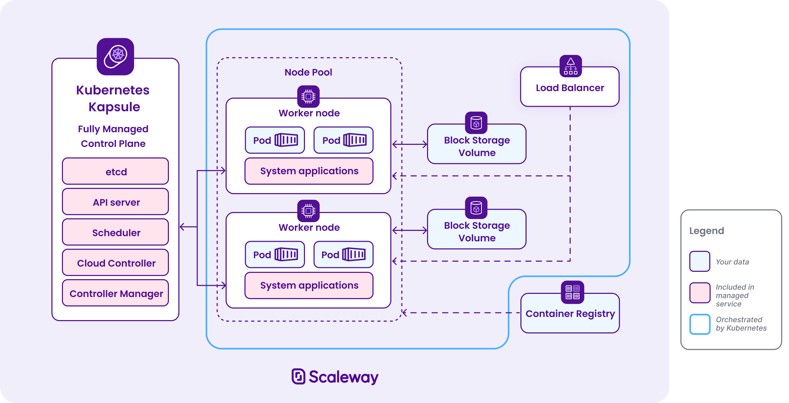

# Cloud  Controller Manager
The CCM is the bridge between Kubernetes and your cloud provider's API (AWS, GCE, DigitalOcean, etc.). It was extracted from `kube-controller-manager` so that cloud-specific logic lives outside the Kubernetes core.

| Controller | Watches | Calls cloud API to... |
|---|---|---|
| Node Controller | Node objects | Populate node addresses, labels (zone, region, instance-type), detect deleted VMs |
| Node Lifecycle Controller | Node health | Check if a VM still exists; if not, remove the Node object |
| Service Controller | Service `type=LoadBalancer` | Create/update/delete a cloud load balancer (e.g., a DigitalOcean LB) |
| Route Controller | Node CIDRs | Program cloud VPC routes so pod-to-pod traffic across nodes works |

```sh
┌──────────────────────────────────────────────────────┐
│  Cloud Provider API  (e.g. api.digitalocean.com)     │
└──────────────────────▲───────────────────────────────┘
                       │  REST calls (create LB, get instance info, etc.)
                       │
              ┌────────┴────────┐
              │  Cloud Controller│  ← implements cloudprovider.Interface
              │  Manager (CCM)  │
              └────────┬────────┘
                       │  watches Nodes, Services via SharedInformers
                       │  authenticates via kubeconfig / ServiceAccount
                       │
              ┌────────▼────────┐
              │  kube-apiserver │
              └─────────────────┘
``` 
- `Registration`: The cloud provider implements Go interface cloudprovider.Interface (defined in `cloud.go`) and registers via `RegisterCloudProvider(name, factory)`.
- `Startup`: CCM connects to the API server using a `kubeconfig` or in-cluster `ServiceAccount`, creates shared informers to watch Nodes and Services.
- `React`: When something changes (new Service of type LoadBalancer, new Node joins), CCM calls the cloud API to reconcile the real infrastructure with the desired state.
- `Leader election`: Multiple CCM replicas can run for HA — only the leader is active.

### Cloud Provider Interface
```go
package cloudprovider

// ControllerClientBuilder allows you to get clients and configs for controllers
// Please note a copy also exists in pkg/controller/client_builder.go
// TODO: Make this depend on the separate controller utilities repo (issues/68947)
type ControllerClientBuilder interface {
	Config(name string) (*restclient.Config, error)
	ConfigOrDie(name string) *restclient.Config
	Client(name string) (clientset.Interface, error)
	ClientOrDie(name string) clientset.Interface
}

// Interface is an abstract, pluggable interface for cloud providers.
type Interface interface {
	// Initialize provides the cloud with a kubernetes client builder and may spawn goroutines
	// to perform housekeeping or run custom controllers specific to the cloud provider.
	// Any tasks started here should be cleaned up when the stop channel closes.
	Initialize(clientBuilder ControllerClientBuilder, stop <-chan struct{})
	// LoadBalancer returns a balancer interface. Also returns true if the interface is supported, false otherwise.
	LoadBalancer() (LoadBalancer, bool)
	// Instances returns an instances interface. Also returns true if the interface is supported, false otherwise.
	Instances() (Instances, bool)
	// InstancesV2 is an implementation for instances and should only be implemented by external cloud providers.
	// Implementing InstancesV2 is behaviorally identical to Instances but is optimized to significantly reduce
	// API calls to the cloud provider when registering and syncing nodes. Implementation of this interface will
	// disable calls to the Zones interface. Also returns true if the interface is supported, false otherwise.
	InstancesV2() (InstancesV2, bool)
	// Zones returns a zones interface. Also returns true if the interface is supported, false otherwise.
	// DEPRECATED: Zones is deprecated in favor of retrieving zone/region information from InstancesV2.
	// This interface will not be called if InstancesV2 is enabled.
	Zones() (Zones, bool)
	// Clusters returns a clusters interface.  Also returns true if the interface is supported, false otherwise.
	Clusters() (Clusters, bool)
	// Routes returns a routes interface along with whether the interface is supported.
	Routes() (Routes, bool)
	// ProviderName returns the cloud provider ID.
	ProviderName() string
	// HasClusterID returns true if a ClusterID is required and set
	HasClusterID() bool
}

type InformerUser interface {
	// SetInformers sets the informer on the cloud object.
	SetInformers(informerFactory informers.SharedInformerFactory)
}

// Clusters is an abstract, pluggable interface for clusters of containers.
type Clusters interface {
	// ListClusters lists the names of the available clusters.
	ListClusters(ctx context.Context) ([]string, error)
	// Master gets back the address (either DNS name or IP address) of the master node for the cluster.
	Master(ctx context.Context, clusterName string) (string, error)
}

// (DEPRECATED) DefaultLoadBalancerName is the default load balancer name that is called from
// LoadBalancer.GetLoadBalancerName. Use this method to maintain backward compatible names for
// LoadBalancers that were created prior to Kubernetes v1.12. In the future, each provider should
// replace this method call in GetLoadBalancerName with a provider-specific implementation that
// is less cryptic than the Service's UUID.
func DefaultLoadBalancerName(service *v1.Service) string {
	//GCE requires that the name of a load balancer starts with a lower case letter.
	ret := "a" + string(service.UID)
	ret = strings.Replace(ret, "-", "", -1)
	//AWS requires that the name of a load balancer is shorter than 32 bytes.
	if len(ret) > 32 {
		ret = ret[:32]
	}
	return ret
}

// GetInstanceProviderID builds a ProviderID for a node in a cloud.
// Note that if the instance does not exist, we must return ("", cloudprovider.InstanceNotFound)
// cloudprovider.InstanceNotFound should NOT be returned for instances that exist but are stopped/sleeping
func GetInstanceProviderID(ctx context.Context, cloud Interface, nodeName types.NodeName) (string, error) {
	instances, ok := cloud.Instances()
	if !ok {
		return "", fmt.Errorf("failed to get instances from cloud provider")
	}
	instanceID, err := instances.InstanceID(ctx, nodeName)
	if err != nil {
		if err == NotImplemented {
			return "", err
		}
		if err == InstanceNotFound {
			return "", err
		}

		return "", fmt.Errorf("failed to get instance ID from cloud provider: %w", err)
	}
	return cloud.ProviderName() + "://" + instanceID, nil
}

// LoadBalancer is an abstract, pluggable interface for load balancers.
//
// Cloud provider may chose to implement the logic for
// constructing/destroying specific kinds of load balancers in a
// controller separate from the ServiceController.  If this is the case,
// then {Ensure,Update}LoadBalancer must return the ImplementedElsewhere error.
// For the given LB service, the GetLoadBalancer must return "exists=True" if
// there exists a LoadBalancer instance created by ServiceController.
// In all other cases, GetLoadBalancer must return a NotFound error.
// EnsureLoadBalancerDeleted must not return ImplementedElsewhere to ensure
// proper teardown of resources that were allocated by the ServiceController.
// This can happen if a user changes the type of LB via an update to the resource
// or when migrating from ServiceController to alternate implementation.
// The finalizer on the service will be added and removed by ServiceController
// irrespective of the ImplementedElsewhere error. Additional finalizers for
// LB services must be managed in the alternate implementation.
type LoadBalancer interface {
	// GetLoadBalancer returns whether the specified load balancer exists, and
	// if so, what its status is.
	// Implementations must treat the *v1.Service parameter as read-only and not modify it.
	// Parameter 'clusterName' is the name of the cluster as presented to kube-controller-manager.
	// TODO: Break this up into different interfaces (LB, etc) when we have more than one type of service
	GetLoadBalancer(ctx context.Context, clusterName string, service *v1.Service) (status *v1.LoadBalancerStatus, exists bool, err error)
	// GetLoadBalancerName returns the name of the load balancer. Implementations must treat the
	// *v1.Service parameter as read-only and not modify it.
	GetLoadBalancerName(ctx context.Context, clusterName string, service *v1.Service) string
	// EnsureLoadBalancer creates a new load balancer 'name', or updates the existing one. Returns the status of the balancer
	// Implementations must treat the *v1.Service and *v1.Node
	// parameters as read-only and not modify them.
	// Parameter 'clusterName' is the name of the cluster as presented to kube-controller-manager.
	//
	// Implementations may return a (possibly wrapped) api.RetryError to enforce
	// backing off at a fixed duration. This can be used for cases like when the
	// load balancer is not ready yet (e.g., it is still being provisioned) and
	// polling at a fixed rate is preferred over backing off exponentially in
	// order to minimize latency.
	EnsureLoadBalancer(ctx context.Context, clusterName string, service *v1.Service, nodes []*v1.Node) (*v1.LoadBalancerStatus, error)
	// UpdateLoadBalancer updates hosts under the specified load balancer.
	// Implementations must treat the *v1.Service and *v1.Node
	// parameters as read-only and not modify them.
	// Parameter 'clusterName' is the name of the cluster as presented to kube-controller-manager
	UpdateLoadBalancer(ctx context.Context, clusterName string, service *v1.Service, nodes []*v1.Node) error
	// EnsureLoadBalancerDeleted deletes the specified load balancer if it
	// exists, returning nil if the load balancer specified either didn't exist or
	// was successfully deleted.
	// This construction is useful because many cloud providers' load balancers
	// have multiple underlying components, meaning a Get could say that the LB
	// doesn't exist even if some part of it is still laying around.
	// Implementations must treat the *v1.Service parameter as read-only and not modify it.
	// Parameter 'clusterName' is the name of the cluster as presented to kube-controller-manager
	EnsureLoadBalancerDeleted(ctx context.Context, clusterName string, service *v1.Service) error
}

// Instances is an abstract, pluggable interface for sets of instances.
type Instances interface {
	// NodeAddresses returns the addresses of the specified instance.
	NodeAddresses(ctx context.Context, name types.NodeName) ([]v1.NodeAddress, error)
	// NodeAddressesByProviderID returns the addresses of the specified instance.
	// The instance is specified using the providerID of the node. The
	// ProviderID is a unique identifier of the node. This will not be called
	// from the node whose nodeaddresses are being queried. i.e. local metadata
	// services cannot be used in this method to obtain nodeaddresses
	NodeAddressesByProviderID(ctx context.Context, providerID string) ([]v1.NodeAddress, error)
	// InstanceID returns the cloud provider ID of the node with the specified NodeName.
	// Note that if the instance does not exist, we must return ("", cloudprovider.InstanceNotFound)
	// cloudprovider.InstanceNotFound should NOT be returned for instances that exist but are stopped/sleeping
	InstanceID(ctx context.Context, nodeName types.NodeName) (string, error)
	// InstanceType returns the type of the specified instance.
	InstanceType(ctx context.Context, name types.NodeName) (string, error)
	// InstanceTypeByProviderID returns the type of the specified instance.
	InstanceTypeByProviderID(ctx context.Context, providerID string) (string, error)
	// AddSSHKeyToAllInstances adds an SSH public key as a legal identity for all instances
	// expected format for the key is standard ssh-keygen format: <protocol> <blob>
	AddSSHKeyToAllInstances(ctx context.Context, user string, keyData []byte) error
	// CurrentNodeName returns the name of the node we are currently running on
	// On most clouds (e.g. GCE) this is the hostname, so we provide the hostname
	CurrentNodeName(ctx context.Context, hostname string) (types.NodeName, error)
	// InstanceExistsByProviderID returns true if the instance for the given provider exists.
	// If false is returned with no error, the instance will be immediately deleted by the cloud controller manager.
	// This method should still return true for instances that exist but are stopped/sleeping.
	InstanceExistsByProviderID(ctx context.Context, providerID string) (bool, error)
	// InstanceShutdownByProviderID returns true if the instance is shutdown in cloudprovider
	InstanceShutdownByProviderID(ctx context.Context, providerID string) (bool, error)
}

// InstancesV2 is an abstract, pluggable interface for cloud provider instances.
// Unlike the Instances interface, it is designed for external cloud providers and should only be used by them.
// Implementation of this interface will disable calls to the Zones interface.
type InstancesV2 interface {
	// InstanceExists returns true if the instance for the given node exists according to the cloud provider.
	// Use the node.name or node.spec.providerID field to find the node in the cloud provider.
	InstanceExists(ctx context.Context, node *v1.Node) (bool, error)
	// InstanceShutdown returns true if the instance is shutdown according to the cloud provider.
	// Use the node.name or node.spec.providerID field to find the node in the cloud provider.
	InstanceShutdown(ctx context.Context, node *v1.Node) (bool, error)
	// InstanceMetadata returns the instance's metadata. The values returned in InstanceMetadata are
	// translated into specific fields and labels in the Node object on registration.
	// Implementations should always check node.spec.providerID first when trying to discover the instance
	// for a given node. In cases where node.spec.providerID is empty, implementations can use other
	// properties of the node like its name, labels and annotations.
	InstanceMetadata(ctx context.Context, node *v1.Node) (*InstanceMetadata, error)
}

// Route is a representation of an advanced routing rule.
type Route struct {
	// Name is the name of the routing rule in the cloud-provider.
	// It will be ignored in a Create (although nameHint may influence it)
	Name string
	// TargetNode is the NodeName of the target instance.
	TargetNode types.NodeName
	// EnableNodeAddresses is a feature gate for TargetNodeAddresses. If false, ignore TargetNodeAddresses.
	// Without this, if users haven't updated their cloud-provider, reconcile() will delete and create same route every time.
	EnableNodeAddresses bool
	// TargetNodeAddresses are the Node IPs of the target Node.
	TargetNodeAddresses []v1.NodeAddress
	// DestinationCIDR is the CIDR format IP range that this routing rule
	// applies to.
	DestinationCIDR string
	// Blackhole is set to true if this is a blackhole route
	// The node controller will delete the route if it is in the managed range.
	Blackhole bool
}

// Routes is an abstract, pluggable interface for advanced routing rules.
type Routes interface {
	// ListRoutes lists all managed routes that belong to the specified clusterName
	ListRoutes(ctx context.Context, clusterName string) ([]*Route, error)
	// CreateRoute creates the described managed route
	// route.Name will be ignored, although the cloud-provider may use nameHint
	// to create a more user-meaningful name.
	CreateRoute(ctx context.Context, clusterName string, nameHint string, route *Route) error
	// DeleteRoute deletes the specified managed route
	// Route should be as returned by ListRoutes
	DeleteRoute(ctx context.Context, clusterName string, route *Route) error
}

var (
	DiskNotFound         = errors.New("disk is not found")
	ImplementedElsewhere = errors.New("implemented by alternate to cloud provider")
	InstanceNotFound     = errors.New("instance not found")
	NotImplemented       = errors.New("unimplemented")
)

// Zone represents the location of a particular machine.
type Zone struct {
	FailureDomain string
	Region        string
}

// Zones is an abstract, pluggable interface for zone enumeration.
// DEPRECATED: Zones is deprecated in favor of retrieving zone/region information from InstancesV2.
// This interface will not be called if InstancesV2 is enabled.
type Zones interface {
	// GetZone returns the Zone containing the current failure zone and locality region that the program is running in
	// In most cases, this method is called from the kubelet querying a local metadata service to acquire its zone.
	// For the case of external cloud providers, use GetZoneByProviderID or GetZoneByNodeName since GetZone
	// can no longer be called from the kubelets.
	GetZone(ctx context.Context) (Zone, error)

	// GetZoneByProviderID returns the Zone containing the current zone and locality region of the node specified by providerID
	// This method is particularly used in the context of external cloud providers where node initialization must be done
	// outside the kubelets.
	GetZoneByProviderID(ctx context.Context, providerID string) (Zone, error)

	// GetZoneByNodeName returns the Zone containing the current zone and locality region of the node specified by node name
	// This method is particularly used in the context of external cloud providers where node initialization must be done
	// outside the kubelets.
	GetZoneByNodeName(ctx context.Context, nodeName types.NodeName) (Zone, error)
}

// PVLabeler is an abstract, pluggable interface for fetching labels for volumes
// DEPRECATED: PVLabeler is deprecated in favor of CSI topology feature.
type PVLabeler interface {
	GetLabelsForVolume(ctx context.Context, pv *v1.PersistentVolume) (map[string]string, error)
}

// InstanceMetadata contains metadata about a specific instance.
// Values returned in InstanceMetadata are translated into specific fields and labels for Node.
type InstanceMetadata struct {
	// ProviderID is a unique ID used to identify an instance on the cloud provider.
	// The ProviderID set here will be set on the node's spec.providerID field.
	// The provider ID format can be set by the cloud provider but providers should
	// ensure the format does not change in any incompatible way.
	//
	// The provider ID format used by existing cloud provider has been:
	//    <provider-name>://<instance-id>
	// Existing providers setting this field should preserve the existing format
	// currently being set in node.spec.providerID.
	ProviderID string
	// InstanceType is the instance's type.
	// The InstanceType set here will be set using the following labels on the node object:
	//   * node.kubernetes.io/instance-type=<instance-type>
	//   * beta.kubernetes.io/instance-type=<instance-type> (DEPRECATED)
	InstanceType string
	// NodeAddress contains information for the instance's address.
	// The node addresses returned here will be set on the node's status.addresses field.
	NodeAddresses []v1.NodeAddress

	// Zone is the zone that the instance is in.
	// The value set here is applied as the following labels on the node:
	//   * topology.kubernetes.io/zone=<zone>
	//   * failure-domain.beta.kubernetes.io/zone=<zone> (DEPRECATED)
	Zone string
	// Region is the region that the instance is in.
	// The value set here is applied as the following labels on the node:
	//   * topology.kubernetes.io/region=<region>
	//   * failure-domain.beta.kubernetes.io/region=<region> (DEPRECATED)
	Region string

	// AdditionalLabels is a map of additional labels provided by the cloud provider.
	// When provided, they will be applied to the node and enable cloud providers
	// to labels nodes with information that may be valuable to that provider.
	AdditionalLabels map[string]string
}
```
## DigitalOcean Cloud Controller Manager
[DigitalOcean Cloud Controller Manager](https://github.com/digitalocean/digitalocean-cloud-controller-manager)

The CCM runs as a controller inside the Kubernetes cluster and handles three main responsibilities:
- `Load Balancer Management` — When you create a Kubernetes Service of type LoadBalancer, the CCM automatically provisions and configures a DigitalOcean Load Balancer. Configuration changes must be made through the Service object (not manually in the DO console), as the CCM will overwrite manual changes.
- `Node Management` — It syncs Kubernetes node metadata (labels, addresses) with the corresponding DigitalOcean Droplet information, ensuring the cluster has accurate cloud-level details about each node.
- `Firewall Management` (optional) — It can manage a DigitalOcean Firewall that dynamically opens/closes access to NodePort services. Enabled via `PUBLIC_ACCESS_FIREWALL_NAME` and `PUBLIC_ACCESS_FIREWALL_TAGS` environment variables.

### How to run it
It authenticates to DigitalOcean via a DO_ACCESS_TOKEN environment variable and connects to Kubernetes via a kubeconfig. A typical local invocation looks like:
```bash
REGION=fra1 DO_ACCESS_TOKEN=your_token go run main.go \
  --kubeconfig <path> --leader-elect=false --cloud-provider=digitalocean
```
In production, it runs as a container image (`digitalocean/digitalocean-cloud-controller-manager:<version>`) deployed into the cluster   
```go
type Interface interface {
    Initialize(clientBuilder ControllerClientBuilder, stop <-chan struct{})
    LoadBalancer() (LoadBalancer, bool)   // create/delete cloud LBs
    InstancesV2()  (InstancesV2, bool)   // get VM metadata (IPs, zone, type)
    Routes()       (Routes, bool)        // program VPC routes
    Clusters()     (Clusters, bool)      // cluster info
    ProviderName() string                // "digitalocean", "aws", etc.
    HasClusterID() bool
}
```
DigitalOcean's CCM implements this interface by calling the DO API (using `DO_ACCESS_TOKEN`) to manage load balancers, read droplet metadata, and optionally manage firewalls for NodePorts.

```sh
kubectl apply -f my-service.yaml (type: LoadBalancer)
    → API server stores Service object
    → CCM's Service controller informer fires
    → CCM calls DO API: POST /v2/load_balancers {name, forwarding_rules, droplet_ids}
    → DO creates a real LB with a public IP
    → CCM writes the external IP back to Service.status.loadBalancer.ingress
    → kubectl get svc → EXTERNAL-IP: 164.90.x.x
```
CCM is the component that makes `type: LoadBalancer`, node auto-registration, and cloud routes actually work by translating Kubernetes intent into cloud API calls.

## AWS Cloud Controller Manager


## Hetzner Cloud Controller Manager
- Load balancer provisioning — when you create a Kubernetes Service of type LoadBalancer, the CCM calls the Hetzner API to create/manage a Hetzner Load Balancer
- Node metadata — annotates nodes with Hetzner-specific info (region, instance type, IPs)
- Node lifecycle — detects when a Hetzner server is deleted and removes the corresponding Kubernetes node object

```sh
Kubernetes API Server
        │
        ▼
  CCM Framework (k8s.io/cloud-provider)
        │
        ├── Node lifecycle ──▶ instances.go ──▶ Hetzner Cloud/Robot API
        ├── Service type=LB ──▶ load_balancers.go ──▶ Hetzner Cloud LB API
        └── Pod networking  ──▶ routes.go ──▶ Hetzner Cloud Network API
```        
## Hetzner-k3s
### Provide a YAML config file
A single `cluster.yaml` defines everything: your Hetzner API token, cluster name, k3s version, SSH keys, networking, master/worker node pools (instance types, counts, locations), and optional autoscaling settings.

### `hetzner-k3s create` provisions the infrastructure
The CLI talks directly to the Hetzner Cloud API (using your token, which never leaves your machine) to:
- Create servers for master and worker nodes in the specified locations/instance types
- Set up private networking and firewalls
- Configure SSH access to the nodes

No egress fees

Hetzner includes 20 TB of free outbound traffic per server. No surprise bandwidth bills, unlike hyperscalers where egress costs can rival compute spend.
### It installs k3s on every node 
Via SSH, it bootstraps k3s on each server — setting up HA masters (if multiple) and joining workers to the cluster

### It installs essential components automatically

| Component | Purpose |
|---|---|
| Hetzner Cloud Controller Manager | Manages load balancers via Hetzner API |
| Hetzner CSI Driver | Provides persistent volumes (Hetzner block storage) |
| System Upgrade Controller | Enables zero-downtime k3s upgrades |
| Cluster Autoscaler | Scales worker nodes up/down based on demand |

If you install only the `hcloud-cloud-controller-manager`, you get:
- Node Lifecycle: When you delete a server in the Hetzner Console, it gets removed from K8s.
- Networking Metadata: Nodes get their private IPs and region/zone labels.  
- Load Balancers: You can create a Service of type LoadBalancer, and Hetzner will provision a physical LB for you.

Without the CSI Driver (`hcloud-csi-driver`), you have no persistent storage.
- If your PostgreSQL database pod restarts, its data is gone forever (or stuck on that specific node's local disk).
- The CSI allows you to use Hetzner Block Storage (Volumes)

```yaml
hetzner_token: <YOUR_HCLOUD_TOKEN>
cluster_name: production-cluster
k3s_version: v1.32.1+k3s1 # Latest stable as of April 2026
public_key_path: "~/.ssh/id_ed25519.pub"
private_key_path: "~/.ssh/id_ed25519"
use_private_network: true 
network_region: eu-central # Covers fsn1, nbg1, hel1

# HA Control Plane: 3 nodes for quorum
masters_pool:
  instance_type: cpx22 # Sufficient for ~50 nodes
  instance_count: 3
  locations:
    - fsn1
    - nbg1
    - hel1

worker_node_pools:
  # Standard App Tier
  - name: app-workers
    instance_type: cpx32
    instance_count: 3
    location: fsn1
    autoscaling:
      enabled: true
      min_nodes: 2
      max_nodes: 10
    labels:
      - "role=frontend"

  # Dedicated Database/Fintech Tier
  # Using local SSD-heavy instances for Postgres performance
  - name: db-workers
    instance_type: cx42 
    instance_count: 2
    location: nbg1
    labels:
      - "role=database"
    taints:
      - "dedicated=database:NoSchedule" # Keeps general apps off DB nodes

# Add-ons for Day 2 Operations
additional_packages:
  - cert-manager
  - rancher-system-upgrade-controller # Handles OS/K3s auto-updates
```  

```yaml
apiVersion: v1
kind: Service
metadata:
  name: traefik
  namespace: kube-system
  annotations:
    # Use a specific LB type (lb11 is entry, lb21 is better for scale)
    load-balancer.hetzner.cloud/type: lb11
    load-balancer.hetzner.cloud/location: nbg1
    load-balancer.hetzner.cloud/use-private-ip: "true"
    # Essential for identity protocols (keeps client IP)
    load-balancer.hetzner.cloud/uses-proxyprotocol: "true" 
spec:
  type: LoadBalancer
  ...
```	

```yaml
apiVersion: v1
kind: PersistentVolumeClaim
metadata:
  name: postgres-pvc
spec:
  accessModes:
    - ReadWriteOnce
  storageClassName: hcloud-volumes # Created by the CSI driver
  resources:
    requests:
      storage: 50Gi
```

20TB of free egress per node is massive. For a 6-node cluster, you have 120TB of free bandwidth.
## Scaleway
Scaleway manages the Kubernetes control plane (either Kapsule or Kosmos), which consists of various components responsible for managing and maintaining the cluster and its state, and scheduling applications. This includes components such as the control plane itself: etcd, API server, scheduler, cloud controller, and controller manager.

Scaleway takes care of Kubernetes system applications such as CoreDNS, Kubeproxy, Container Networking Interface (CNI), and Container Storage Interface (CSI), which are vital for the optimal functioning of the Kubernetes cluster and its associated resources.

Scaleway is also responsible for node provisioning and providing updates of operating system node images.



[Building a Production-Ready Kubernetes Cluster on Scaleway with Terraform](https://hervekhg.medium.com/building-a-production-ready-kubernetes-cluster-on-scaleway-with-terraform-269e9d558128)

```sh
kubectl create secret docker-registry scw-registry \
  --docker-server=$REGISTRY_ENDPOINT \
  --docker-username=nologin \
  --docker-password=$REGISTRY_PASSWORD
```  

