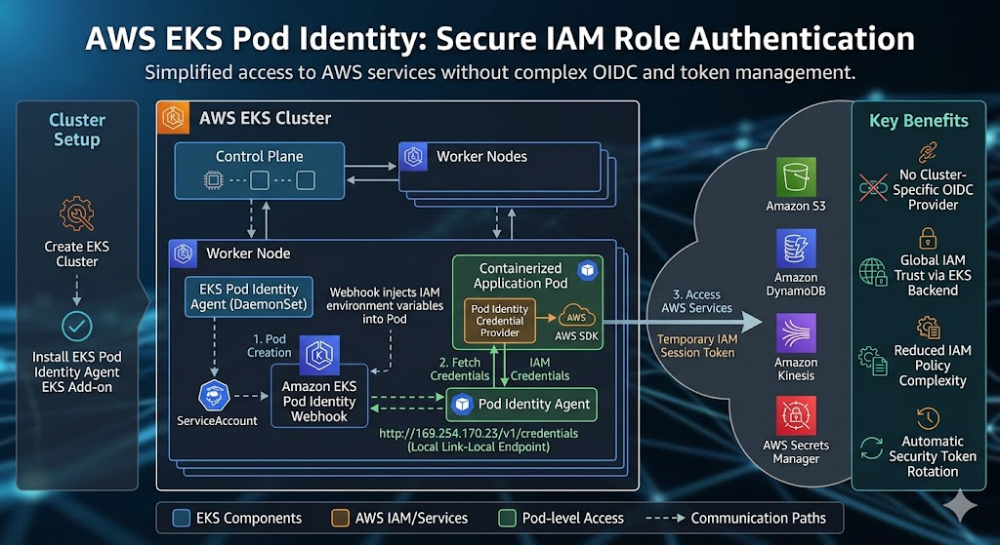

# RBAC and Identity

ServiceAccounts, RBAC, OIDC federation, IRSA, TLS certificates, secrets management, and kubelogin.

See also: [`kubernetes.md`](kubernetes.md) (architecture overview) · [`kube-networking.md`](kube-networking.md) · [`cloud-kubernetes.md`](cloud-kubernetes.md)

## ServiceAccounts and RBAC
- `ServiceAccounts`: Every Pod gets a default ServiceAccount, which provides an identity for processes running in the Pod. The `kubelet` automatically mounts a token for this ServiceAccount into the Pod, allowing it to authenticate to the API server.
- `RBAC (Role-Based Access Control)`: Kubernetes uses RBAC to control who can do what within the cluster. You define `Roles` (namespaced) or `ClusterRoles` (cluster-wide) that specify permissions, and then bind those roles to users or ServiceAccounts with `RoleBindings` or `ClusterRoleBindings`. This way, you can ensure that a Pod only has the permissions it needs to function, following the principle of least privilege.

If a human wants to talk to the Kubernetes API, they use a User Account (usually backed by an external identity provider like Okta, Google, or client certificates).
But what if your application (running inside a Pod) needs to talk to the Kubernetes API?
For example, what if you are running Prometheus and it needs to ask the API server for a list of all Pods to monitor?

That is what a ServiceAccount is for. It is an identity for a machine/process running inside your cluster.
When you create a Pod, Kubernetes automatically mounts a token for the `default` ServiceAccount into the Pod at `/var/run/secrets/kubernetes.io/serviceaccount/token`. This token can be used to authenticate to the API server and perform actions based on the permissions granted to that ServiceAccount.

When a Pod is created, it is usually assigned a ServiceAccount. If you don't specify one, it defaults to the `default` account in that namespace.
On its own, a ServiceAccount has almost no permissions. You must use `Role-Based Access Control `(RBAC) to link a ServiceAccount to a `Role` or `ClusterRole` via a `RoleBinding` or `ClusterRoleBinding`.

## Defining a ServiceAccount
```yaml
apiVersion: v1
kind: ServiceAccount
metadata:
  name: my-service-account
  namespace: default
```
To use this in a Pod, you simply reference it in the spec:
```yaml
apiVersion: v1
kind: Pod
metadata:
  name: my-pod
spec:
  serviceAccountName: my-service-account
  containers:
  - name: my-container
    image: nginx
```
Now, when `my-pod` starts, it will have the token for `my-service-account` mounted inside it, allowing it to authenticate to the Kubernetes API server with whatever permissions are granted to `my-service-account` via RBAC.

## Role/ClusterRole and RoleBinding/ClusterRoleBinding
A `Role` defines a set of rules for what can be done within a specific namespace. If you need the permissions to apply across the entire cluster, you would use a `ClusterRole`.
```yaml
apiVersion: rbac.authorization.k8s.io/v1
kind: Role
metadata:
  name: pod-reader
  namespace: default
rules:
- apiGroups: [""] # "" indicates the core API group
  resources: ["pods"]
  verbs: ["get", "watch", "list"]
```
This `Role` allows read-only access to Pods in the `default` namespace. To grant this Role to our ServiceAccount, we create a `RoleBinding`:
```yaml
apiVersion: rbac.authorization.k8s.io/v1
kind: RoleBinding
metadata:
  name: read-pods-binding
  namespace: default
subjects:
- kind: ServiceAccount
  name: my-service-account
  namespace: default
roleRef:
  kind: Role
  name: pod-reader
  apiGroup: rbac.authorization.k8s.io
```
Now, `my-service-account` has the permissions defined in the `pod-reader` Role, allowing any Pod that uses `my-service-account` to read Pod information in the `default` namespace.

In RBAC bindings, there are three kinds of subjects:
```yaml
# 1. ServiceAccount — for pods/workloads
subjects:
- kind: ServiceAccount
  name: my-app
  namespace: production        # required — SAs are namespaced

# 2. User — for humans (identified by OIDC, certificates, etc.)
subjects:
- kind: User
  name: jane@example.com
  apiGroup: rbac.authorization.k8s.io

# 3. Group — for a group of users
subjects:
- kind: Group
  name: dev-team
  apiGroup: rbac.authorization.k8s.io
```
```yaml
apiVersion: v1
kind: ServiceAccount
metadata:
  name: internal-app-sa
  namespace: development
```
The `RoleBinding` grants the permissions defined in the Role to the ServiceAccount.
```yaml
apiVersion: rbac.authorization.k8s.io/v1
kind: RoleBinding
metadata:
  name: read-pods-binding
  namespace: development
subjects:
- kind: ServiceAccount
  name: internal-app-sa # Name of your ServiceAccount
  namespace: development
roleRef:
  kind: Role
  name: pod-reader # Name of your Role
  apiGroup: rbac.authorization.k8s.io
```   
`roleRef` specifies which `Role` or `ClusterRole` the binding grants. The `kind` has only two options: 
```yaml
# Option 1: Reference a namespaced Role
roleRef:
  kind: Role
  name: pod-reader
  apiGroup: rbac.authorization.k8s.io

# Option 2: Reference a cluster-wide ClusterRole
roleRef:
  kind: ClusterRole
  name: pod-reader
  apiGroup: rbac.authorization.k8s.io
```
If you just run `kubectl run my-nginx --image=nginx`, you didn't specify a ServiceAccount. But Kubernetes quietly gives it one anyway.

Every namespace has a ServiceAccount named default. When you submit a Pod to the API server:
- The `ServiceAccount Admission Controller`  intercepts the Pod creation request.
- It mutates the Pod definition, automatically injecting a volume mount into every container.
- It mounts a specific directory: `/var/run/secrets/kubernetes.io/serviceaccount/`

If you were to `exec` into literally almost any Pod and look in that directory, you would find three files:
- `token`: A JSON Web Token (JWT) signed by the cluster.
- `ca.crt`: The certificate authority so the Pod can verify it's securely talking to the real API server.
- `namespace`: A text file containing the Pod's namespace.

When your application inside the Pod makes an HTTPS request to the `kube-apiserver`, it includes that token file in the HTTP `Authorization: Bearer <token>` header.

By default, creating a ServiceAccount gives you an identity, but it gives you absolutely zero permissions.

If your Prometheus Pod uses its ServiceAccount to say "Give me a list of all Pods", the API Server's Authorization module (RBAC) will immediately reject it with a 403 Forbidden, because that ServiceAccount doesn't have permission to read Pods.

```yaml
//sa- ServiceAccount
apiVersion: v1
kind: ServiceAccount
metadata:
  name: prometheus-sa
  namespace: monitoring 
```  

Kubernetes uses `Bound ServiceAccount Token Volumes`.
- The API Server dynamically generates the JWT on the fly when the Kubelet starts the Pod.
- The token has an expiration time (e.g., 1 hour).
- The Kubelet automatically reaches out to the API server to refresh the token and rotates the file on disk before it expires.
- The token is directly tied to the exact Pod UID. If the Pod is deleted, the token instantly becomes invalid, making the cluster highly resistant to stolen credentials theft.

`Always prefer Roles over ClusterRoles whenever possible.`

```yaml
# All authenticated users
- kind: Group
  name: system:authenticated

# All unauthenticated requests
- kind: Group
  name: system:unauthenticated

# All ServiceAccounts in all namespaces
- kind: Group
  name: system:serviceaccounts

# All ServiceAccounts in a specific namespace
- kind: Group
  name: system:serviceaccounts:production
```
## API Groups and Resources
In Kubernetes, resources are categorized by API Groups. When you define a Role, you need to specify the resource name and its corresponding group
### The Core Group ("")
In your YAML snippet, apiGroups: [""] refers to the Core API Group (sometimes called the "legacy" group).  
Because `pods`, `services`, `namespaces`, `configmaps`, and `secrets` were created in K8s v1.0 before API Groups existed, they are permanently grandfathered into this unnamed, empty-string group.
```sh
apiGroups: [""]
pods
services
configmaps
secrets
namespaces
nodes (Requires ClusterRole)
persistentvolumes (Requires ClusterRole)
persistentvolumeclaims
serviceaccounts
endpoints
events
```
### The Workloads & Scaling Groups
These manage the lifecycle of your Pods.
```sh
apiGroups: ["apps"]
deployments
statefulsets
daemonsets
replicasets
apiGroups: ["batch"]
jobs
cronjobs
apiGroups: ["autoscaling"]
horizontalpodautoscalers
```
```sh
kubectl api-resources --api-group=autoscaling 2>/dev/null || echo "No cluster available"
NAME                       SHORTNAMES   APIVERSION       NAMESPACED   KIND
horizontalpodautoscalers   hpa          autoscaling/v2   true         HorizontalPodAutoscaler

```
### Networking (API Group: "networking.k8s.io")
These handle routing traffic into and around the cluster.
```sh
apiGroups: ["networking.k8s.io"]
ingresses
networkpolicies
ingressclasses
```

### The Security & Access Groups
These control who can do what, and structural constraints.
```sh
apiGroups: ["rbac.authorization.k8s.io"]
roles
rolebindings
clusterroles
clusterrolebindings
apiGroups: ["policy"]
poddisruptionbudgets (PDBs)
```
### The Storage Group
For dynamic volume provisioning.
```sh
apiGroups: ["storage.k8s.io"]
storageclasses (Requires ClusterRole)
volumeattachments
csidrivers
```

```sh
kubectl api-resources --sort-by=name
NAME                                SHORTNAMES   APIVERSION                        NAMESPACED   KIND
apiservices                                      apiregistration.k8s.io/v1         false        APIService
bindings                                         v1                                true         Binding
certificatesigningrequests          csr          certificates.k8s.io/v1            false        CertificateSigningRequest
clusterrolebindings                              rbac.authorization.k8s.io/v1      false        ClusterRoleBinding
clusterroles                                     rbac.authorization.k8s.io/v1      false        ClusterRole
componentstatuses                   cs           v1                                false        ComponentStatus
configmaps                          cm           v1                                true         ConfigMap
controllerrevisions                              apps/v1                           true         ControllerRevision
cronjobs                            cj           batch/v1                          true         CronJob
csidrivers                                       storage.k8s.io/v1                 false        CSIDriver
csinodes                                         storage.k8s.io/v1                 false        CSINode
csistoragecapacities                             storage.k8s.io/v1                 true         CSIStorageCapacity
customresourcedefinitions           crd,crds     apiextensions.k8s.io/v1           false        CustomResourceDefinition
daemonsets                          ds           apps/v1                           true         DaemonSet
deployments                         deploy       apps/v1                           true         Deployment
deviceclasses                                    resource.k8s.io/v1                false        DeviceClass
endpoints                           ep           v1                                true         Endpoints
endpointslices                                   discovery.k8s.io/v1               true         EndpointSlice
events                              ev           v1                                true         Event
events                              ev           events.k8s.io/v1                  true         Event
flowschemas                                      flowcontrol.apiserver.k8s.io/v1   false        FlowSchema
horizontalpodautoscalers            hpa          autoscaling/v2                    true         HorizontalPodAutoscaler
ingressclasses                                   networking.k8s.io/v1              false        IngressClass
ingresses                           ing          networking.k8s.io/v1              true         Ingress
ipaddresses                         ip           networking.k8s.io/v1              false        IPAddress
jobs                                             batch/v1                          true         Job
leases                                           coordination.k8s.io/v1            true         Lease
limitranges                         limits       v1                                true         LimitRange
localsubjectaccessreviews                        authorization.k8s.io/v1           true         LocalSubjectAccessReview
mutatingwebhookconfigurations                    admissionregistration.k8s.io/v1   false        MutatingWebhookConfiguration
namespaces                          ns           v1                                false        Namespace
networkpolicies                     netpol       networking.k8s.io/v1              true         NetworkPolicy
nodes                               no           v1                                false        Node
persistentvolumeclaims              pvc          v1                                true         PersistentVolumeClaim
persistentvolumes                   pv           v1                                false        PersistentVolume
poddisruptionbudgets                pdb          policy/v1                         true         PodDisruptionBudget
pods                                po           v1                                true         Pod
podtemplates                                     v1                                true         PodTemplate
priorityclasses                     pc           scheduling.k8s.io/v1              false        PriorityClass
prioritylevelconfigurations                      flowcontrol.apiserver.k8s.io/v1   false        PriorityLevelConfiguration
replicasets                         rs           apps/v1                           true         ReplicaSet
replicationcontrollers              rc           v1                                true         ReplicationController
resourceclaims                                   resource.k8s.io/v1                true         ResourceClaim
resourceclaimtemplates                           resource.k8s.io/v1                true         ResourceClaimTemplate
resourcequotas                      quota        v1                                true         ResourceQuota
resourceslices                                   resource.k8s.io/v1                false        ResourceSlice
rolebindings                                     rbac.authorization.k8s.io/v1      true         RoleBinding
roles                                            rbac.authorization.k8s.io/v1      true         Role
runtimeclasses                                   node.k8s.io/v1                    false        RuntimeClass
secrets                                          v1                                true         Secret
selfsubjectaccessreviews                         authorization.k8s.io/v1           false        SelfSubjectAccessReview
selfsubjectreviews                               authentication.k8s.io/v1          false        SelfSubjectReview
selfsubjectrulesreviews                          authorization.k8s.io/v1           false        SelfSubjectRulesReview
serviceaccounts                     sa           v1                                true         ServiceAccount
servicecidrs                                     networking.k8s.io/v1              false        ServiceCIDR
services                            svc          v1                                true         Service
statefulsets                        sts          apps/v1                           true         StatefulSet
storageclasses                      sc           storage.k8s.io/v1                 false        StorageClass
subjectaccessreviews                             authorization.k8s.io/v1           false        SubjectAccessReview
tokenreviews                                     authentication.k8s.io/v1          false        TokenReview
validatingadmissionpolicies                      admissionregistration.k8s.io/v1   false        ValidatingAdmissionPolicy
validatingadmissionpolicybindings                admissionregistration.k8s.io/v1   false        ValidatingAdmissionPolicyBinding
validatingwebhookconfigurations                  admissionregistration.k8s.io/v1   false        ValidatingWebhookConfiguration
volumeattachments                                storage.k8s.io/v1                 false        VolumeAttachment
volumeattributesclasses             vac          storage.k8s.io/v1                 false        VolumeAttributesClass
```
### Custom Resources (CRDs)
If you have installed operators or tools they will have their own API groups.
Example: `prometheuses.monitoring.coreos.com` or `postgresqls.acid.zalan.do`

### Sub-resources
Some resources have "sub-resources" that allow for more granular control. These are defined using a forward slash `/`.
- `pods/log`: Allows reading logs without full access to the Pod object.
- `pods/exec`: Allows executing commands inside a container.
- `pods/portforward`: Allows opening a port tunnel to a pod.
- `deployments/scale`: Allows an identity to change the replica count without editing the entire deployment spec

If you give someone the `update` verb on `pods`, they can edit the labels. BUT, they cannot read the logs or execute into the container (`kubectl exec`).  
Why? Because reading logs and executing commands are considered Subresources. They live "underneath" the main resource.  
To grant access to these in a Role, you use a slash `/`.  

```yaml
rules:
- apiGroups: [""]
  resources: ["pods"]
  verbs: ["get", "list"]             # Can see the pods
- apiGroups: [""]
  resources: ["pods/log"]            # SUBRESOURCE for logs
  verbs: ["get"]                     # Can run `kubectl logs`
- apiGroups: [""]
  resources: ["pods/exec"]           # SUBRESOURCE for shell access
  verbs: ["create"]                  # Can run `kubectl exec` (Notice the verb is 'create' a session!)
- apiGroups: ["apps"]
  resources: ["deployments/scale"]   # SUBRESOURCE for scaling
  verbs: ["patch", "update"]         # Can run `kubectl scale deployment`
```  
If you ever forget which API Group a resource belongs to, just run `kubectl api-resources`. It prints a table perfectly mapping every resource to its correct API Group!

### The CI/CD Pipeline Deployer
Imagine you have GitHub Actions or Jenkins deploying your application to a production namespace. It needs to update `Deployments`, update `ConfigMaps/Secrets`, and tweak `Services/Ingresses`. It should NOT be allowed to delete the namespace itself or create new RBAC roles

```yaml
---
apiVersion: v1
kind: ServiceAccount
metadata:
  name: cicd-deployer
  namespace: production
---
apiVersion: rbac.authorization.k8s.io/v1
kind: Role
metadata:
  name: cicd-deployer-role
  namespace: production
rules:
  # 1. Manage core application networking and config
  - apiGroups: [""]
    resources: ["services", "configmaps", "secrets"]
    verbs: ["get", "list", "watch", "create", "update", "patch", "delete"]
  
  # 2. Manage workload lifecycle (Deployments, StatefulSets)
  - apiGroups: ["apps"]
    resources: ["deployments", "statefulsets", "daemonsets"]
    verbs: ["get", "list", "watch", "create", "update", "patch", "delete"]
  
  # 3. Allow CI/CD to trigger restarts and scaling directly
  - apiGroups: ["apps"]
    resources: ["deployments/scale", "statefulsets/scale"]
    verbs: ["get", "patch", "update"]
  
  # 4. Manage Ingress routing
  - apiGroups: ["networking.k8s.io"]
    resources: ["ingresses"]
    verbs: ["get", "list", "watch", "create", "update", "patch", "delete"]
---
apiVersion: rbac.authorization.k8s.io/v1
kind: RoleBinding
metadata:
  name: cicd-deployer-binding
  namespace: production
subjects:
  - kind: ServiceAccount
    name: cicd-deployer
    namespace: production
roleRef:
  kind: Role
  name: cicd-deployer-role
  apiGroup: rbac.authorization.k8s.io
 ```

 ###  The "Developer Troubleshooting" Role
In production, developers should theoretically have read-only access. However, when things break, they need to read logs, look at events, and port-forward to a database to debug. They should NOT be allowed to edit `ConfigMaps`, read `Secrets`, or delete `Deployments`.

```yaml 
---
apiVersion: v1
kind: ServiceAccount
metadata:
  # Note: A real developer would use their User Account, 
  # but a troubleshooting pod/script would use this ServiceAccount.
  name: dev-troubleshooter
  namespace: production
---
apiVersion: rbac.authorization.k8s.io/v1
kind: Role
metadata:
  name: dev-troubleshooter-role
  namespace: production
rules:
  # 1. View all core components (Notice Secrets are EXCLUDED)
  - apiGroups: [""]
    resources: ["pods", "services", "configmaps", "endpoints", "persistentvolumeclaims"]
    verbs: ["get", "list", "watch"]
  
  # 2. View all workload controllers
  - apiGroups: ["apps"]
    resources: ["deployments", "statefulsets", "replicasets"]
    verbs: ["get", "list", "watch"]
  
  # 3. Read the cluster event log to see *why* things are crashing
  - apiGroups: ["events.k8s.io"]
    resources: ["events"]
    verbs: ["get", "list", "watch"]
  
  # 4. CRITICAL: The exact subresources needed for debugging
  - apiGroups: [""]
    resources: ["pods/log"]
    verbs: ["get", "list", "watch"]
  - apiGroups: [""]
    resources: ["pods/portforward"]
    verbs: ["create"] # 'create' is required to open a port-forward tunnel
  - apiGroups: [""]
    resources: ["pods/exec"]
    verbs: ["create"] # Optional: Only add if they are allowed to shell into containers
---
apiVersion: rbac.authorization.k8s.io/v1
kind: RoleBinding
metadata:
  name: dev-troubleshooter-binding
  namespace: production
subjects:
  - kind: ServiceAccount
    name: dev-troubleshooter
    namespace: production
roleRef:
  kind: Role
  name: dev-troubleshooter-role
  apiGroup: rbac.authorization.k8s.io
```

### The Monitoring Stack (Prometheus / Grafana)
Prometheus needs to discover every `Pod`, `Service`, and `Endpoint` across ALL namespaces to scrape metrics. This requires a `ClusterRole` (not a namespace-scoped Role), but it should be strictly read-only.
```yaml
---
apiVersion: v1
kind: Namespace
metadata:
  name: monitoring
---
apiVersion: v1
kind: ServiceAccount
metadata:
  name: prometheus
  namespace: monitoring
---
apiVersion: rbac.authorization.k8s.io/v1
kind: ClusterRole
metadata:
  name: prometheus-reader
rules:
  # 1. Discover all targets across all namespaces
  - apiGroups: [""]
    resources: ["pods", "services", "endpoints", "nodes"]
    verbs: ["get", "list", "watch"]

  # 2. Read node-level metrics (required for node-exporter)
  - apiGroups: [""]
    resources: ["nodes/metrics", "nodes/proxy"]
    verbs: ["get"]

  # 3. Discover Ingresses for blackbox probing
  - apiGroups: ["networking.k8s.io"]
    resources: ["ingresses"]
    verbs: ["get", "list", "watch"]

  # 4. If using ServiceMonitor CRDs (Prometheus Operator)
  - apiGroups: ["monitoring.coreos.com"]
    resources: ["servicemonitors", "podmonitors", "prometheusrules"]
    verbs: ["get", "list", "watch"]

  # 5. Read ConfigMaps for Prometheus recording rules
  - apiGroups: [""]
    resources: ["configmaps"]
    verbs: ["get"]
---
apiVersion: rbac.authorization.k8s.io/v1
kind: ClusterRoleBinding
metadata:
  name: prometheus-reader-binding
subjects:
  - kind: ServiceAccount
    name: prometheus
    namespace: monitoring    # <-- CRITICAL: Must match the SA's namespace
roleRef:
  kind: ClusterRole
  name: prometheus-reader
  apiGroup: rbac.authorization.k8s.io
```

### The Namespace Admin (Multi-Tenancy)
In large organizations, you give each team their own namespace and a "Team Admin" who has full control within that namespace, but zero visibility into other teams' namespaces. They can even create their own `Roles` and `RoleBindings` internally—but they can never escalate to `ClusterRole`.
```yaml
---
apiVersion: v1
kind: Namespace
metadata:
  name: team-payments
  labels:
    team: payments
---
apiVersion: v1
kind: ServiceAccount
metadata:
  name: team-payments-admin
  namespace: team-payments
---
apiVersion: rbac.authorization.k8s.io/v1
kind: Role
metadata:
  name: namespace-admin
  namespace: team-payments
rules:
  # 1. Full control over all core resources
  - apiGroups: [""]
    resources: ["pods", "services", "configmaps", "secrets",
                "persistentvolumeclaims", "serviceaccounts", "endpoints"]
    verbs: ["*"]

  # 2. Full control over workloads
  - apiGroups: ["apps"]
    resources: ["deployments", "statefulsets", "daemonsets", "replicasets"]
    verbs: ["*"]

  # 3. Full control over jobs
  - apiGroups: ["batch"]
    resources: ["jobs", "cronjobs"]
    verbs: ["*"]

  # 4. Full control over networking
  - apiGroups: ["networking.k8s.io"]
    resources: ["ingresses", "networkpolicies"]
    verbs: ["*"]

  # 5. Can manage autoscaling
  - apiGroups: ["autoscaling"]
    resources: ["horizontalpodautoscalers"]
    verbs: ["*"]

  # 6. Can create Roles and RoleBindings WITHIN their namespace
  #    (Cannot touch ClusterRoles — that would be privilege escalation)
  - apiGroups: ["rbac.authorization.k8s.io"]
    resources: ["roles", "rolebindings"]
    verbs: ["*"]

  # 7. Debugging subresources
  - apiGroups: [""]
    resources: ["pods/log", "pods/exec", "pods/portforward"]
    verbs: ["*"]

  # 8. View events
  - apiGroups: ["events.k8s.io"]
    resources: ["events"]
    verbs: ["get", "list", "watch"]
---
apiVersion: rbac.authorization.k8s.io/v1
kind: RoleBinding
metadata:
  name: team-payments-admin-binding
  namespace: team-payments
subjects:
  - kind: ServiceAccount
    name: team-payments-admin
    namespace: team-payments
  # You can also bind to real users from your identity provider:
  - kind: User
    name: jane@company.com
    apiGroup: rbac.authorization.k8s.io
  # Or to an entire group from OIDC/LDAP:
  - kind: Group
    name: payments-team
    apiGroup: rbac.authorization.k8s.io
roleRef:
  kind: Role
  name: namespace-admin
  apiGroup: rbac.authorization.k8s.io
```

### The Read-Only Cluster Auditor (Compliance / SOC2)
For compliance audits, security teams need a single account that can read everything across the entire cluster (including Secrets, RBAC, and Node configurations) but cannot modify a single byte. This is how you pass SOC2 and ISO 27001 audits for Kubernetes.
```yaml
---
apiVersion: v1
kind: ServiceAccount
metadata:
  name: cluster-auditor
  namespace: kube-system
---
apiVersion: rbac.authorization.k8s.io/v1
kind: ClusterRole
metadata:
  name: cluster-auditor
rules:
  # Read EVERYTHING across every API group
  - apiGroups: ["*"]
    resources: ["*"]
    verbs: ["get", "list", "watch"]
---
apiVersion: rbac.authorization.k8s.io/v1
kind: ClusterRoleBinding
metadata:
  name: cluster-auditor-binding
subjects:
  - kind: ServiceAccount
    name: cluster-auditor
    namespace: kube-system
roleRef:
  kind: ClusterRole
  name: cluster-auditor
  apiGroup: rbac.authorization.k8s.io
```  

### Configuration Management (ConfigMaps & Secrets)
```yaml
# ConfigMap
apiVersion: v1
kind: ConfigMap
metadata:
  name: app-config
data:
  DATABASE_HOST: "postgres.production.svc"
  LOG_LEVEL: "info"
  nginx.conf: |
    server {
      listen 80;
      location / { proxy_pass http://backend; }
    }
 ```
```yaml
# Secret
apiVersion: v1
kind: Secret
metadata:
  name: app-secrets
type: Opaque
data:
  DATABASE_PASSWORD: cGFzc3dvcmQxMjM=    # base64 encoded
  API_KEY: c2VjcmV0LWtleS14eXo=          # base64 encoded
```
`kubectl get secret app-secrets -o yaml` shows base64 encoded values. To decode them, use:
```sh
echo "cGFzc3dvcmQxMjM=" | base64 --decode
```
`kubectl get configmap app-config -o yaml` shows values in plain text


Kubernetes Secrets are NOT encrypted by default. They are only base64 encoded.
- `Encrypt etcd at rest`-> Configure the API server's `EncryptionConfiguration` to use `AES-CBC` or `AES-GCM` encryption. The API server will encrypt Secret data before writing it to etcd, and decrypt it on the way out. ConfigMaps remain unencrypted.
- `External Secrets Operator` -> Syncs secrets from AWS Secrets Manager, HashiCorp Vault, GCP Secret Manager, or Azure Key Vault directly into K8s Secret objects at runtime.
- `Sealed Secrets (Bitnami)` -> Encrypts the Secret YAML with a cluster-specific public key. The encrypted YAML is safe to commit to Git. Only the cluster's controller can decrypt it.
- `Disable auto-mounting` -> If a Pod doesn't need to talk to the API server, prevent the default ServiceAccount token from being mounted:
```yaml
apiVersion: v1
kind: Pod
metadata:
  name: my-app
spec:
  automountServiceAccountToken: false   # <-- No token file injected
  containers:
    - name: app
      image: nginx
```
Both ConfigMaps and Secrets can be consumed in exactly two ways:

Way 1: Environment Variables
```yaml
containers:
  - name: app
    image: my-app
    env:
      - name: DB_HOST
        valueFrom:
          configMapKeyRef:
            name: app-config
            key: DATABASE_HOST
      - name: DB_PASSWORD
        valueFrom:
          secretKeyRef:
            name: app-secrets
            key: DATABASE_PASSWORD
```

Way 2: Volume Mounts (Files)
```yaml
containers:
  - name: app
    image: my-app
    volumeMounts:
      - name: config-volume
        mountPath: /etc/config        # ConfigMap keys become files in this directory
      - name: secret-volume
        mountPath: /etc/secrets       # Secret keys become files (on tmpfs / RAM)
        readOnly: true
volumes:
  - name: config-volume
    configMap:
      name: app-config
  - name: secret-volume
    secret:
      secretName: app-secrets
```

Pro-Tip on Volume Mounts: If you mount a ConfigMap as a volume and then update the ConfigMap with `kubectl apply`, the Kubelet will automatically update the files inside the running container (usually within 30-60 seconds) without restarting the Pod. This is incredibly useful for hot-reloading configuration. Environment variables, however, are baked in at Pod start and never update.

### The External Secrets Operator (ESO): a Kubernetes Operator 
- `It defines Custom Resources (CRDs)`: `ExternalSecret`, `SecretStore`, `ClusterSecretStore`
- `It runs a controller (reconciliation loop) that watches those CRs`
- It reconciles desired state → actual state: when you create an `ExternalSecret` CR, the ESO controller fetches the secret value from an external provider (AWS Secrets Manager, HashiCorp Vault, GCP Secret Manager, Azure Key Vault, etc.) and creates/updates a native Kubernetes `Secret` object

```sh
┌─────────────────────────────────────┐
│  External Provider                  │
│  (AWS Secrets Manager, Vault, etc.) │
└──────────────▲──────────────────────┘
               │  fetch secret value
               │
      ┌────────┴─────────┐
      │  ESO Controller  │  ← watches ExternalSecret CRs
      │  (the Operator)  │  ← runs as a Deployment in cluster
      └────────┬─────────┘
               │  creates/updates
               ▼
      ┌──────────────────┐
      │  K8s Secret      │  ← native Secret, usable by Pods
      └──────────────────┘
```   
The CCM(Cloud Controller Manager) implements a built-in Kubernetes interface (cloudprovider.Interface) and manages core resources (Nodes, Services, Routes). ESO extends Kubernetes with new resource types via CRDs and manages its own custom resources — which is the classic Operator pattern   
### The Two CRDs ESO Installs
1. `SecretStore` (or `ClusterSecretStore`): This tells ESO where to find secrets and how to authenticate to the external provider.

2. `ExternalSecret`: This tells ESO which specific secret to fetch and what K8s `Secret` to create from it.

```sh
+---------------------------+       +---------------------------+
|   AWS Secrets Manager     |       |   HashiCorp Vault         |
|                           |       |                           |
|  "prod/db-password"       |       |  "secret/data/api-key"    |
|   -> "S3cur3P@ss!"        |       |   -> "xyz-token-999"      |
+-------------+-------------+       +-------------+-------------+
              |                                   |
              |          HTTPS / gRPC             |
              +----------------+------------------+
                               |
                               v
              +----------------+------------------+
              |   External Secrets Operator       |
              |   (Controller Pod in cluster)     |
              |                                   |
              |  1. Watches ExternalSecret CRDs   |
              |  2. Authenticates to provider     |
              |  3. Fetches the secret value      |
              |  4. Creates/Updates K8s Secret    |
              +----------------+------------------+
                               |
                               v
              +----------------+------------------+
              |   Native Kubernetes Secret        |
              |   (in etcd, auto-refreshed)       |
              |                                   |
              |   name: db-credentials            |
              |   data:                           |
              |     password: UzNjdXIzUEBzcyE=    |
              +----------------+------------------+
                               |
                               v
              +----------------+------------------+
              |   Your Application Pod            |
              |   (mounts the K8s Secret normally)|
              +-----------------------------------+
``` 
```yaml
# SecretStore — provider config goes here (one-time setup)
apiVersion: external-secrets.io/v1beta1
kind: SecretStore
metadata:
  name: aws-store
spec:
  provider:
    aws:                          # ← swap this block for vault/gcp/azure
      service: SecretsManager
      region: us-east-1
      auth:
        secretRef:
          accessKeyIDSecretRef: ...
---
# ExternalSecret — identical shape regardless of provider
apiVersion: external-secrets.io/v1beta1
kind: ExternalSecret
metadata:
  name: my-secret
spec:
  refreshInterval: 1h
  secretStoreRef:
    name: aws-store               # ← just points to the store
  target:
    name: my-k8s-secret           # ← the native Secret it creates
  data:
    - secretKey: password
      remoteRef:
        key: prod/db-password     # ← key in the external provider
```
To switch from AWS to Vault, you only change the `SecretStore` — the `ExternalSecret` stays the same                     

| | SecretStore | ClusterSecretStore |
|---|---|---|
| Scope | Namespaced | Cluster-wide |
| Who can use it | ExternalSecrets in the same namespace only | ExternalSecrets in any namespace |
| Use case | Team-specific provider config | Shared provider config for the whole cluster |

###  A Complete Working Example (AWS Secrets Manager)
Step 1: Create a SecretStore — Tell ESO how to authenticate to AWS.
```yaml
apiVersion: external-secrets.io/v1beta1
kind: SecretStore
metadata:
  name: aws-secret-store
  namespace: production
spec:
  provider:
    aws:
      service: SecretsManager
      region: us-east-1
      auth:
        # Option A: Use a K8s Secret containing AWS credentials
        secretRef:
          accessKeyIDSecretRef:
            name: aws-credentials        # A manually created K8s Secret
            key: access-key-id
          secretAccessKeySecretRef:
            name: aws-credentials
            key: secret-access-key
        # Option B (Better): Use IRSA (IAM Roles for ServiceAccounts)
        # No static credentials needed. The ESO Pod's ServiceAccount
        # is mapped to an IAM Role via AWS STS federation.
        # jwt:
        #   serviceAccountRef:
        #     name: external-secrets-sa
```
Step 2: Create an ExternalSecret — Tell ESO which secret to fetch and what K8s Secret to produce.
```yaml
apiVersion: external-secrets.io/v1beta1
kind: ExternalSecret
metadata:
  name: db-credentials
  namespace: production
spec:
  refreshInterval: 5m       # <-- ESO re-fetches from AWS every 5 minutes!

  secretStoreRef:
    name: aws-secret-store   # <-- Points to the SecretStore above
    kind: SecretStore

  target:
    name: db-credentials     # <-- The K8s Secret that ESO will create/manage
    creationPolicy: Owner    # <-- If the ExternalSecret is deleted, the K8s Secret is also deleted

  data:
    # Map individual keys from AWS to keys in the K8s Secret
    - secretKey: password              # Key name in the resulting K8s Secret
      remoteRef:
        key: prod/db-password          # The secret name in AWS Secrets Manager
        property: password             # If the AWS secret is JSON, extract this field

    - secretKey: username
      remoteRef:
        key: prod/db-password
        property: username
```
Step 3: Your Pod uses the resulting Secret normally. It has no idea ESO exists.
```yaml
apiVersion: v1
kind: Pod
metadata:
  name: my-app
  namespace: production
spec:
  containers:
    - name: app
      image: my-app:latest
      env:
        - name: DB_PASSWORD
          valueFrom:
            secretKeyRef:
              name: db-credentials    # <-- The Secret ESO created automatically
              key: password
        - name: DB_USERNAME
          valueFrom:
            secretKeyRef:
              name: db-credentials
              key: username
```
The name of the resulting Kubernetes Secret comes from `target.name`
```sh
target:
  name: db-credentials     # ← THIS is the K8s Secret's name
```  
The resulting Secret object is:
```sh
apiVersion: v1
kind: Secret
metadata:
  name: db-credentials     # ← came from target.name
  namespace: production    # ← came from the ExternalSecret's namespace
```
`secretKey: password` is the KEY name inside the K8s Secret's data map
A Kubernetes Secret stores data as a map of key → value:
```sh
apiVersion: v1
kind: Secret
metadata:
  name: db-credentials
data:
  password: <base64...>    # ← key=password, value=base64-encoded
  username: <base64...>    # ← key=username, value=base64-encoded
```  
`secretKey` is just the key name you want in that map.  
| Secret type | Keys it contains |
|---|---|
| `kubernetes.io/tls` | `tls.crt`, `tls.key` |
| `kubernetes.io/dockerconfigjson` | `.dockerconfigjson` |
| `kubernetes.io/ssh-auth` | `ssh-privatekey` |
| `kubernetes.io/service-account-token` | `token`, `ca.crt`, `namespace` |
A TLS Secret holds both the cert and the key — that's two keys in one Secret.


When you store a secret in AWS Secrets Manager or Azure Key Vault, the secret values appear as plain text to you in the management console (or when you retrieve them via the API/CLI with the proper permissions), but behind the scenes, they are always encrypted at rest

Both AWS and Azure use a concept called Envelope Encryption. Instead of using one master key to encrypt every single secret in the data center, they use a multi-tiered key architecture:
- `Data Encryption Key (DEK)`: When you save a secret, the service generates a unique, symmetric key specifically to encrypt that individual secret data.
- `Key Encryption Key (KEK / KMS Key)`: The unique DEK is then encrypted using a master key managed by a dedicated security service—AWS KMS (Key Management Service) or Azure Key Vault Managed HSM/Keys.
### OIDC
Kubernetes ServiceAccount tokens ARE OAuth2/OIDC-compatible JWTs (JSON Web Tokens). The API server is itself an OIDC Identity Provider.

```sh
# Inside a pod:
cat /var/run/secrets/kubernetes.io/serviceaccount/token | cut -d'.' -f2 | base64 -d | jq .
```
```json
{
  "aud": ["https://kubernetes.default.svc"],
  "exp": 1744300800,
  "iat": 1744214400,
  "iss": "https://oidc.eks.us-east-1.amazonaws.com/id/ABCDEF1234567890",
  "kubernetes.io": {
    "namespace": "production",
    "pod": {
      "name": "my-app-7b9f4d6c8-x2k9m",
      "uid": "a1b2c3d4-e5f6-7890-abcd-ef1234567890"
    },
    "serviceaccount": {
      "name": "my-app-sa",
      "uid": "f6e5d4c3-b2a1-0987-6543-210fedcba987"
    }
  },
  "sub": "system:serviceaccount:production:my-app-sa"
}
```
```sh
sub: "system:serviceaccount:<namespace>:<serviceaccount-name>"
              │              │            │
              │              │            └── ServiceAccount name
              │              └── Namespace
              └── Fixed prefix for all ServiceAccount identities
```
The "default ServiceAccount in the default namespace" — every namespace automatically gets a SA named default, and pods that don't specify `serviceAccountName` use it.
```sh
kubectl exec test-web-5b4dc647b5-nmtrn -- cat /var/run/secrets/kubernetes.io/serviceaccount/token  
eyJhbGciOijA2LCJpYXQiOjE3NzYzMj
```
```json
{
  "aud": [
    "https://kubernetes.default.svc.cluster.local"
  ],
  "exp": 1807865206,
  "iat": 1776329206,
  "iss": "https://kubernetes.default.svc.cluster.local",
  "jti": "0a3fe5f2-f2ec-42cc-970b-75b51e563537",
  "kubernetes.io": {
    "namespace": "default",
    "node": {
      "name": "minikube",
      "uid": "d2726d3a-c139-4312-b872-1f887df70878"
    },
    "pod": {
      "name": "test-web-5b4dc647b5-nmtrn",
      "uid": "4fd04178-bf8b-451e-88b5-63cfcd34f41f"
    },
    "serviceaccount": {
      "name": "default",
      "uid": "123acbb9-9eee-4d64-85c0-cfedacba7278"
    },
    "warnafter": 1776332813
  },
  "nbf": 1776329206,
  "sub": "system:serviceaccount:default:default"
}
```
### Workload Identity Federation (Talking to AWS/GCP/Azure)
Here is where it gets powerful. Your Pod has a JWT signed by Kubernetes. AWS has IAM Roles. How do you connect them without storing any AWS access keys?

The answer is OIDC Federation :
1. K8s exposes an OIDC issuer (the projected SA token is a JWT)
2. Cloud provider trusts this OIDC issuer
3. Pod presents its SA token to the cloud's STS-equivalent
4. Cloud validates the token's signature against the K8s OIDC keys
5. Cloud returns short-lived cloud credentials based on a mapped role
#### How AWS IRSA (IAM Roles for ServiceAccounts) Works
```sh
+------------------+     +------------------+     +------------------+     +------------------+
|   Pod in EKS     |     |   AWS SDK        |     |   AWS STS        |     | EKS OIDC Endpoint|
|   (has K8s JWT)  |     |   (inside Pod)   |     |  (Token Exchange)|     |  (Public Internet)|
+--------+---------+     +--------+---------+     +--------+---------+     +--------+---------+
         |                        |                        |                        |
         | Pod starts. Kubelet mounts JWT at:              |                        |
         | /var/run/secrets/eks.amazonaws.com/.../token    |                        |
         |                        |                        |                        |
         | EKS webhook injected env vars:                  |                        |
         | AWS_ROLE_ARN=arn:aws:iam::123..:role/MyAppRole   |                        |
         | AWS_WEB_IDENTITY_TOKEN_FILE=/var/run/.../token   |                        |
         |                        |                        |                        |
         |  1. app calls          |                        |                        |
         |     s3.ListBuckets()   |                        |                        |
         |----------------------->|                        |                        |
         |                        |                        |                        |
         |                        |  2. AssumeRoleWith     |                        |
         |                        |     WebIdentity(       |                        |
         |                        |       RoleArn, JWT)    |                        |
         |                        |----------------------->|                        |
         |                        |                        |                        |
         |                        |    +-------------------------------------------------+
         |                        |    |  VERIFICATION PHASE                             |
         |                        |    +-------------------------------------------------+
         |                        |                        |                        |
         |                        |                        |  3. GET /.well-known/  |
         |                        |                        |     openid-configuration
         |                        |                        |----------------------->|
         |                        |                        |                        |
         |                        |                        |  4. Response:          |
         |                        |                        |     { jwks_uri: ".." } |
         |                        |                        |<-----------------------|
         |                        |                        |                        |
         |                        |                        |  5. GET /keys (JWKS)   |
         |                        |                        |----------------------->|
         |                        |                        |                        |
         |                        |                        |  6. Response:          |
         |                        |                        |     { keys: [{RSA..}]} |
         |                        |                        |<-----------------------|
         |                        |                        |                        |
         |                        |                        |  7. Verify JWT         |
         |                        |                        |     signature using    |
         |                        |                        |     public key         |
         |                        |                        |                        |
         |                        |                        |  8. Check exp          |
         |                        |                        |     (not expired?)     |
         |                        |                        |                        |
         |                        |                        |  9. Check aud ==       |
         |                        |                        |     "sts.amazonaws.com"|
         |                        |    +-------------------------------------------------+
         |                        |    |  AUTHORIZATION PHASE                            |
         |                        |    +-------------------------------------------------+
         |                        |                        |                        |
         |                        |                        | 10. Fetch IAM Role     |
         |                        |                        |     trust policy       |
         |                        |                        |                        |
         |                        |                        | 11. Match JWT claims:  |
         |                        |                        |     iss == "https://   |
         |                        |                        |       oidc.eks.../     |
         |                        |                        |       id/ABCDEF"       |
         |                        |                        |     sub == "system:    |
         |                        |                        |       serviceaccount:  |
         |                        |                        |       production:      |
         |                        |                        |       my-app-sa"       |
         |                        |                        |                        |
         |          +------------------------------------------+                    |
         |          | IF ALL CHECKS PASS                       |                    |
         |          +------------------------------------------+                    |
         |                        |                        |                        |
         |                        | 12. Temporary AWS      |                        |
         |                        |     credentials:       |                        |
         |                        |     AccessKeyId        |                        |
         |                        |     SecretAccessKey    |                        |
         |                        |     SessionToken       |                        |
         |                        |     (expires 1 hour)   |                        |
         |                        |<-----------------------|                        |
         |                        |                        |                        |
         |                        |                        |                        |
         |                        |                +------------------+             |
         |                        |                |    AWS S3        |             |
         |                        |                | (Target Resource)|             |
         |                        |                +--------+---------+             |
         |                        |                         |                       |
         |                        | 13. ListBuckets() with  |                       |
         |                        |     temporary creds     |                       |
         |                        |------------------------>|                       |
         |                        |                         |                       |
         |                        | 14. { Buckets: [...] }  |                       |
         |                        |<------------------------|                       |
         |                        |                         |                       |
         | 15. Results returned   |                         |                       |
         |<-----------------------|                         |                       |
         |                        |                         |                       |
         |          +------------------------------------------+                    |
         |          | IF ANY CHECK FAILS                       |                    |
         |          +------------------------------------------+                    |
         |                        |                        |                        |
         |                        | AccessDenied           |                        |
         |                        |<-----------------------|                        |
         | Error raised           |                        |                        |
         |<-----------------------|                        |                        |
         |                        |                        |                        |
         |                        |                        |                        |
         | +--------------------------------------------------------------------+   |
         | | 55 MINUTES LATER...                                                 |  |
         | | Kubelet has already rotated the JWT file on disk.                    |  |
         | | AWS SDK detects credentials are about to expire.                    |  |
         | | SDK re-reads the new JWT and calls STS again (step 2).              |  |
         | | Zero downtime. Zero human intervention.                             |  |
         | +--------------------------------------------------------------------+   |
           
```json
{
  "Version": "2012-10-17",
  "Statement": [
    {
      "Effect": "Allow",
      "Principal": {
        "Federated": "arn:aws:iam::123456789012:oidc-provider/oidc.eks.us-east-1.amazonaws.com/id/ABCDEF"
      },
      "Action": "sts:AssumeRoleWithWebIdentity",
      "Condition": {
        "StringEquals": {
          "oidc.eks.us-east-1.amazonaws.com/id/ABCDEF:sub": "system:serviceaccount:production:my-app-sa",
          "oidc.eks.us-east-1.amazonaws.com/id/ABCDEF:aud": "sts.amazonaws.com"
        }
      }
    }
  ]
}
```
This trust policy says: "Only accept JWTs from my specific EKS cluster, AND only if the sub claim matches the exact ServiceAccount my-app-sa in the production namespace."

| Cloud | Name | What it maps to |
|---|---|---|
| AWS EKS | IAM Roles for Service Accounts (IRSA) | IAM Role |
| AWS EKS (newer) | EKS Pod Identity | IAM Role (simpler, no OIDC dance) |
| GCP GKE | Workload Identity | GCP Service Account |
| Azure AKS | Azure AD Workload Identity | Azure AD App/Managed Identity |
| Generic | OIDC Workload Identity Federation | varies |

The pod takes its SA token, hands it to the cloud's STS, and gets back cloud credentials.
#### The Kubernetes Side: Annotate the ServiceAccount
```yaml
apiVersion: v1
kind: ServiceAccount
metadata:
  name: my-app-sa
  namespace: production
  annotations:
    # This annotation tells the AWS SDK inside the Pod which IAM Role to assume
    eks.amazonaws.com/role-arn: "arn:aws:iam::123456789012:role/MyAppS3AccessRole"
   ```

   #### The Pod: Zero Configuration 
   ```yaml
   apiVersion: apps/v1
kind: Deployment
metadata:
  name: my-app
  namespace: production
spec:
  template:
    spec:
      serviceAccountName: my-app-sa    # <-- Just use the annotated SA
      containers:
        - name: app
          image: my-app:latest
          # NO env vars with AWS_ACCESS_KEY_ID needed!
          # The AWS SDK automatically:
          # 1. Reads the projected JWT from the mounted volume
          # 2. Calls STS AssumeRoleWithWebIdentity
          # 3. Gets temporary credentials
          # 4. Uses them transparently
```
     
### Custom Audiences: Using K8s Tokens With Your Own Services
You can also request a token with a custom audience so your own microservices can verify it. This is how you build zero-trust service-to-service authentication without a service mesh.
```yaml
apiVersion: v1
kind: Pod
metadata:
  name: my-app
spec:
  serviceAccountName: my-app-sa
  containers:
    - name: app
      image: my-app
      volumeMounts:
        - name: vault-token
          mountPath: /var/run/secrets/vault
  volumes:
    - name: vault-token
      projected:
        sources:
          - serviceAccountToken:
              path: token
              expirationSeconds: 3600           # Expires in 1 hour
              audience: "https://vault.company.com"  # Custom audience!
```              

#### The Problem OIDC Solves
Kubernetes has no built-in user database. The only native ways to authenticate a human are:
- `Client Certificates` — issue a TLS cert to every developer. Painful to distribute and effectively impossible to revoke, since Kubernetes doesn't support CRLs or OCSP — your only options are rotating the cluster CA or relying on short-lived certs.
- `Static Token Files` — hardcode tokens in a file on the API server. Insecure, no rotation story, doesn't scale beyond a handful of users.

*Everything else delegates authentication to an external identity provider, using one of three integration points*:
1. `OIDC` — point the API server at any OIDC issuer (Okta, Auth0, Google, Keycloak, Dex). Users get a JWT, kubectl sends it, the API server verifies the signature locally.
- `Webhook Token Authentication` — the API server calls out to an arbitrary HTTPS endpoint to validate tokens. This is how EKS (IAM), GKE (Google IAM), and AKS (Azure AD) actually work — not via OIDC.
- `Authenticating Proxy` — front the API server with a proxy (oauth2-proxy, Pomerium, Teleport) that terminates SSO and forwards user identity via `X-Remote-User` headers.

OIDC is the cleanest standards-based path, and it lets you say: "If Okta says you are jane@company.com and you belong to the platform-team group, I trust you." But it's not the only escape from certs and static tokens — webhook auth and authenticating proxies solve the same problem differently, and they're what most managed Kubernetes services use under the hood

```sh
┌─────────────────────┐  ┌─────────────────────┐  ┌─────────────────────┐  ┌─────────────────────┐  ┌─────────────────────┐
│   EKS Pod Identity  │  │   Pod in EKS        │  │   AWS SDK           │  │   AWS STS           │  │  EKS OIDC Provider  │
│   Mutating Webhook  │  │   (Application)     │  │   (inside Pod)      │  │   (us-east-1)       │  │  (public HTTPS URL  │
│   (one-time setup)  │  │                     │  │                     │  │                     │  │  set up by EKS)     │
└──────────┬──────────┘  └──────────┬──────────┘  └──────────┬──────────┘  └──────────┬──────────┘  └──────────┬──────────┘
           │                        │                        │                        │                        │
═══════════ POD ADMISSION (one-time, when pod is created) ════════════════════════════════════════════════════════
           │                        │                        │                        │                        │
           │ ServiceAccount has annotation:                  │                        │                        │
           │   eks.amazonaws.com/role-arn=arn:...:role/MyApp │                        │                        │
           │                        │                        │                        │                        │
           │ Webhook MUTATES pod spec to inject:             │                        │                        │
           │   - projected SA token volume                   │                        │                        │
           │     audience: sts.amazonaws.com                 │                        │                        │
           │     expirationSeconds: 86400 (default)          │                        │                        │
           │   - env vars:                                   │                        │                        │
           │       AWS_ROLE_ARN                              │                        │                        │
           │       AWS_WEB_IDENTITY_TOKEN_FILE               │                        │                        │
           │       AWS_STS_REGIONAL_ENDPOINTS=regional       │                        │                        │
           │                        │                        │                        │                        │
═══════════ POD STARTS ═══════════════════════════════════════════════════════════════════════════════════════════
           │                        │                        │                        │                        │
           │ Kubelet uses TokenRequest API to mint JWT,      │                        │                        │
           │ writes it to:                                   │                        │                        │
           │   /var/run/secrets/eks.amazonaws.com/serviceaccount/token                │                        │
           │                        │                        │                        │                        │
           │                        │ 1. app calls           │                        │                        │
           │                        │    s3.ListBuckets()    │                        │                        │
           │                        │───────────────────────>│                        │                        │
           │                        │                        │                        │                        │
           │                        │ (no creds yet — SDK    │                        │                        │
           │                        │  uses WebIdentity-     │                        │                        │
           │                        │  Provider chain;       │                        │                        │
           │                        │  AWS_WEB_IDENTITY_     │                        │                        │
           │                        │  TOKEN_FILE is set)    │                        │                        │
           │                        │                        │                        │                        │
           │                        │                        │ 2. AssumeRoleWith-     │                        │
           │                        │                        │    WebIdentity(        │                        │
           │                        │                        │      RoleArn=          │                        │
           │                        │                        │        $AWS_ROLE_ARN,  │                        │
           │                        │                        │      WebIdentityToken= │                        │
           │                        │                        │        <JWT from file>)│                        │
           │                        │                        │───────────────────────>│                        │
           │                        │                        │                        │                        │
           │                        │                        │                        │ ┌──── VERIFICATION ───┐│
           │                        │                        │                        │ │  3. Decode JWT       ││
           │                        │                        │                        │ │     header → kid     ││
           │                        │                        │                        │ │     payload → iss    ││
           │                        │                        │                        │ │                      ││
           │                        │                        │                        │ │  4. JWKS CACHE?      ││
           │                        │                        │                        │ │     YES → skip 5-8   ││
           │                        │                        │                        │ │     NO  → fetch:     ││
           │                        │                        │                        │ │  5. GET              ││
           │                        │                        │                        │ │  /.well-known/       ││
           │                        │                        │                        │ │  openid-config       ││
           │                        │                        │                        │ │ ────────────────────>││
           │                        │                        │                        │ │  6. { jwks_uri:.. }  ││
           │                        │                        │                        │ │ <────────────────────││
           │                        │                        │                        │ │  7. GET <jwks_uri>   ││
           │                        │                        │                        │ │ ────────────────────>││
           │                        │                        │                        │ │  8. { keys: [...] }  ││
           │                        │                        │                        │ │ <────────────────────││
           │                        │                        │                        │ │     (cached ~24h)    ││
           │                        │                        │                        │ │                      ││
           │                        │                        │                        │ │  9. Find key by kid  ││
           │                        │                        │                        │ │ 10. Verify signature ││
           │                        │                        │                        │ │ 11. Check exp/nbf    ││
           │                        │                        │                        │ │ 12. Check aud ==     ││
           │                        │                        │                        │ │     sts.amazonaws.com││
           │                        │                        │                        │ └──────────────────────┘│
           │                        │                        │                        │ ┌──── AUTHORIZATION ──┐│
           │                        │                        │                        │ │ 13. Load IAM Role's  ││
           │                        │                        │                        │ │     trust policy     ││
           │                        │                        │                        │ │                      ││
           │                        │                        │                        │ │ 14. Match conditions:││
           │                        │                        │                        │ │   StringEquals:      ││
           │                        │                        │                        │ │    oidc.eks.<region>.││
           │                        │                        │                        │ │     amazonaws.com/   ││
           │                        │                        │                        │ │     id/<ID>:sub      ││
           │                        │                        │                        │ │      == system:      ││
           │                        │                        │                        │ │       serviceaccount:││
           │                        │                        │                        │ │       prod:my-app-sa ││
           │                        │                        │                        │ │    .../aud           ││
           │                        │                        │                        │ │      == sts.amazon.. ││
           │                        │                        │                        │ └──────────────────────┘│
           │                        │                        │                        │                        │
           │                        │                        │ 15. Temporary creds:   │                        │
           │                        │                        │   AccessKeyId          │                        │
           │                        │                        │   SecretAccessKey      │                        │
           │                        │                        │   SessionToken         │                        │
           │                        │                        │   Expiration (~1h)     │                        │
           │                        │                        │<───────────────────────│                        │
           │                        │                        │                        │                        │
           │                        │                        │  (SDK caches creds in memory until 5 min before expiry)
           │                        │                        │                                                 │
           │                        │                        │                ┌─────────────────────┐         │
           │                        │                        │                │     AWS S3          │         │
           │                        │                        │                └──────────┬──────────┘         │
           │                        │                        │ 16. ListBuckets(Authorization: AWS4-HMAC-SHA256 │
           │                        │                        │     signed with temporary creds)               │
           │                        │                        │───────────────────────────────────────────────>│
           │                        │                        │                                                 │
           │                        │                        │ 17. { Buckets: [...] }                          │
           │                        │                        │<───────────────────────────────────────────────│
           │                        │                        │                                                 │
           │                        │ 18. Result             │                                                 │
           │                        │<───────────────────────│                                                 │
           │                        │                        │                                                 │
═══════════ FAILURE PATH (any check 9–14 fails) ══════════════════════════════════════════════════════════════
           │                        │                        │                        │                        │
           │                        │                        │ InvalidIdentityToken / │                        │
           │                        │                        │ AccessDenied           │                        │
           │                        │                        │<───────────────────────│                        │
           │                        │ Error propagates       │                        │                        │
           │                        │<───────────────────────│                        │                        │
           │                        │                        │                        │                        │
═══════════ ROTATION (continuous) ═════════════════════════════════════════════════════════════════════════════
           │                        │                        │                        │                        │
           │ Kubelet rotates JWT file at ~80% of TTL         │                        │                        │
           │ (default TTL 24h → refreshes every ~19h)        │                        │                        │
           │                        │                        │                        │                        │
           │ AWS creds expire ~1h; SDK re-reads the JWT file │                        │                        │
           │ and calls AssumeRoleWithWebIdentity again       │                        │                        │
           │ (steps 2–15). No app code change needed.        │                        │                        │
           │                        │                        │                        │                        │

```
The two critical AWS-side resources that make this work:
- `IAM OIDC Identity Provider` — a resource in your AWS account that says "trust JWTs from `oidc.eks.<region>.amazonaws.com/id/<cluster-id>` with these CA fingerprints"
- `IAM Role trust policy` — references the OIDC provider above, with conditions like:
```json
{
  "Effect": "Allow",
  "Principal": {
    "Federated": "arn:aws:iam::123:oidc-provider/oidc.eks.us-east-1.amazonaws.com/id/ABC"
  },
  "Action": "sts:AssumeRoleWithWebIdentity",
  "Condition": {
    "StringEquals": {
      "oidc.eks.us-east-1.amazonaws.com/id/ABC:sub": "system:serviceaccount:prod:my-app-sa",
      "oidc.eks.us-east-1.amazonaws.com/id/ABC:aud": "sts.amazonaws.com"
    }
  }
}
```       
### Configuring the API Server
The kube-apiserver must be started with flags that tell it which OIDC provider to trust:
```sh
kube-apiserver \
  --oidc-issuer-url="https://company.okta.com/oauth2/default" \
  --oidc-client-id="kubernetes-cluster-prod" \
  --oidc-username-claim="email" \
  --oidc-groups-claim="groups" \
  --oidc-username-prefix="oidc:" \
  --oidc-groups-prefix="oidc:"
```
```go
const (
	wellKnownEndpointPath = "/.well-known/openid-configuration"
)

type Options struct {
	// JWTAuthenticator is the authenticator that will be used to verify the JWT.
	JWTAuthenticator apiserver.JWTAuthenticator

	// Optional KeySet to allow for synchronous initialization instead of fetching from the remote issuer.
	// Mutually exclusive with JWTAuthenticator.Issuer.DiscoveryURL.
	//
	// The following API server metrics for fetching JWKS and provider status will not be recorded if this is set.
	//  - apiserver_authentication_jwt_authenticator_jwks_fetch_last_timestamp_seconds
	//  - apiserver_authentication_jwt_authenticator_jwks_fetch_last_key_set_info
	KeySet oidc.KeySet

	// PEM encoded root certificate contents of the provider.  Mutually exclusive with Client.
	CAContentProvider CAContentProvider

	// EgressLookup allows for optional opt-in egress configuration via a custom dialer.  Mutually exclusive with Client.
	EgressLookup egressselector.Lookup

	// Optional http.Client used to make all requests to the remote issuer.  Mutually exclusive with CAContentProvider and EgressLookup.
	Client *http.Client

	// Optional CEL compiler used to compile the CEL expressions. This is useful to use a shared instance
	// of the compiler as these compilers holding a CEL environment are expensive to create. If not provided,
	// a default compiler will be created.
	// Note: the compiler construction depends on feature gates and the compatibility version to be initialized.
	Compiler authenticationcel.Compiler

	// SupportedSigningAlgs sets the accepted set of JOSE signing algorithms that
	// can be used by the provider to sign tokens.
	//
	// https://tools.ietf.org/html/rfc7518#section-3.1
	//
	// This value defaults to RS256, the value recommended by the OpenID Connect
	// spec:
	//
	// https://openid.net/specs/openid-connect-core-1_0.html#IDTokenValidation
	SupportedSigningAlgs []string

	DisallowedIssuers []string

	// APIServerID is the ID of the API server
	// This is used in metrics to identify the API server
	APIServerID string

	// now is used for testing. It defaults to time.Now.
	now func() time.Time
}
```

### Binding OIDC Users and Groups to K8s Roles
Once the API server extracts the user and groups from the JWT, you bind them to Roles using standard RBAC.

Bind a specific user:
```yaml
apiVersion: rbac.authorization.k8s.io/v1
kind: ClusterRoleBinding
metadata:
  name: jane-cluster-admin
subjects:
  - kind: User
    name: "oidc:jane@company.com"     # <-- Must match the prefix + claim value
    apiGroup: rbac.authorization.k8s.io
roleRef:
  kind: ClusterRole
  name: cluster-admin
  apiGroup: rbac.authorization.k8s.io
```
#### Bind an entire team/group (the scalable approach):
```yaml
---
# The Role: What can be done
apiVersion: rbac.authorization.k8s.io/v1
kind: Role
metadata:
  name: developer-access
  namespace: production
rules:
  - apiGroups: [""]
    resources: ["pods", "services", "configmaps"]
    verbs: ["get", "list", "watch"]
  - apiGroups: [""]
    resources: ["pods/log", "pods/portforward"]
    verbs: ["get", "create"]
  - apiGroups: ["apps"]
    resources: ["deployments", "replicasets"]
    verbs: ["get", "list", "watch"]
---
# The Binding: WHO gets this Role
apiVersion: rbac.authorization.k8s.io/v1
kind: RoleBinding
metadata:
  name: platform-team-dev-access
  namespace: production
subjects:
  - kind: Group
    name: "oidc:platform-team"           # <-- Every member of this Okta group
    apiGroup: rbac.authorization.k8s.io
  - kind: Group
    name: "oidc:backend-team"            # <-- Another Okta group gets the same access
    apiGroup: rbac.authorization.k8s.io
roleRef:
  kind: Role
  name: developer-access
  apiGroup: rbac.authorization.k8s.io
 ```
 Now when a new developer joins the platform-team group in Okta, they instantly get Kubernetes access without anyone touching kubectl or creating certificates. When they leave the company and HR disables their Okta account, their JWT can no longer be issued, and access is revoked automatically.

 ### The kubectl Side: kubeconfig
The developer's` ~/.kube/config` uses the oidc auth provider (or the newer kubelogin exec plugin):   
```yaml
apiVersion: v1
kind: Config
clusters:
  - name: prod-cluster
    cluster:
      server: https://k8s-api.company.com:6443
      certificate-authority-data: LS0tLS1CRU...
users:
  - name: oidc-user
    user:
      exec:
        apiVersion: client.authentication.k8s.io/v1beta1
        command: kubectl
        args:
          - oidc-login
          - get-token
          - --oidc-issuer-url=https://company.okta.com/oauth2/default
          - --oidc-client-id=kubernetes-cluster-prod
          - --oidc-extra-scope=groups
          - --oidc-extra-scope=email
contexts:
  - name: prod
    context:
      cluster: prod-cluster
      user: oidc-user
      namespace: production
current-context: prod
```
When the developer runs `kubectl get pods`:
- The exec plugin (`kubelogin`) checks if a cached token exists and is still valid.
- If not, it opens a browser window to Okta's login page.
- After login + MFA, it receives the ID token.
- It passes the token to kubectl, which sends it to the API server.

### ServiceAccount Token — API Server IS the Issuer
```sh
+------------------+                    +------------------+
|    Kubelet       |                    |  kube-apiserver  |
+--------+---------+                    +--------+---------+
         |                                       |
         |  1. "Pod X just started.              |
         |     Give me a token for               |
         |     ServiceAccount 'my-app-sa'"       |
         |  POST /api/v1/serviceaccounts/        |
         |       my-app-sa/token                 |
         |-------------------------------------->|
         |                                       |
         |                            2. API server generates
         |                               a JWT and signs it
         |                               with ITS OWN private key
         |                                       |
         |  3. Here is the signed JWT            |
         |<--------------------------------------|
         |                                       |
         |  4. Kubelet mounts it into            |
         |     the Pod's filesystem               |
```         
The API server is both the issuer and the validator. It signs the token with its private key, and later when the Pod presents the token back, it verifies it with the corresponding public key.
`The Kubernetes ServiceAccount JWT is ALWAYS issued by the kube-apiserver.`

### OIDC Token — API Server is ONLY the Validator

```sh
+------------------+     +------------------+     +------------------+
|   Developer      |     |   Okta / Google  |     |  kube-apiserver  |
|   (Browser)      |     |   (IdP)          |     |                  |
+--------+---------+     +--------+---------+     +--------+---------+
         |                        |                        |
         |  1. Login to Okta      |                        |
         |     (username + MFA)   |                        |
         |----------------------->|                        |
         |                        |                        |
         |  2. Okta generates     |                        |
         |     a JWT and signs it |                        |
         |     with OKTA'S        |                        |
         |     private key        |                        |
         |                        |                        |
         |  3. Here is the JWT    |                        |
         |<-----------------------|                        |
         |                        |                        |
         |  4. kubectl sends the Okta JWT to the API server|
         |-----------------------------------------------> |
         |                        |                        |
         |                        |    5. API server       |
         |                        |       DOES NOT         |
         |                        |       recognize this   |
         |                        |       token. It did    |
         |                        |       not sign it.     |
         |                        |                        |
         |                        |    6. API server       |
         |                        |       fetches Okta's   |
         |                        |       public keys      |
         |                        |       from the OIDC    |
         |                        |       endpoint to      |
         |                        |       verify the       |
         |                        |       signature.       |
         |                        |                        |
         |                        |    7. Signature valid. |
         |                        |       Extract claims:  |
         |                        |       user: jane@...   |
         |                        |       groups: [...]    |
         |                        |                        |
         |                        |    8. Run RBAC.        |
         |                        |                        |
         |  9. 200 OK             |                        |
         |<----------------------------------------------- |
```     
The API server never talked to Okta to get the token. It never even knew Jane was logging in. It only saw the token after kubectl sent it, and it validated it by downloading Okta's public keys.    

`The Kubernetes ServiceAccount JWT is ALWAYS issued by the kube-apiserver. What AWS gives you is a DIFFERENT credential entirely.`

```sh
TOKEN 1                                    TOKEN 2
(Kubernetes ServiceAccount JWT)            (AWS Temporary Credentials)
Issued by: kube-apiserver                  Issued by: AWS STS
Signed by: API server's private key        Signed by: AWS
Used for:  Proving "I am my-app-sa"        Used for:  Calling AWS APIs (S3, DynamoDB)
Format:    JWT (eyJhbGciOi...)             Format:    AccessKeyId + SecretAccessKey
                                                      + SessionToken
Lives at:  /var/run/secrets/.../token       Lives at:  Environment vars or
                                                      ~/.aws/credentials (in memory)

           TOKEN 1 is EXCHANGED for TOKEN 2
           ================================
           The Pod gives Token 1 to AWS STS.
           AWS STS verifies Token 1.
           AWS STS hands back Token 2.
 ```
 ```json
 {
  "iss": "https://oidc.eks.us-east-1.amazonaws.com/id/ABCDEF1234567890"
}
```
The EKS-managed `kube-apiserver` signed the JWT with its own private key   

### The EKS Pod Identity Agent (Newer Method)
AWS introduced a newer system called EKS Pod Identity (replacing IRSA) 
```sh
OLD WAY (IRSA):
+--------+     JWT      +----------+     AWS Creds    +--------+
|  Pod   |------------->| AWS STS  |----------------->| AWS S3 |
+--------+              +----------+                  +--------+
  Pod does the token exchange itself via the AWS SDK.

NEW WAY (EKS Pod Identity):
+--------+              +--------------------+     AWS Creds    +--------+
|  Pod   |------------->| EKS Pod Identity   |----------------->| AWS S3 |
+--------+   localhost  | Agent (DaemonSet   |                  +--------+
                        | on every Node)     |
                        +--------------------+
  A local agent on the Node handles the exchange.
  The Pod just calls a local HTTP endpoint.
 ```
 With EKS Pod Identity:
- AWS runs a DaemonSet on every node called the `eks-pod-identity-agent`.
- Your Pod makes a request to `http://169.254.170.23/v1/credentials` (a link-local address on the node).
- The agent authenticates the Pod using its K8s ServiceAccount token (still issued by the API server).
- The agent calls AWS STS on behalf of the Pod and returns the temporary AWS credentials.
From the Pod's perspective, it just called a local endpoint and got AWS credentials. It never directly talked to STS or used a JWT explicitly. 

## TLS Certificates 

| Use Case | Details |
|---|---|
| Cluster CA certificates | The root CA that signs every internal TLS certificate. Stored as a Secret in kube-system. If compromised, the entire cluster must be rebuilt |
| Kubelet client/server certs | Every kubelet has a TLS cert to authenticate to the API server AND to serve its own HTTPS endpoints. Auto-rotated by the kubelet |
| etcd TLS certs | etcd uses mutual TLS (mTLS). The API server must present a client cert to etcd, and etcd presents its server cert back |
| Ingress TLS certs | Your public-facing HTTPS certificates (e.g., *.company.com). Stored as kubernetes.io/tls type Secrets |
| Service Mesh mTLS certs | If you run Istio/Linkerd, every single Pod gets an automatically issued and rotated mTLS certificate so that all pod-to-pod traffic is encrypted |

Ingress TLS Secret example:
```yaml
apiVersion: v1
kind: Secret
metadata:
  name: company-tls
  namespace: production
type: kubernetes.io/tls         # <-- Special type
data:
  tls.crt: LS0tLS1CRUdJTi...   # Base64-encoded certificate chain
  tls.key: LS0tLS1CRUdJTi...   # Base64-encoded private key
```  
```yaml
apiVersion: networking.k8s.io/v1
kind: Ingress
metadata:
  name: my-app
  namespace: production
spec:
  tls:
    - hosts:
        - app.company.com
      secretName: company-tls    # <-- References the TLS Secret
  rules:
    - host: app.company.com
      http:
        paths:
          - path: /
            pathType: Prefix
            backend:
              service:
                name: my-app
                port:
                  number: 80
```

`cert-manager` (Auto-renewal): In production, nobody manually manages TLS certs. You install `cert-manager`, which is an Operator that automatically requests certificates from Let's Encrypt (or an internal CA), stores them as K8s Secrets, and renews them before they expire.

```yaml
apiVersion: cert-manager.io/v1
kind: Certificate
metadata:
  name: company-tls
  namespace: production
spec:
  secretName: company-tls           # cert-manager creates this Secret automatically
  issuerRef:
    name: letsencrypt-prod
    kind: ClusterIssuer
  dnsNames:
    - app.company.com
    - api.company.com
  duration: 2160h                    # 90 days
  renewBefore: 720h                  # Renew 30 days before expiry
```
```sh
kubectl exec test-web-5b4dc647b5-nmtrn -- ls /var/run/secrets/kubernetes.io/serviceaccount
ca.crt
namespace
token
```
### Container Registry Pull Secrets
If your images are in a private registry, every Pod needs credentials to pull them:
```yaml
apiVersion: v1
kind: Secret
metadata:
  name: registry-credentials
  namespace: production
type: kubernetes.io/dockerconfigjson    # <-- Special type
data:
  .dockerconfigjson: eyJhdXRocyI6...    # Base64-encoded Docker config
```
```yaml
apiVersion: v1
kind: Pod
metadata:
  name: my-app
spec:
  imagePullSecrets:
    - name: registry-credentials    # <-- Pod uses this to authenticate to the registry
  containers:
    - name: app
      image: private-registry.company.com/my-app:v2.1
```

Pro-Tip: You can attach `imagePullSecrets` directly to a ServiceAccount so every Pod using that SA automatically gets the pull credentials without specifying it in every Pod spec:
```yaml
apiVersion: v1
kind: ServiceAccount
metadata:
  name: default
  namespace: production
imagePullSecrets:
  - name: registry-credentials
```
With External Secrets Operator, the secret value still ends up as a K8s Secret in etcd. With the CSI driver, the secret is fetched from Vault at Pod startup and mounted directly into the container's filesystem. It never exists as a Kubernetes Secret object, so even a cluster admin running `kubectl get secrets` cannot see it.

### The Complete Secret Types Map
Kubernetes has a `type` field on every Secret that controls validation:

```sh
+--------------------------------------+--------------------------------------------+
| Secret Type                          | What It Holds                              |
+--------------------------------------+--------------------------------------------+
| Opaque                               | Arbitrary user-defined data (default)       |
| kubernetes.io/tls                    | tls.crt + tls.key (TLS certificates)        |
| kubernetes.io/dockerconfigjson       | .dockerconfigjson (registry credentials)     |
| kubernetes.io/basic-auth             | username + password                        |
| kubernetes.io/ssh-auth               | ssh-privatekey                             |
| kubernetes.io/service-account-token  | Legacy SA token (auto-generated)           |
| bootstrap.kubernetes.io/token        | Bootstrap tokens for kubeadm               |
+--------------------------------------+--------------------------------------------+
```
### Production Secrets Architecture
Here is what a mature production cluster's secrets landscape looks like:
```sh
+------------------------------------------------------------------+
|                    EXTERNAL VAULTS                                |
|  +------------------+  +------------------+  +------------------+ |
|  | AWS Secrets Mgr  |  | HashiCorp Vault  |  | Let's Encrypt    | |
|  +--------+---------+  +--------+---------+  +--------+---------+ |
+-----------|----------------------|----------------------|---------+
            |                      |                      |
            v                      v                      v
+------------------------------------------------------------------+
|                    OPERATORS (Controllers)                        |
|  +------------------+  +------------------+  +------------------+ |
|  | External Secrets |  | CSI Secret Store |  | cert-manager     | |
|  | Operator         |  | Driver           |  |                  | |
|  +--------+---------+  +--------+---------+  +--------+---------+ |
+-----------|----------------------|----------------------|---------+
            |                      |                      |
            v                      v                      v
+------------------------------------------------------------------+
|                    KUBERNETES SECRETS (etcd)                     |
|                    Encrypted at rest (AES-256)                   |
|                                                                  |
|  +-------------+  +-------------+  +-------------+  +---------+  |
|  | DB Creds    |  | API Keys    |  | TLS Certs   |  | Registry|  |
|  | (Opaque)    |  | (Opaque)    |  | (tls type)  |  | (docker)|  |
|  +------+------+  +------+------+  +------+------+  +----+----+  |
+---------|----------------|----------------|---------------|-------+
          |                |                |               |
          v                v                v               v
+------------------------------------------------------------------+
|                    PODS                                          |
|  +------------------------------------------------------------+  |
|  | env: DB_PASSWORD     | env: STRIPE_KEY  | volumeMount:     |  |
|  |   (from secretKeyRef)|  (from secretRef)| /etc/tls (cert)  |  |
|  +------------------------------------------------------------+  |
+------------------------------------------------------------------+
```
CSI (Container Storage Interface) is for volumes only (persistent disks, NFS, etc.). But there is a specific project called the Secrets Store CSI Driver that cleverly uses the CSI plugin mechanism to mount secrets as volumes
### The Plugin Way: kubelogin (Most Common for Developers)
This is what most companies use. You install the `kubelogin` plugin once, and it handles everything automatically forever.

```yaml
users:
  - name: oidc-user
    user:
      exec:
        apiVersion: client.authentication.k8s.io/v1beta1
        command: kubectl
        args:
          - oidc-login
          - get-token
          - --oidc-issuer-url=https://company.okta.com/oauth2/default
          - --oidc-client-id=kubernetes-cluster-prod
 ```
 What happens when Jane runs `kubectl get pods`:
 ```sh
 FIRST TIME:
+----------+     +----------+     +----------+     +----------+
|  Jane    |     | kubelogin|     |   Okta   |     | API Svr  |
+----+-----+     +----+-----+     +----+-----+     +----+-----+
     |                |                |                |
     | kubectl get    |                |                |
     | pods           |                |                |
     |--------------->|                |                |
     |                | No cached      |                |
     |                | token. Open    |                |
     |                | browser.       |                |
     |  Browser pops  |                |                |
     |  up Okta login |                |                |
     |<---------------|                |                |
     |                |                |                |
     | Login + MFA    |                |                |
     |------------------------------>  |                |
     |                |                |                |
     |                | ID Token +     |                |
     |                | Refresh Token  |                |
     |                |<---------------|                |
     |                |                |                |
     |                | Cache tokens   |                |
     |                | locally at     |                |
     |                | ~/.kube/cache/ |                |
     |                |                |                |
     |                | Send ID Token  |                |
     |                |------------------------------>  |
     |                |                |                |
     | Results        |                |  200 OK        |
     |<---------------|<------------------------------  |

EVERY SUBSEQUENT TIME (for hours/days):
+----------+     +----------+                   +----------+
|  Jane    |     | kubelogin|                   | API Svr  |
+----+-----+     +----+-----+                   +----+-----+
     |                |                              |
     | kubectl get    |                              |
     | pods           |                              |
     |--------------->|                              |
     |                | Cached token                 |
     |                | still valid?                 |
     |                | YES -> use it                |
     |                | NO  -> use Refresh           |
     |                |        Token to silently     |
     |                |        get new ID Token      |
     |                |        from Okta (no browser)|
     |                |                              |
     |                | Send token                   |
     |                |----------------------------->|
     |                |                              |
     | Results        |                   200 OK     |
     |<---------------|<-----------------------------|
```     
### The CI/CD Way (Fully Automated, No Human)
For GitHub Actions, GitLab CI, or Jenkins, there is never a browser or a human. The CI system itself has its own identity.

GitHub Actions with OIDC (no static credentials at all):
```yaml
# .github/workflows/deploy.yml
jobs:
  deploy:
    permissions:
      id-token: write               # GitHub generates an OIDC JWT for this workflow
    steps:
      - name: Configure AWS
        uses: aws-actions/configure-aws-credentials@v4
        with:
          role-to-assume: arn:aws:iam::123456789012:role/GitHubDeployRole
          aws-region: us-east-1
          # GitHub's OIDC token is EXCHANGED for AWS creds (same pattern as IRSA!)

      - name: Configure kubectl
        run: aws eks update-kubeconfig --name prod-cluster

      - name: Deploy
        run: kubectl apply -f manifests/
```

### The Cloud Console Way (EKS/GKE/AKS — Zero OIDC Config Needed)
On managed Kubernetes services, the cloud CLI handles everything natively. You don't even need kubelogin.

AWS EKS:
```yaml
users:
  - name: eks-user
    user:
      exec:
        apiVersion: client.authentication.k8s.io/v1beta1
        command: aws
        args:
          - eks
          - get-token
          - --cluster-name
          - prod-cluster
          - --region
          - us-east-1
```          
 Every time `kubectl` runs, it calls `aws eks get-token`, which uses your existing AWS CLI credentials (from `aws sso login` or `~/.aws/credentials`) to generate a presigned STS token. No OIDC configuration needed on the API server at all. EKS uses a different auth mechanism called AWS IAM Authenticator.        

GCP GKE:
```yaml
users:
  - name: gke-user
    user:
      exec:
        apiVersion: client.authentication.k8s.io/v1beta1
        command: gke-gcloud-auth-plugin
```        
It uses your `gcloud auth login` session automatically.

Azure AKS:
```yaml
users:
  - name: aks-user
    user:
      exec:
        apiVersion: client.authentication.k8s.io/v1beta1
        command: kubelogin
        args:
          - get-token
          - --login
          - azurecli           # Uses your existing `az login` session
          - --server-id
          - 6dae42f8-...
```          
Fetch database passwords at startup	AWS Secrets Manager
"Why not just attach an IAM Role to the EC2 instance (the Node) and let every Pod on that node inherit it?"

This is the old, insecure way (called the Instance Metadata approach). The problem:
```sh
BAD: Node-level IAM Role
+------------------------------------------------------------------+
|  Node (EC2 Instance with IAM Role: FullS3Access + FullRDSAccess) |
|                                                                  |
|  +------------------+  +------------------+  +------------------+|
|  | Payment Pod      |  | Logging Pod      |  | Hacker's        | |
|  | (needs S3)       |  | (needs CloudWatch)|  | compromised Pod| |
|  +------------------+  +------------------+  +------------------+|
|                                                                  |
|  ALL THREE PODS get FullS3Access + FullRDSAccess                 |
|  The hacker can delete your database.                            |
+------------------------------------------------------------------+

GOOD: Pod-level IAM Role (IRSA / Pod Identity)
+------------------------------------------------------------------+
|  Node (EC2 Instance with NO IAM Role)                            |
|                                                                  |
|  +------------------+  +------------------+  +------------------+|
|  | Payment Pod      |  | Logging Pod      |  | Hacker's        | |
|  | SA: payment-sa   |  | SA: logging-sa   |  | compromised Pod | |
|  | Role: S3 only    |  | Role: CW only    |  | SA: default     | |
|  +------------------+  +------------------+  | Role: NONE      | |
|                                              +------------------+|
|  Each Pod gets ONLY what it needs. The hacker gets nothing.      |
+------------------------------------------------------------------+
```
IRSA / Pod Identity gives each Pod its own isolated AWS permissions. This is the Principle of Least Privilege applied at the Pod level, and it is the entire reason the IRSA mechanism exists.

`A ServiceAccount is an identity. A Workload is a running application.`  
A Workload uses a ServiceAccount. The ServiceAccount does not know or care what Workload is using it. Multiple Workloads can share the same ServiceAccount.

```yaml
apiVersion: apps/v1
kind: Deployment            # <-- This is the WORKLOAD (the running app)
metadata:
  name: payment-service
spec:
  replicas: 3
  template:
    spec:
      serviceAccountName: payment-sa    # <-- This is the IDENTITY (the badge)
      containers:
        - name: app
          image: payment-service:v2.1
          resources:
            requests:
              cpu: "500m"
              memory: "256Mi"
```
```yaml
apiVersion: v1
kind: ServiceAccount        # <-- Just a name. No containers. No CPU.
metadata:
  name: payment-sa
  annotations:
    eks.amazonaws.com/role-arn: arn:aws:iam::123456789012:role/PaymentS3Role
```

```sh
+------------------------------------------------------------------+
|  Worker Node                                                     |
|                                                                  |
|  1. CNI ROUTES (Pod-to-Pod networking)                           |
|     - Routes to local Pods on THIS node (veth pairs)             |
|     - Routes to remote Pods on OTHER nodes (tunnels/BGP)         |
|                                                                  |
|  2. KUBE-PROXY RULES (Service load balancing)                    |
|     - iptables/IPVS rules for EVERY Service in the cluster       |
|     - These exist on EVERY node, even if the node runs zero      |
|       Pods for that Service                                      |
+------------------------------------------------------------------+
```

Instance Metadata: `http://169.254.169.254/latest/meta-data/iam/security-credential`

Pod Identity: `http://169.254.170.23/v1/credentials`

